# PHẦN 2: MÔ TẢ HỆ THỐNG ĐANG XÂY DỰNG

## 2.1. Phân tích thiết kế tổng thể

Hệ thống Quản lý Tàu biển (Maritime Management System - MMS) được định hình dựa trên sự phân cấp vận hành chặt chẽ giữa môi trường trên bờ (Shore System) và dưới tàu (Edge System), đảm bảo sự đồng bộ dữ liệu xuyên suốt theo các quy định của Bộ luật ISM. Tại trung tâm của thiết kế tổng quát là sơ đồ Use Case với sự tham gia của bốn nhóm tác nhân chính, trong đó quyền hạn được phân định rõ ràng dựa trên vai trò thực tế trong ngành hàng hải. Admin văn phòng giữ vai trò điều phối tổng thể đội tàu và phê duyệt các báo cáo chiến lược, trong khi Thuyền trưởng và Máy trưởng thực hiện quyền quản trị trực tiếp trên tàu, từ việc ký duyệt nhật ký đến giám sát kỹ thuật phòng máy.

### Sơ đồ Use Case tổng quát

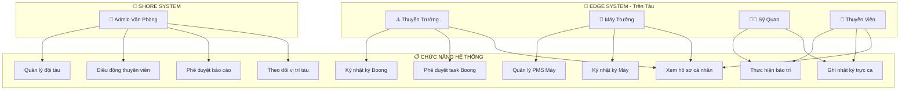

Về mặt cấu trúc chức năng, hệ thống được tổ chức theo mô hình cây phân cấp (Functional Tree) bao gồm sáu module nghiệp vụ chính. **Telemetry & Monitoring** đảm nhiệm việc thu thập dữ liệu thời gian thực từ các cảm biến GPS, động cơ, bồn nhiên liệu và môi trường. **PMS (Planned Maintenance System)** quản lý toàn bộ quy trình bảo trì thiết bị theo kế hoạch, từ lịch trình định kỳ đến theo dõi giờ vận hành. **Fuel Analytics** phân tích tiêu thụ nhiên liệu và tính toán chỉ số CII theo quy định IMO. **Crew Management** quản lý hồ sơ thuyền viên, chứng chỉ nghề nghiệp và giờ trực ca. **Voyage Management** theo dõi hành trình từ cảng đi đến cảng đến, bao gồm các điểm ghé và hoạt động xếp dỡ hàng. Cuối cùng, **Compliance & Reporting** đảm bảo tuân thủ pháp quy thông qua hệ thống nhật ký điện tử (Deck Log, Engine Log, Oil Record Book) và các báo cáo hàng hải bắt buộc.

Sự liên kết giữa các module tạo ra một hệ sinh thái dữ liệu khép kín: dữ liệu Running Hours từ Telemetry tự động kích hoạt tạo task trong PMS; thông tin tiêu thụ nhiên liệu được tổng hợp vào Fuel Analytics để tính CII; dữ liệu vị trí và thời tiết được điền tự động vào Logbooks và Noon Report. Mọi biến động về giờ vận hành thiết bị hay hạn định chứng chỉ đều được hệ thống tự động nhận diện và xử lý.

### Sơ đồ Nghiệp vụ Quản lý Hệ thống (Business Process Diagram)

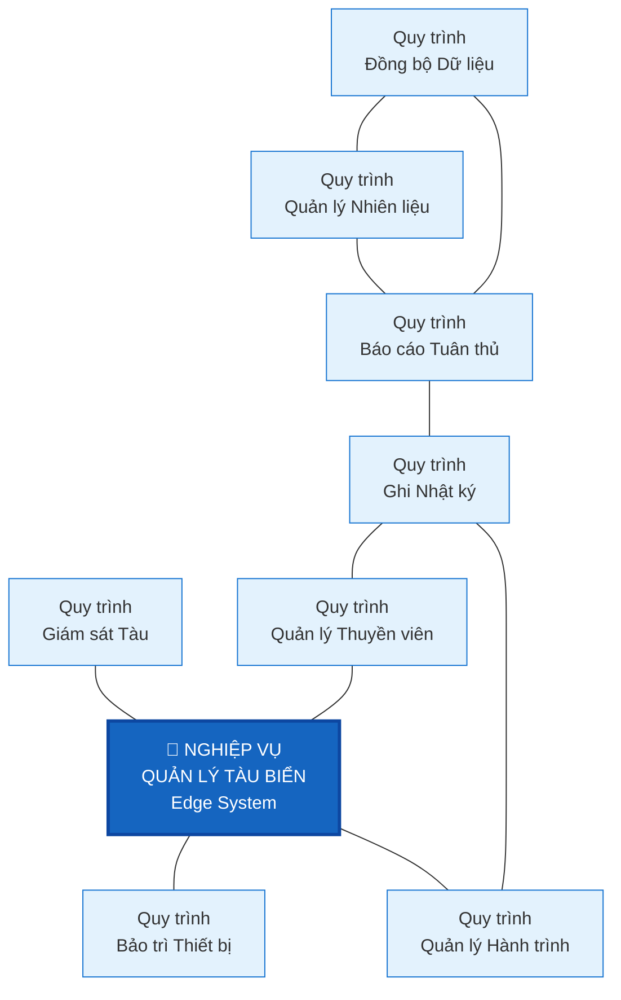

### Sơ đồ Phân rã Chức năng (Functional Decomposition Diagram)

```mermaid
graph TD
    ROOT["🚢 HỆ THỐNG QUẢN LÝ TÀU BIỂN<br/>Maritime Management System - Edge"]
    
    ROOT --> M1["1.0 Quản lý<br/>Hệ thống"]
    ROOT --> M2["2.0 Telemetry<br/>& Monitoring"]
    ROOT --> M3["3.0 PMS<br/>Bảo trì"]
    ROOT --> M4["4.0 Quản lý<br/>Thuyền viên"]
    ROOT --> M5["5.0 Quản lý<br/>Hành trình"]
    ROOT --> M6["6.0 Nhật ký<br/>& Báo cáo"]
    
    M1 --> M11["1.1 Quản lý<br/>người dùng"]
    M1 --> M12["1.2 Quản lý<br/>quyền"]
    M1 --> M13["1.3 Phân quyền"]
    M1 --> M14["1.4 Đăng nhập"]
    M1 --> M15["1.5 Đăng xuất"]
    M1 --> M16["1.6 Đổi mật khẩu"]
    
    M2 --> M21["2.1 Thu thập<br/>GPS/AIS"]
    M2 --> M22["2.2 Thu thập<br/>dữ liệu máy"]
    M2 --> M23["2.3 Giám sát<br/>máy phát"]
    M2 --> M24["2.4 Giám sát<br/>bồn nhiên liệu"]
    M2 --> M25["2.5 Thu thập<br/>môi trường"]
    M2 --> M26["2.6 Dashboard<br/>thời gian thực"]
    
    M3 --> M31["3.1 QL nhóm<br/>thiết bị"]
    M3 --> M32["3.2 QL tài sản<br/>thiết bị"]
    M3 --> M33["3.3 QL lịch<br/>bảo trì"]
    M3 --> M34["3.4 QL nhiệm vụ<br/>bảo trì"]
    M3 --> M35["3.5 QL checklist"]
    M3 --> M36["3.6 QL hoãn<br/>bảo trì"]
    M3 --> M37["3.7 QL vật tư<br/>phụ tùng"]
    
    M4 --> M41["4.1 QL hồ sơ<br/>thuyền viên"]
    M4 --> M42["4.2 QL chứng chỉ"]
    M4 --> M43["4.3 QL trực ca"]
    M4 --> M44["4.4 QL giờ nghỉ<br/>ngơi"]
    
    M5 --> M51["5.1 QL chuyến đi"]
    M5 --> M52["5.2 QL cảng ghé"]
    M5 --> M53["5.3 QL hàng hóa"]
    M5 --> M54["5.4 Ghi nhận<br/>Voyage Log"]
    
    M6 --> M61["6.1 Nhật ký<br/>Boong"]
    M6 --> M62["6.2 Nhật ký<br/>Máy"]
    M6 --> M63["6.3 Sổ dầu<br/>Oil Record"]
    M6 --> M64["6.4 Sổ rác<br/>Garbage Record"]
    M6 --> M65["6.5 Sổ nước<br/>dằn Ballast"]
    M6 --> M66["6.6 Noon Report"]
    M6 --> M67["6.7 Báo cáo<br/>Departure/Arrival"]
    
    style ROOT fill:#1565c0,color:#fff
    style M1 fill:#42a5f5,color:#fff
    style M2 fill:#42a5f5,color:#fff
    style M3 fill:#42a5f5,color:#fff
    style M4 fill:#42a5f5,color:#fff
    style M5 fill:#42a5f5,color:#fff
    style M6 fill:#42a5f5,color:#fff
```

### Sơ đồ Luồng Dữ liệu Mức Ngữ cảnh (Context DFD - Level 0)

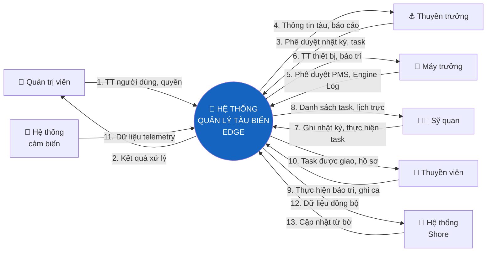

### Sơ đồ Luồng Dữ liệu Mức Đỉnh (Top-Level DFD - Level 1)

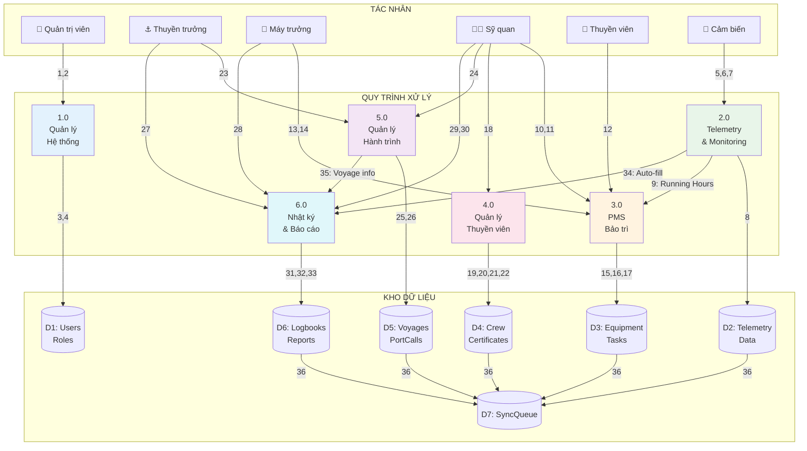

### Sơ đồ Luồng Dữ liệu Mức Dưới Đỉnh - 1.0 Quản lý Hệ thống

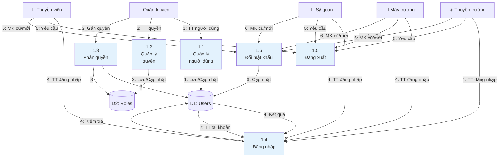

### Sơ đồ Luồng Dữ liệu Mức Dưới Đỉnh - 2.0 Telemetry & Monitoring

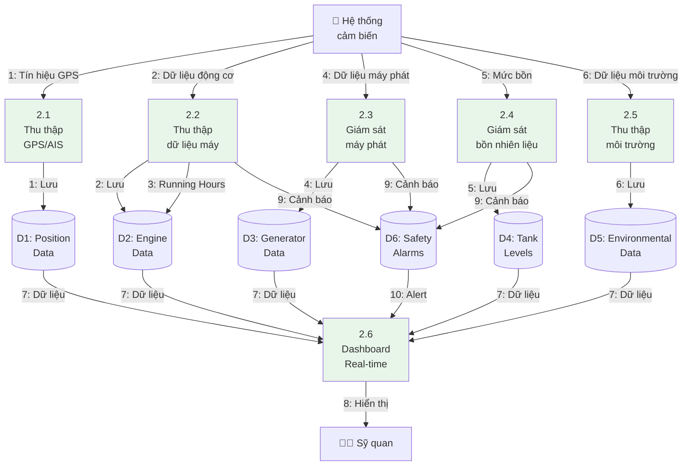

### Sơ đồ Luồng Dữ liệu Mức Dưới Đỉnh - 3.0 PMS Bảo trì

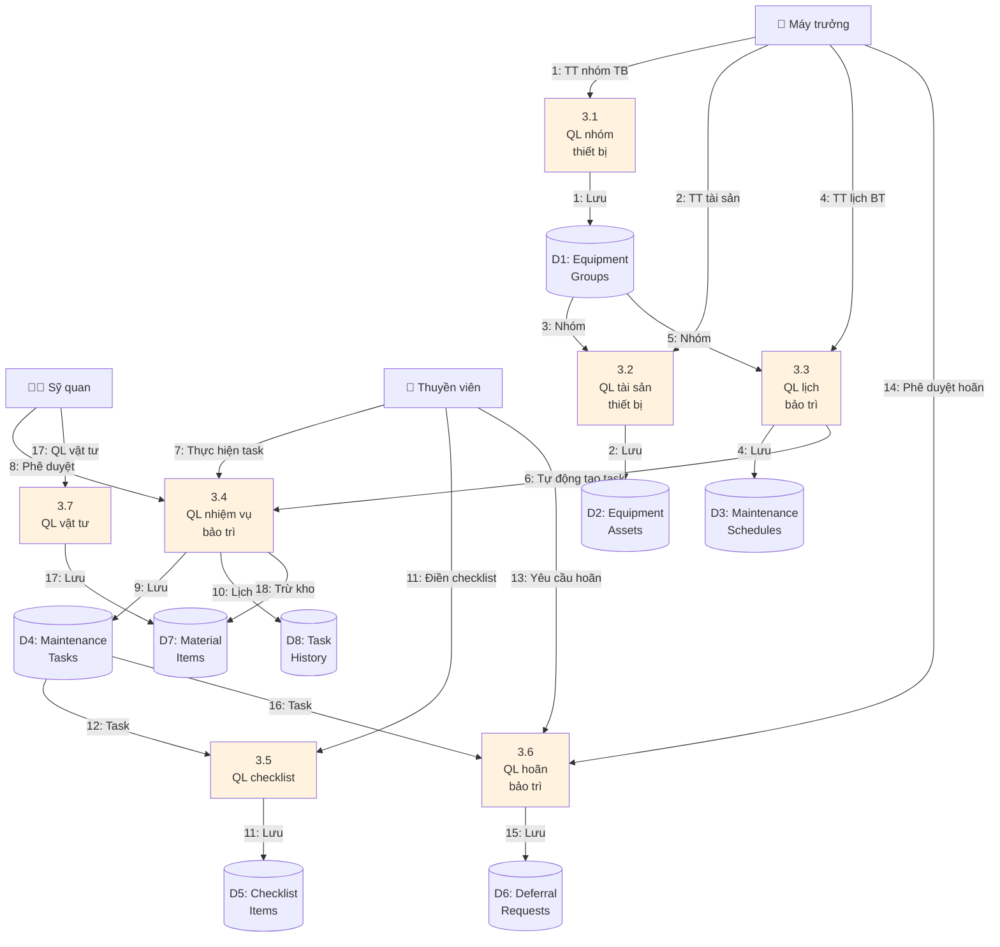

### Sơ đồ Luồng Dữ liệu Mức Dưới Đỉnh - 4.0 Quản lý Thuyền viên

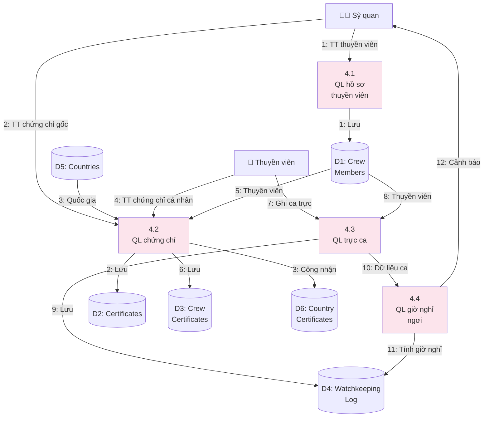

### Sơ đồ Luồng Dữ liệu Mức Dưới Đỉnh - 5.0 Quản lý Hành trình

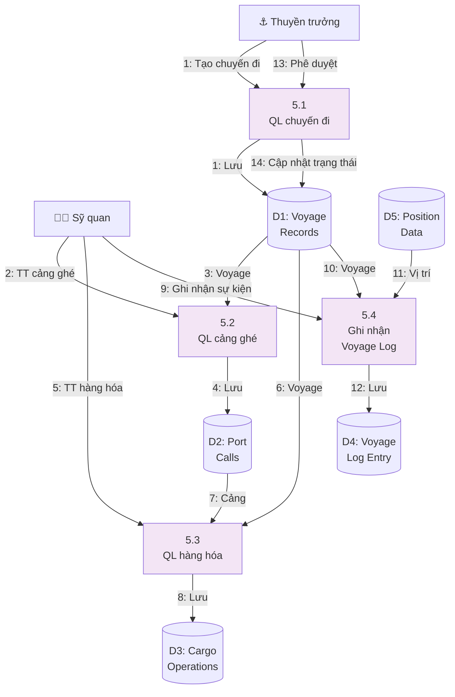

### Sơ đồ Luồng Dữ liệu Mức Dưới Đỉnh - 6.0 Nhật ký & Báo cáo

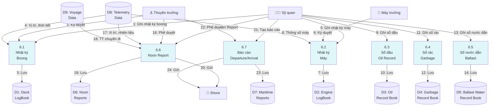

Để hiện thực hóa các chức năng này, quy trình nghiệp vụ được thiết kế với tính tự động hóa cao. Điển hình là quy trình bảo trì thiết bị, nơi hệ thống tự động kiểm tra lịch trình định kỳ để khởi tạo các nhiệm vụ (Tasks) trước ngày đến hạn. Mọi thao tác từ lúc thuyền viên bắt đầu thực hiện đến khi sỹ quan ký duyệt đều tuân thủ một trạng thái máy (State Machine) nghiêm ngặt, đảm bảo tính minh bạch và khả năng truy xuất nguồn gốc dữ liệu lịch sử.

### Quy trình Thực hiện Bảo trì (PMS Workflow)

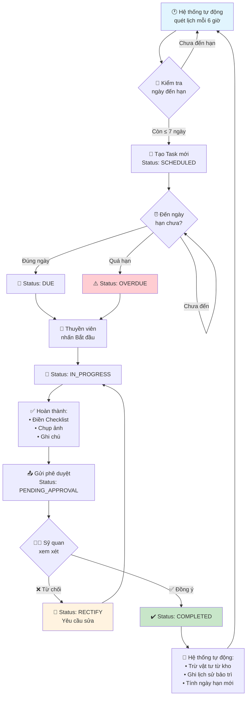

### Quy trình Quản lý Chứng chỉ Thuyền viên

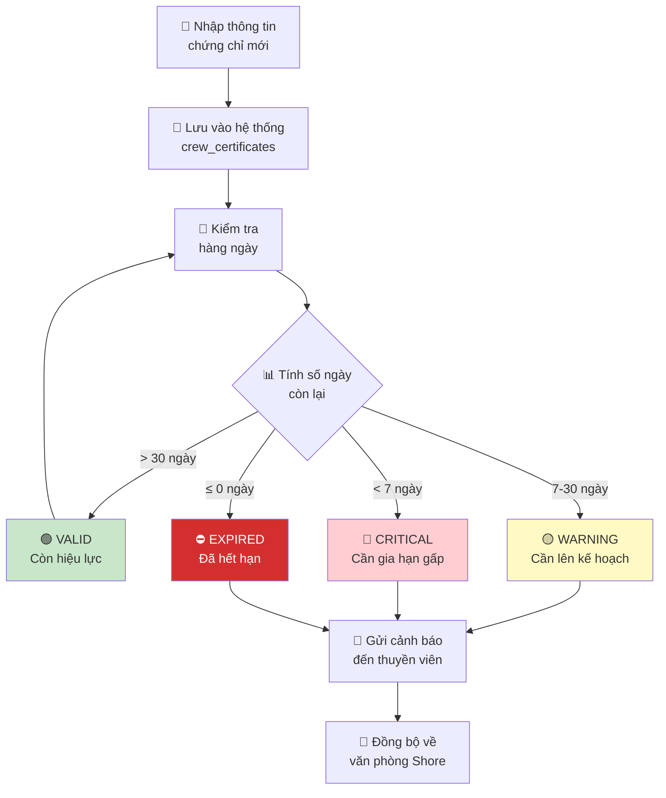

### Quy trình Thu thập Dữ liệu Telemetry

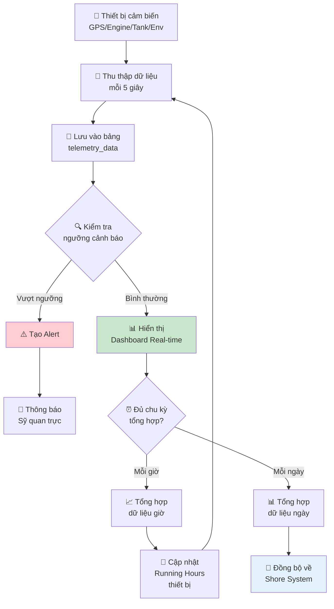

### Quy trình Phân tích Nhiên liệu & Tính CII

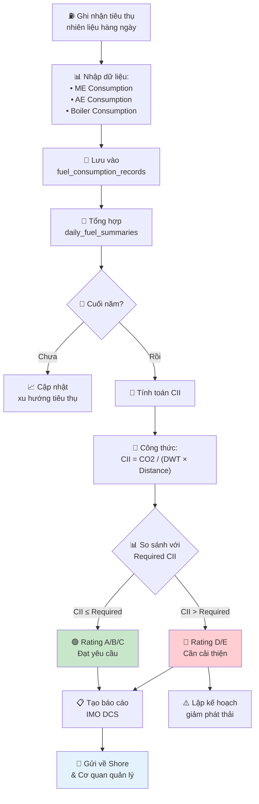

### Quy trình Quản lý Chuyến đi (Voyage)

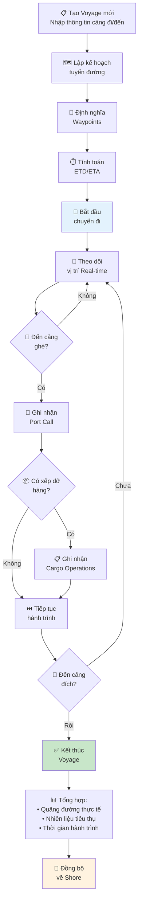

### Quy trình Ghi Nhật ký Hàng hải (Logbook)

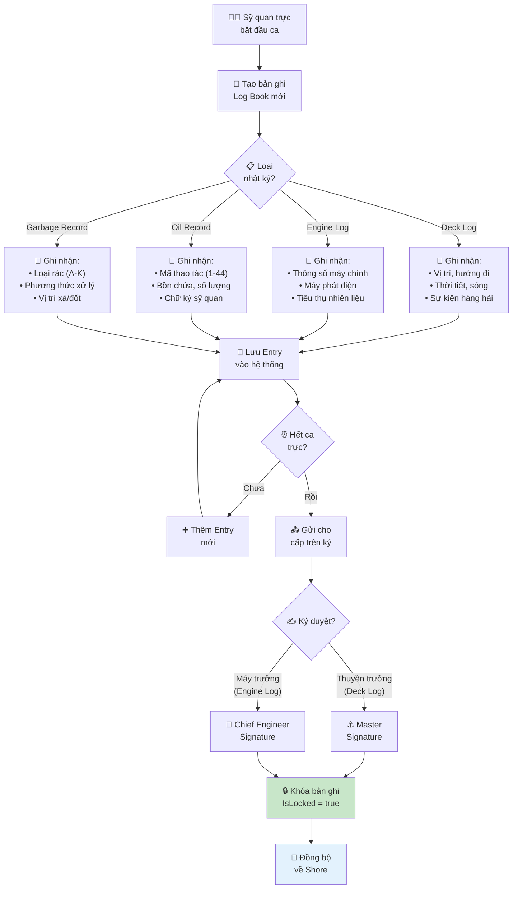

### Quy trình Tạo Noon Report

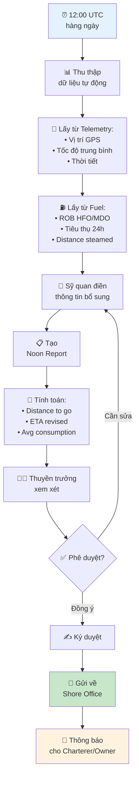

---

## 2.2. Phân tích thiết kế chi tiết các phần đã triển khai

Trong Giai đoạn 1, công tác thiết kế chi tiết đã hoàn thiện nền tảng cơ sở dữ liệu PostgreSQL với hơn 55 bảng nghiệp vụ được chuẩn hóa theo mô hình 3NF. Kiến trúc dữ liệu tập trung vào việc quản lý thực thể thuyền viên và hệ thống chứng chỉ STCW, cho phép lưu trữ đa dạng các loại giấy tờ chuyên môn kèm theo file quét số hóa. Đối với phân hệ PMS, sơ đồ thực thể được xây dựng linh hoạt để hỗ trợ bảo trì theo cả chu kỳ thời gian và giờ vận hành thực tế được cập nhật từ hệ thống Telemetry.

### Sơ đồ ERD - Module Crew Management (Quản lý Thuyền viên)

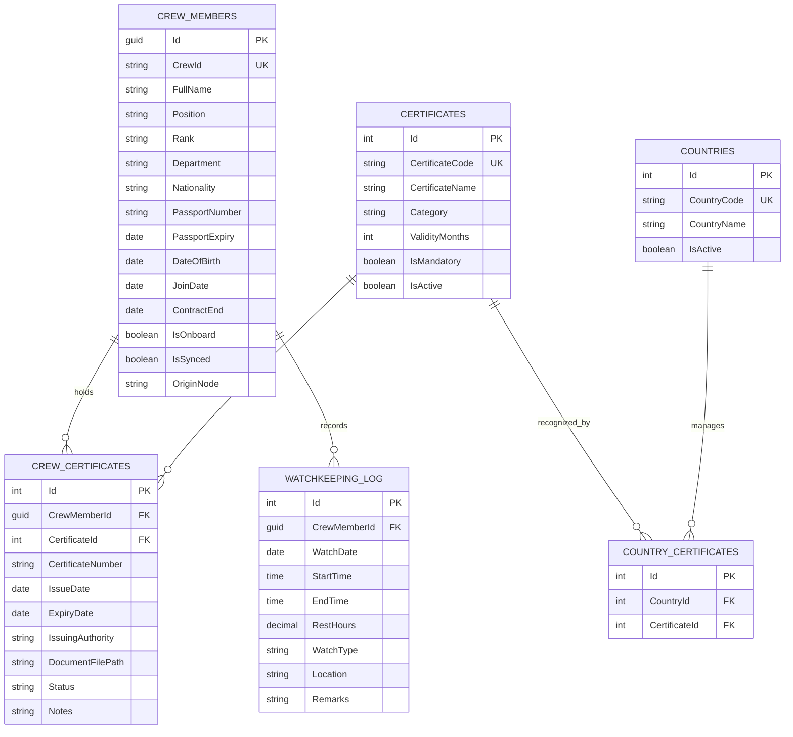

### Sơ đồ ERD - Module PMS (Planned Maintenance System)

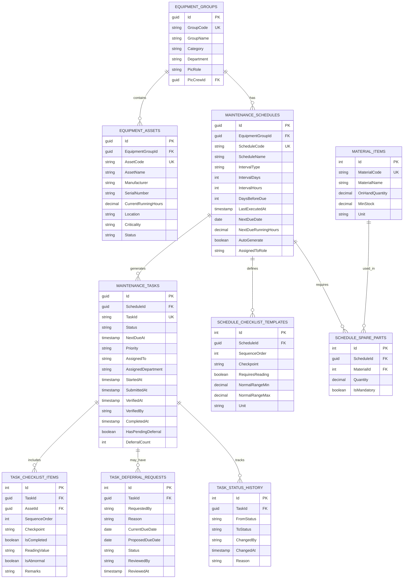

### Sơ đồ ERD - Module Telemetry & Monitoring

```mermaid
erDiagram
    TELEMETRY_DATA ||--o{ GPS_POSITIONS : "includes"
    TELEMETRY_DATA ||--o{ ENGINE_DATA : "includes"
    TELEMETRY_DATA ||--o{ GENERATOR_DATA : "includes"
    TELEMETRY_DATA ||--o{ FUEL_TANK_DATA : "includes"
    TELEMETRY_DATA ||--o{ ENVIRONMENTAL_DATA : "includes"

    TELEMETRY_DATA {
        guid Id PK
        timestamp RecordedAt
        string DataSource
        boolean IsSynced
    }
    
    GPS_POSITIONS {
        guid Id PK
        guid TelemetryId FK
        decimal Latitude
        decimal Longitude
        decimal Speed
        decimal Heading
        decimal COG
        decimal SOG
        string NavigationStatus
    }
    
    ENGINE_DATA {
        guid Id PK
        guid TelemetryId FK
        string EngineId
        decimal RPM
        decimal Power
        decimal FuelRate
        decimal ExhaustTemp
        decimal OilPressure
        decimal CoolantTemp
        decimal RunningHours
    }
    
    GENERATOR_DATA {
        guid Id PK
        guid TelemetryId FK
        string GeneratorId
        decimal Voltage
        decimal Current
        decimal Frequency
        decimal Power
        decimal RunningHours
        string Status
    }
    
    FUEL_TANK_DATA {
        guid Id PK
        guid TelemetryId FK
        string TankId
        string FuelType
        decimal CurrentLevel
        decimal Capacity
        decimal Temperature
    }
    
    ENVIRONMENTAL_DATA {
        guid Id PK
        guid TelemetryId FK
        decimal WindSpeed
        decimal WindDirection
        decimal WaveHeight
        decimal SeaTemp
        decimal AirTemp
        decimal Humidity
        decimal Pressure
    }
```

### Sơ đồ ERD - Module Fuel Analytics

```mermaid
erDiagram
    FUEL_CONSUMPTION_RECORDS ||--o{ DAILY_FUEL_SUMMARIES : "aggregates"
    BUNKER_OPERATIONS ||--o{ FUEL_CONSUMPTION_RECORDS : "supplies"
    VOYAGES ||--o{ FUEL_CONSUMPTION_RECORDS : "during"
    CII_CALCULATIONS }o--|| VOYAGES : "calculated_for"
    EMISSION_REPORTS }o--|| VOYAGES : "generated_for"

    FUEL_CONSUMPTION_RECORDS {
        guid Id PK
        guid VoyageId FK
        date RecordDate
        string FuelType
        decimal MEConsumption
        decimal AEConsumption
        decimal BoilerConsumption
        decimal TotalConsumption
        decimal RunningHours
        decimal DistanceTraveled
    }
    
    DAILY_FUEL_SUMMARIES {
        guid Id PK
        date SummaryDate
        decimal TotalHFO
        decimal TotalMDO
        decimal TotalLNG
        decimal AverageSpeed
        decimal AverageConsumption
        decimal CO2Emission
    }
    
    BUNKER_OPERATIONS {
        guid Id PK
        date BunkerDate
        string Port
        string FuelType
        decimal Quantity
        decimal Density
        decimal Sulfur
        string Supplier
        string BDNNumber
    }
    
    CII_CALCULATIONS {
        guid Id PK
        guid VoyageId FK
        int Year
        decimal AttainedCII
        decimal RequiredCII
        string Rating
        decimal CO2Emissions
        decimal TransportWork
    }
    
    EMISSION_REPORTS {
        guid Id PK
        guid VoyageId FK
        string ReportType
        decimal TotalCO2
        decimal TotalSOx
        decimal TotalNOx
        date ReportDate
    }
    
    VOYAGES {
        guid Id PK
        string VoyageNumber
        string DeparturePort
        string ArrivalPort
        timestamp DepartureTime
        timestamp ArrivalTime
        decimal TotalDistance
        string Status
    }
```

### Sơ đồ ERD - Module Compliance & Reporting (Logbooks)

```mermaid
erDiagram
    DECK_LOG_BOOKS ||--o{ DECK_LOG_ENTRIES : "contains"
    ENGINE_LOG_BOOKS ||--o{ ENGINE_LOG_ENTRIES : "contains"
    OIL_RECORD_BOOKS ||--o{ OIL_RECORD_ENTRIES : "contains"
    GARBAGE_RECORD_BOOKS ||--o{ GARBAGE_RECORD_ENTRIES : "contains"
    BALLAST_WATER_RECORD_BOOKS ||--o{ BALLAST_WATER_ENTRIES : "contains"
    NOON_REPORTS }o--|| VOYAGES : "during"

    DECK_LOG_BOOKS {
        guid Id PK
        date LogDate
        string WatchPeriod
        string OOW
        string MasterSignature
        timestamp SignedAt
        boolean IsLocked
    }
    
    DECK_LOG_ENTRIES {
        guid Id PK
        guid DeckLogBookId FK
        time EntryTime
        string EventType
        text Description
        decimal Latitude
        decimal Longitude
        string Weather
        string SeaState
        string Visibility
    }
    
    ENGINE_LOG_BOOKS {
        guid Id PK
        date LogDate
        string WatchPeriod
        string DutyEngineer
        string ChiefEngineerSignature
        timestamp SignedAt
        boolean IsLocked
    }
    
    ENGINE_LOG_ENTRIES {
        guid Id PK
        guid EngineLogBookId FK
        time EntryTime
        string EventType
        text Description
        decimal MEPower
        decimal MERPM
        decimal AELoad
    }
    
    OIL_RECORD_BOOKS {
        guid Id PK
        string BookPart
        date StartDate
        date EndDate
        boolean IsClosed
    }
    
    OIL_RECORD_ENTRIES {
        guid Id PK
        guid OilRecordBookId FK
        date EntryDate
        string OperationCode
        decimal Quantity
        string TankId
        text Remarks
        string OfficerSignature
    }
    
    GARBAGE_RECORD_BOOKS {
        guid Id PK
        date StartDate
        date EndDate
        boolean IsClosed
    }
    
    GARBAGE_RECORD_ENTRIES {
        guid Id PK
        guid GarbageRecordBookId FK
        date EntryDate
        string Category
        decimal EstimatedAmount
        string DisposalMethod
        decimal Latitude
        decimal Longitude
    }
    
    BALLAST_WATER_RECORD_BOOKS {
        guid Id PK
        date StartDate
        date EndDate
        boolean IsClosed
    }
    
    BALLAST_WATER_ENTRIES {
        guid Id PK
        guid BallastWaterRecordBookId FK
        date EntryDate
        string OperationType
        string TankId
        decimal Quantity
        decimal Latitude
        decimal Longitude
        string TreatmentMethod
    }
    
    NOON_REPORTS {
        guid Id PK
        guid VoyageId FK
        date ReportDate
        time ReportTime
        decimal Latitude
        decimal Longitude
        decimal DistanceToGo
        decimal ETAHours
        decimal AvgSpeed
        decimal FuelROB_HFO
        decimal FuelROB_MDO
        string Weather
        string Remarks
    }
```

### Sơ đồ ERD - Module Voyage Management

```mermaid
erDiagram
    VOYAGES ||--o{ PORT_CALLS : "includes"
    VOYAGES ||--o{ CARGO_OPERATIONS : "has"
    VOYAGES ||--o{ VOYAGE_WAYPOINTS : "follows"
    PORT_CALLS ||--o{ CARGO_OPERATIONS : "at"

    VOYAGES {
        guid Id PK
        string VoyageNumber UK
        string VesselName
        string DeparturePort
        string ArrivalPort
        timestamp DepartureTime
        timestamp ArrivalTime
        timestamp ETD
        timestamp ETA
        decimal PlannedDistance
        decimal ActualDistance
        string CargoType
        decimal CargoQuantity
        string Status
    }
    
    PORT_CALLS {
        guid Id PK
        guid VoyageId FK
        string PortCode
        string PortName
        string Country
        string CallPurpose
        timestamp ArrivalTime
        timestamp DepartureTime
        string BerthNumber
        string AgentName
    }
    
    CARGO_OPERATIONS {
        guid Id PK
        guid VoyageId FK
        guid PortCallId FK
        string OperationType
        string CargoType
        decimal Quantity
        timestamp StartTime
        timestamp EndTime
        string HoldNumber
        text Remarks
    }
    
    VOYAGE_WAYPOINTS {
        guid Id PK
        guid VoyageId FK
        int SequenceOrder
        string WaypointName
        decimal Latitude
        decimal Longitude
        decimal PlannedSpeed
        timestamp PlannedArrival
        timestamp ActualArrival
    }
```

---

## 2.3. Kiến trúc tổng thể hệ thống

Về mặt logic xử lý, hệ thống đã cài đặt thành công thuật toán cảnh báo hạn định chứng chỉ dựa trên thời gian thực, tự động phân cấp mức độ rủi ro qua các trạng thái màu sắc để hỗ trợ bộ phận nhân sự. Bên cạnh đó, logic tự động tạo nhiệm vụ bảo trì cũng được triển khai dựa trên việc phân tích dữ liệu giờ vận hành (Running Hours) từ cảm biến. Đặc biệt, cơ chế đồng bộ dữ liệu Delta Sync đã được thiết kế nhằm tối ưu hóa việc truyền tải qua vệ tinh, chỉ tập trung vào các thay đổi nhỏ nhất của dữ liệu để tiết kiệm chi phí băng thông lên đến 82%. Toàn bộ các chức năng này đã được hiện thực hóa qua hơn 125 đầu cuối API và giao diện Dashboard thời gian thực trên cả nền tảng Web và Mobile.

### Sơ đồ Kiến trúc Edge-Shore

```mermaid
flowchart TB
    subgraph Shore["🏢 SHORE SYSTEM"]
        ShoreDB[("PostgreSQL<br/>Shore Database")]
        ShoreAPI["Shore API<br/>ASP.NET Core 8.0"]
        ShoreWeb["Shore Dashboard<br/>React 19"]
        
        ShoreWeb --> ShoreAPI
        ShoreAPI --> ShoreDB
    end
    
    subgraph Satellite["🛰️ VSAT Connection"]
        Sync["Delta Sync<br/>Protocol"]
    end
    
    subgraph Edge["🚢 EDGE SYSTEM - Trên Tàu"]
        EdgeDB[("PostgreSQL<br/>Edge Database")]
        EdgeAPI["Edge API<br/>ASP.NET Core 8.0"]
        EdgeWeb["Edge Dashboard<br/>React 19"]
        Mobile["Mobile App<br/>Flutter"]
        
        subgraph Sensors["📡 Thiết bị cảm biến"]
            GPS["GPS/AIS"]
            Engine["Engine Sensors"]
            Tank["Tank Gauges"]
            Env["Environmental"]
        end
        
        Sensors --> EdgeAPI
        EdgeWeb --> EdgeAPI
        Mobile --> EdgeAPI
        EdgeAPI --> EdgeDB
    end
    
    ShoreAPI <--> Sync
    Sync <--> EdgeAPI
    
    style Shore fill:#e3f2fd
    style Edge fill:#e8f5e9
    style Satellite fill:#fff3e0
```

### Sơ đồ Data Flow - Delta Sync

```mermaid
sequenceDiagram
    participant Edge as 🚢 Edge System
    participant Queue as 📤 Sync Queue
    participant VSAT as 🛰️ VSAT
    participant Shore as 🏢 Shore System
    
    Edge->>Edge: Detect data change
    Edge->>Edge: Calculate delta (changed fields only)
    Edge->>Queue: Add to Sync Queue
    
    Note over Queue: Priority: Critical > High > Normal
    
    loop Every 15 minutes
        Queue->>VSAT: Send batch of changes
        VSAT->>Shore: Transmit via satellite
        Shore->>Shore: Apply changes
        Shore-->>VSAT: Acknowledge
        VSAT-->>Queue: Mark as synced
    end
    
    Note over Edge,Shore: Bandwidth saving: ~82%
```

---

## 2.4. Tóm tắt kết quả Giai đoạn 1

### Thống kê triển khai

| Module | Số bảng | Số API | Trạng thái |
|--------|---------|--------|------------|
| Crew Management | 5 | 25 | ✅ Hoàn thành |
| PMS | 10 | 35 | ✅ Hoàn thành |
| Telemetry | 9 | 15 | ✅ Hoàn thành |
| Fuel Analytics | 6 | 12 | ✅ Hoàn thành |
| Voyage Management | 4 | 10 | ✅ Hoàn thành |
| Compliance & Reporting | 12 | 28 | ✅ Hoàn thành |
| Materials | 4 | 8 | ✅ Hoàn thành |
| Authentication | 5 | 12 | ✅ Hoàn thành |
| **Tổng cộng** | **55** | **125+** | |

### Công nghệ sử dụng

```mermaid
graph LR
    subgraph Backend
        NET["ASP.NET Core 8.0"]
        EF["Entity Framework Core 8.0"]
        PG["PostgreSQL 15"]
    end
    
    subgraph Frontend
        React["React 19"]
        TS["TypeScript"]
        TW["Tailwind CSS"]
    end
    
    subgraph Mobile
        Flutter["Flutter 3.x"]
        Dart["Dart"]
    end
    
    subgraph Infrastructure
        Docker["Docker"]
        Compose["Docker Compose"]
    end
    
    Backend --> Frontend
    Backend --> Mobile
    Infrastructure --> Backend
```
