# 🚢 PHÂN TÍCH TỔNG QUAN DỰ ÁN HỆ THỐNG QUẢN LÝ TÀU BIỂN
## Maritime Management System - Comprehensive Project Overview

**Ngày báo cáo:** 24 tháng 12, 2025  
**Phiên bản:** 1.1  
**Loại dự án:** Nghiên cứu khoa học (NCKH)  
**Trạng thái:** Đang phát triển

---

## 📋 MỤC LỤC

1. [Tổng Quan Dự Án](#1-tổng-quan-dự-án)
2. [Kiến Trúc Hệ Thống](#2-kiến-trúc-hệ-thống)
3. [Công Nghệ Sử Dụng](#3-công-nghệ-sử-dụng)
4. [Các Module Chính](#4-các-module-chính)
5. [Tính Năng Đã Triển Khai](#5-tính-năng-đã-triển-khai)
6. [Tuân Thủ Tiêu Chuẩn Quốc Tế](#6-tuân-thủ-tiêu-chuẩn-quốc-tế)
7. [Kết Quả Đạt Được](#7-kết-quả-đạt-được)
8. [Hướng Phát Triển Tương Lai](#8-hướng-phát-triển-tương-lai)

---

## 1. TỔNG QUAN DỰ ÁN

### 1.1. Giới Thiệu

**Hệ thống Quản lý Hạm đội Tàu Chuyên nghiệp** là một giải pháp toàn diện được phát triển theo tiêu chuẩn quốc tế IMO (International Maritime Organization), tích hợp đầy đủ từ theo dõi thời gian thực, quản lý nhiên liệu thông minh, đến hệ thống cảnh báo tự động và thu thập dữ liệu từ cảm biến trên tàu.

### 1.2. Vấn Đề Giải Quyết

| Vấn Đề | Giải Pháp Của Dự Án |
|--------|---------------------|
| **Quản lý tàu truyền thống thủ công** | Tự động hóa toàn bộ quy trình với AI |
| **Thiếu dữ liệu thời gian thực** | Edge computing với thu thập dữ liệu 5 giây/lần |
| **Không tuân thủ tiêu chuẩn IMO** | Tích hợp đầy đủ IMO DCS, CII, EEOI, MARPOL |
| **Lãng phí nhiên liệu** | AI phân tích hiệu suất và tối ưu hóa |
| **Khó quản lý bảo trì định kỳ** | PMS tự động tạo task trước 7 ngày |
| **Thông tin không đồng bộ giữa tàu-bờ** | Delta sync với 82% tiết kiệm băng thông |

### 1.3. Mục Tiêu Dự Án

- ✅ **Tự động hóa** quản lý đội tàu và bảo trì thiết bị
- ✅ **Tuân thủ** các tiêu chuẩn IMO, SOLAS, MARPOL
- ✅ **Tối ưu hóa** tiêu thụ nhiên liệu và giảm phát thải
- ✅ **Tăng cường** an toàn hàng hải và quản lý thủy thủ đoàn
- ✅ **Hỗ trợ** ra quyết định thông qua phân tích dữ liệu

---

## 2. KIẾN TRÚC HỆ THỐNG

### 2.1. Kiến Trúc Edge-Shore (Tàu-Bờ)

Dự án được thiết kế theo mô hình **Edge-Shore Architecture**, bao gồm 2 hệ thống độc lập:

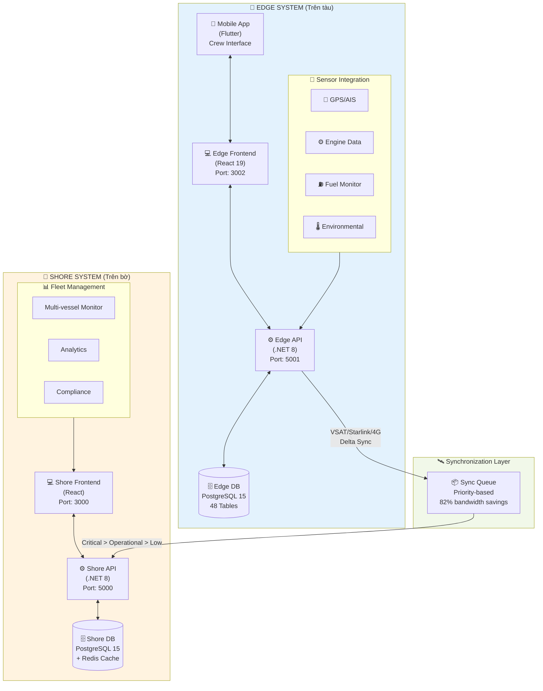
```mermaid
graph TB
    subgraph EDGE["🚢 EDGE SYSTEM (Trên tàu)"]
        MA["📱 Mobile App<br/>(Flutter)<br/>Crew Interface"]
        EF["💻 Edge Frontend<br/>(React 19)<br/>Port: 3002"]
        EA["⚙️ Edge API<br/>(.NET 8)<br/>Port: 5001"]
        
        subgraph Sensors["🔌 Sensor Integration"]
            GPS["📡 GPS/AIS"]
            ENG["⚙️ Engine Data"]
            FUEL["⛽ Fuel Monitor"]
            ENV["🌡️ Environmental"]
        end
        
        EDB[("🗄️ Edge DB<br/>PostgreSQL 15<br/>48 Tables")]
        
        MA <--> EF
        EF <--> EA
        EA <--> EDB
        Sensors --> EA
    end
    
    subgraph SYNC["🛰️ Synchronization Layer"]
        Q["📦 Sync Queue<br/>Priority-based<br/>82% bandwidth savings"]
    end
    
    subgraph SHORE["🏢 SHORE SYSTEM (Trên bờ)"]
        SF["💻 Shore Frontend<br/>(React)<br/>Port: 3000"]
        SA["⚙️ Shore API<br/>(.NET 8)<br/>Port: 5000"]
        
        subgraph Fleet["📊 Fleet Management"]
            MULTI["Multi-vessel Monitor"]
            ANAL["Analytics"]
            COMP["Compliance"]
        end
        
        SDB[("🗄️ Shore DB<br/>PostgreSQL 15<br/>+ Redis Cache")]
        
        SF <--> SA
        SA <--> SDB
        Fleet --> SF
    end
    
    EA -->|"VSAT/Starlink/4G<br/>Delta Sync"| Q
    Q -->|"Critical > Operational > Low"| SA
    
    style EDGE fill:#e3f2fd
    style SHORE fill:#fff3e0
    style SYNC fill:#f1f8e9
```

### 2.2. So Sánh Edge System vs Shore System

| Tiêu Chí | Edge System (Tàu) | Shore System (Bờ) |
|----------|-------------------|-------------------|
| **Vị trí** | Trên tàu | Trung tâm điều hành |
| **Backend** | edge-services/ (Port 5001) | backend/ (Port 5000) |
| **Frontend** | frontend-edge/ (Port 3002) | frontend/ (Port 3000) |
| **Mobile** | frontend-mobile/ (Flutter) | - |
| **Database** | PostgreSQL (Port 5433, 48 tables) | PostgreSQL (Port 5432) |
| **Mạng** | Offline-first, LAN | Luôn online |
| **Người dùng** | Thuyền trưởng, Thủy thủ đoàn | Quản lý đội tàu, Cảng |
| **Tính năng chính** | Thu thập dữ liệu cảm biến, PMS, Crew | Phân tích tổng hợp, Báo cáo, Tuân thủ |
| **Đồng bộ** | Queue-based sync với priority | Nhận dữ liệu từ nhiều tàu |

### 2.3. Luồng Dữ Liệu

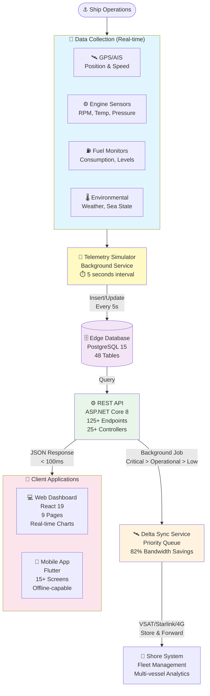
```mermaid
flowchart TD
    Start(["⚓ Ship Operations"])
    
    subgraph Collection["📡 Data Collection (Real-time)"]
        S1["🛰️ GPS/AIS<br/>Position & Speed"]
        S2["⚙️ Engine Sensors<br/>RPM, Temp, Pressure"]
        S3["⛽ Fuel Monitors<br/>Consumption, Levels"]
        S4["🌡️ Environmental<br/>Weather, Sea State"]
    end
    
    TS["🔄 Telemetry Simulator<br/>Background Service<br/>⏱️ 5 seconds interval"]
    
    DB[("🗄️ Edge Database<br/>PostgreSQL 15<br/>48 Tables")]
    
    API["⚙️ REST API<br/>ASP.NET Core 8<br/>125+ Endpoints<br/>25+ Controllers"]
    
    subgraph Clients["👥 Client Applications"]
        WEB["💻 Web Dashboard<br/>React 19<br/>9 Pages<br/>Real-time Charts"]
        MOB["📱 Mobile App<br/>Flutter<br/>15+ Screens<br/>Offline-capable"]
    end
    
    Sync["🛰️ Delta Sync Service<br/>Priority Queue<br/>82% Bandwidth Savings"]
    
    Shore["🏢 Shore System<br/>Fleet Management<br/>Multi-vessel Analytics"]
    
    Start --> Collection
    Collection --> TS
    TS -->|"Insert/Update<br/>Every 5s"| DB
    DB -->|"Query"| API
    API -->|"JSON Response<br/>< 100ms"| Clients
    
    API -->|"Background Job<br/>Critical > Operational > Low"| Sync
    Sync -->|"VSAT/Starlink/4G<br/>Store & Forward"| Shore
    
    style Collection fill:#e1f5fe
    style TS fill:#fff9c4
    style DB fill:#f3e5f5
    style API fill:#e8f5e9
    style Clients fill:#fce4ec
    style Sync fill:#fff3e0
```

---

## 3. CÔNG NGHỆ SỬ DỤNG

### 3.1. Edge System Technology Stack

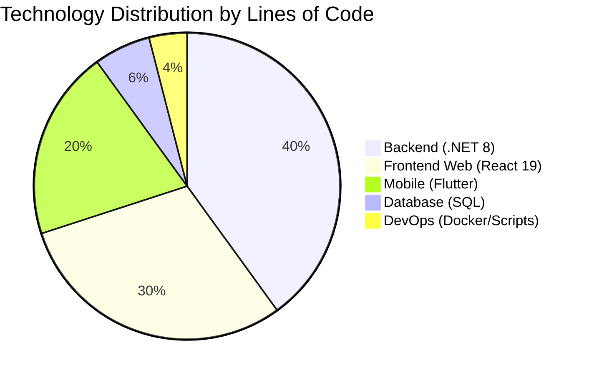
```mermaid
pie title Technology Distribution by Lines of Code
    "Backend (.NET 8)" : 20000
    "Frontend Web (React 19)" : 15000
    "Mobile (Flutter)" : 10000
    "Database (SQL)" : 3000
    "DevOps (Docker/Scripts)" : 2000
```

| Lớp | Công Nghệ | Phiên Bản | Vai Trò |
|-----|-----------|-----------|---------|
| **Backend** | ASP.NET Core | 8.0 | Web API Framework |
| | Entity Framework Core | 8.0 | ORM |
| | Npgsql | 8.0 | PostgreSQL Driver |
| | Swagger/OpenAPI | 3.0 | API Documentation |
| | IHostedService | - | Background Tasks |
| **Frontend Web** | React | 19 | UI Framework |
| | TypeScript | 5.9 | Type Safety |
| | Vite | 6.0 | Build Tool |
| | Tailwind CSS | 3.4 | Styling |
| | shadcn/ui | - | Component Library |
| | Zustand | 5.0 | State Management |
| | React Router | 7 | Routing |
| | Recharts | 2.14 | Data Visualization |
| **Frontend Mobile** | Flutter | 3.x | Cross-platform |
| | Dart | 3.x | Language |
| | Dio | - | HTTP Client |
| | Hive | - | Local Database |
| | Provider | - | State Management |
| **Database** | PostgreSQL | 15 | Relational Database |
| | pgAdmin | 4 | Database Management |
| **DevOps** | Docker | - | Containerization |
| | Docker Compose | - | Multi-container |

### 3.2. Shore System Technology Stack

| Lớp | Công Nghệ | Mô Tả |
|-----|-----------|-------|
| **Backend** | ASP.NET Core 8.0 | Web API |
| | Redis 7-Alpine | Caching & Session |
| | JWT Bearer | Authentication |
| **Frontend** | React 18 | Web Dashboard |
| | TypeScript 5.x | Type Safety |
| **Database** | PostgreSQL 15 | Fleet Database |

---

## 4. CÁC MODULE CHÍNH

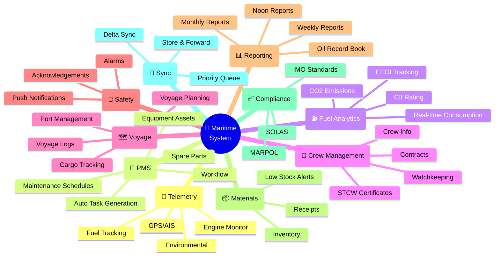
```mermaid
mindmap
  root((🚢 Maritime<br/>System))
    (📡 Telemetry)
      GPS/AIS
      Engine Monitor
      Fuel Tracking
      Environmental
    (🔧 PMS)
      Equipment Assets
      Maintenance Schedules
      Auto Task Generation
      Spare Parts
      Workflow
    (⛽ Fuel Analytics)
      Real-time Consumption
      CII Rating
      EEOI Tracking
      CO2 Emissions
    (👥 Crew Management)
      Crew Info
      STCW Certificates
      Watchkeeping
      Contracts
    (🗺️ Voyage)
      Voyage Planning
      Voyage Logs
      Cargo Tracking
      Port Management
    (🚨 Safety)
      Alarms
      Acknowledgements
      Push Notifications
    (📊 Reporting)
      Weekly Reports
      Monthly Reports
      Noon Reports
      Oil Record Book
    (📦 Materials)
      Inventory
      Receipts
      Low Stock Alerts
    (✅ Compliance)
      IMO Standards
      SOLAS
      MARPOL
    (🔄 Sync)
      Delta Sync
      Priority Queue
      Store & Forward
```

### 4.1. Module Edge System (Trên Tàu)

#### 4.1.1. Telemetry & Monitoring (Thu Thập Dữ Liệu)
- **Chức năng:**
  - Thu thập dữ liệu GPS/AIS mỗi 5 giây
  - Giám sát động cơ chính (Main Engine)
  - Giám sát máy phát điện (Generator)
  - Theo dõi mực nhiên liệu trong bồn
  - Dữ liệu môi trường (nhiệt độ, độ ẩm, áp suất)
- **Công nghệ:** 
  - Background Service (TelemetrySimulatorService)
  - NMEA/Modbus protocol simulation
- **Controllers:** TelemetryController, VesselTelemetryController

#### 4.1.2. PMS - Planned Maintenance System

**Tổng quan:** Hệ thống bảo trì kế hoạch tự động hóa, tuân thủ ISM Code, giúp đảm bảo tất cả thiết bị được bảo trì đúng lịch.

**Cấu trúc Database:**
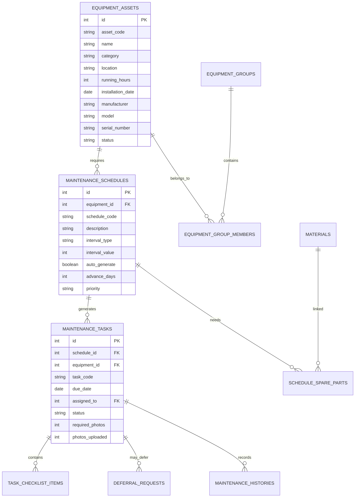
```mermaid
erDiagram
    EQUIPMENT_ASSETS ||--o{ MAINTENANCE_SCHEDULES : requires
    EQUIPMENT_ASSETS ||--o{ EQUIPMENT_GROUP_MEMBERS : belongs_to
    EQUIPMENT_GROUPS ||--o{ EQUIPMENT_GROUP_MEMBERS : contains
    
    MAINTENANCE_SCHEDULES ||--o{ MAINTENANCE_TASKS : generates
    MAINTENANCE_SCHEDULES ||--o{ SCHEDULE_SPARE_PARTS : needs
    
    MAINTENANCE_TASKS ||--o{ TASK_CHECKLIST_ITEMS : contains
    MAINTENANCE_TASKS ||--o{ DEFERRAL_REQUESTS : may_defer
    MAINTENANCE_TASKS ||--o{ MAINTENANCE_HISTORIES : records
    
    MATERIALS ||--o{ SCHEDULE_SPARE_PARTS : linked
    
    EQUIPMENT_ASSETS {
        int id PK
        string asset_code
        string name
        string category
        string location
        int running_hours
        date installation_date
        string manufacturer
        string model
        string serial_number
        string status
    }
    
    MAINTENANCE_SCHEDULES {
        int id PK
        int equipment_id FK
        string schedule_code
        string description
        string interval_type
        int interval_value
        boolean auto_generate
        int advance_days
        string priority
    }
    
    MAINTENANCE_TASKS {
        int id PK
        int schedule_id FK
        int equipment_id FK
        string task_code
        date due_date
        int assigned_to FK
        string status
        int required_photos
        int photos_uploaded
    }
```

**Phần 1: Equipment Assets Management (Quản lý Tài sản Thiết bị)**

**Tác vụ:**
- `GET /api/equipment-assets` - Danh sách tất cả thiết bị
- `GET /api/equipment-assets?category={cat}` - Lọc theo danh mục
- `GET /api/equipment-assets/{id}` - Chi tiết thiết bị
- `POST /api/equipment-assets` - Thêm thiết bị mới
- `PUT /api/equipment-assets/{id}` - Cập nhật thông tin
- `PATCH /api/equipment-assets/{id}/running-hours` - Cập nhật giờ chạy
- `POST /api/equipment-assets/import` - Import từ Excel
- `DELETE /api/equipment-assets/{id}` - Xóa thiết bị

**Danh mục thiết bị (Categories):**
1. **Main Engine** - Động cơ chính
2. **Auxiliary Engines** - Động cơ phụ
3. **Generator Sets** - Máy phát điện
4. **Pumps** - Các loại bơm (Fuel, Ballast, Cargo, Bilge)
5. **Boilers** - Lò hơi
6. **Compressors** - Máy nén khí
7. **HVAC Systems** - Hệ thống điều hòa
8. **Navigation Equipment** - Thiết bị hàng hải (GPS, Radar, ECDIS)
9. **Communication Equipment** - Thiết bị thông tin (VHF, GMDSS)
10. **Safety Equipment** - Thiết bị an toàn (Life rafts, Fire extinguishers)
11. **Deck Machinery** - Thiết bị boong (Winches, Cranes)
12. **Steering Gear** - Hệ thống lái

**Thông tin mỗi thiết bị:**
- Asset Code (unique)
- Tên thiết bị
- Danh mục
- Vị trí (Engine Room, Bridge, Deck, etc.)
- Running Hours (giờ chạy tích lũy)
- Ngày lắp đặt
- Nhà sản xuất
- Model & Serial Number
- Trạng thái: Operational, Under Maintenance, Out of Service

**Phần 2: Maintenance Schedules (Lịch Bảo Trì)**

**Tác vụ:**
- `GET /api/maintenance-schedules` - Danh sách lịch bảo trì
- `GET /api/maintenance-schedules/{id}` - Chi tiết lịch
- `GET /api/maintenance-schedules/asset/{assetId}` - Lịch của thiết bị
- `POST /api/maintenance-schedules` - Tạo lịch mới
- `PUT /api/maintenance-schedules/{id}` - Cập nhật lịch
- `GET /api/maintenance-schedules/preview` - Preview task sẽ được tạo
- `POST /api/maintenance-schedules/{id}/spare-parts` - Thêm phụ tùng cần thiết

**Loại interval (Chu kỳ bảo trì):**

1. **CALENDAR** - Theo lịch cố định
   - Ví dụ: Mỗi 30 ngày, 90 ngày, 180 ngày, 1 năm
   - Dùng cho: Fire extinguisher inspection, Life raft service

2. **RUNNING_HOURS** - Theo giờ chạy
   - Ví dụ: Mỗi 500 giờ, 1000 giờ, 5000 giờ
   - Dùng cho: Engine oil change, Generator service
   - Hệ thống tự động tracking running hours

3. **CONDITION_BASED** - Theo tình trạng
   - Ví dụ: Khi nhiệt độ > 80°C, Vibration > threshold
   - Dùng cho: Predictive maintenance

**Cấu hình Schedule:**
```json
{
  "schedule_code": "ME-OIL-500H",
  "equipment_id": 1,
  "description": "Main Engine Oil Change",
  "interval_type": "RUNNING_HOURS",
  "interval_value": 500,
  "auto_generate": true,
  "advance_days": 7,
  "priority": "HIGH",
  "estimated_duration_hours": 4,
  "required_crew": 2,
  "spare_parts": [
    {"material_id": 101, "quantity": 200, "unit": "liters"},
    {"material_id": 102, "quantity": 4, "unit": "pieces"}
  ]
}
```

**Phần 3: Auto Task Generation (Tự động tạo Task)**

**Background Service:** `MaintenanceSchedulerService`
- Chạy mỗi 6 giờ
- Scan tất cả schedules có `auto_generate = true`
- Tạo task trước 7 ngày (configurable)

**Logic tạo task:**
```
FOR each schedule WHERE auto_generate = true:
  IF interval_type == CALENDAR:
    next_due_date = last_completed_date + interval_value days
    IF today >= (next_due_date - advance_days):
      CREATE maintenance_task
  
  IF interval_type == RUNNING_HOURS:
    next_due_hours = last_completed_hours + interval_value
    current_hours = equipment.running_hours
    IF current_hours >= (next_due_hours - safety_margin):
      CREATE maintenance_task
```

**Task được tạo bao gồm:**
- Task Code (auto-generated): `TASK-{schedule_code}-{YYYYMMDD}`
- Due Date
- Assigned To (default: C/E or dept head)
- Status: PENDING
- Checklist Items (copied from schedule template)
- Required Photos count

**Phần 4: Task Workflow (Quy trình Thực hiện)
- **Workflow Chi Tiết:**

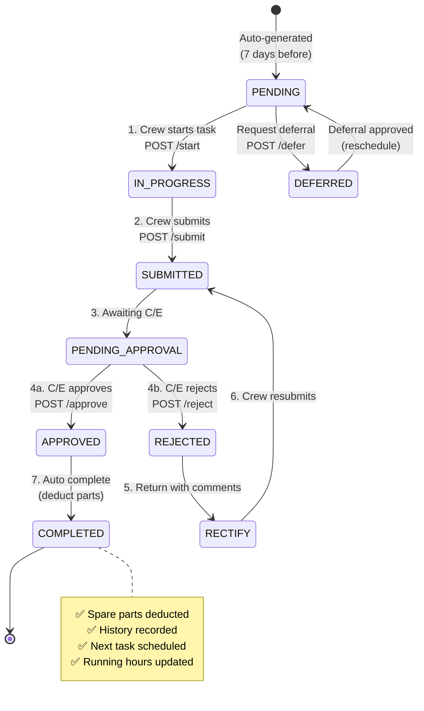
```mermaid
stateDiagram-v2
    [*] --> PENDING: Auto-generated<br/>(7 days before)
    
    PENDING --> IN_PROGRESS: 1. Crew starts task<br/>POST /start
    IN_PROGRESS --> SUBMITTED: 2. Crew submits<br/>POST /submit
    
    SUBMITTED --> PENDING_APPROVAL: 3. Awaiting C/E
    
    PENDING_APPROVAL --> APPROVED: 4a. C/E approves<br/>POST /approve
    PENDING_APPROVAL --> REJECTED: 4b. C/E rejects<br/>POST /reject
    
    REJECTED --> RECTIFY: 5. Return with comments
    RECTIFY --> SUBMITTED: 6. Crew resubmits
    
    APPROVED --> COMPLETED: 7. Auto complete<br/>(deduct parts)
    COMPLETED --> [*]
    
    PENDING --> DEFERRED: Request deferral<br/>POST /defer
    DEFERRED --> PENDING: Deferral approved<br/>(reschedule)
    
    note right of COMPLETED
        ✅ Spare parts deducted
        ✅ History recorded
        ✅ Next task scheduled
        ✅ Running hours updated
    end note
```

**Chi tiết từng bước:**

**Bước 1: START TASK**
- API: `POST /api/maintenance/tasks/{id}/start`
- Crew click "Start" trên mobile/web
- Validation:
  - Task phải ở trạng thái PENDING
  - Crew phải được assign
  - Certificates phải valid
- Actions:
  - Status → IN_PROGRESS
  - started_at = now()
  - started_by = current_user

**Bước 2: WORK & CHECKLIST**
- Crew thực hiện công việc
- Tick checklist items:
  - `PATCH /api/task-checklist-items/{id}` - Check/uncheck
  - `PUT /api/task-checklist-items/{id}` - Add notes
- Upload photos:
  - `POST /api/maintenance/tasks/{id}/photos`
  - Validation: Min photos = required_photos
- Ghi running hours (nếu cần):
  - `PATCH /api/equipment-assets/{id}/running-hours`

**Bước 3: SUBMIT**
- API: `POST /api/maintenance/tasks/{id}/submit`
- Validation:
  - Tất cả checklist items phải checked
  - Photos đủ số lượng yêu cầu
  - Notes không để trống (nếu required)
- Actions:
  - Status → SUBMITTED
  - submitted_at = now()
  - Notification → C/E (Chief Engineer)
  - Push notification: "Task ready for approval"

**Bước 4a: APPROVE (C/E)**
- API: `POST /api/task-workflow/approve/{taskId}`
- C/E review:
  - Xem checklist completed
  - Xem photos
  - Xem notes của crew
- Actions:
  - Status → APPROVED
  - approved_at = now()
  - approved_by = C/E user
  - Trigger auto-completion

**Bước 4b: REJECT (C/E)**
- API: `POST /api/task-workflow/reject/{taskId}`
- Body: `{"comments": "Need to check oil level again"}`
- Actions:
  - Status → REJECTED → RECTIFY
  - Notification → Assigned crew
  - Comments hiển thị trong task detail

**Bước 5-6: RECTIFY & RESUBMIT**
- Crew xem comments từ C/E
- Sửa lại công việc
- Resubmit → quay lại bước 3

**Bước 7: AUTO COMPLETE**
- Trigger khi APPROVED
- Actions:
  1. **Deduct spare parts:**
     ```sql
     FOR each spare_part in schedule_spare_parts:
       UPDATE materials 
       SET quantity = quantity - spare_part.quantity
       WHERE material_id = spare_part.material_id
     ```
  2. **Record history:**
     ```sql
     INSERT INTO maintenance_histories (
       task_id, equipment_id, completed_at, 
       completed_by, spare_parts_used, notes
     )
     ```
  3. **Update equipment:**
     ```sql
     UPDATE equipment_assets
     SET last_maintenance_date = now()
     WHERE id = task.equipment_id
     ```
  4. **Schedule next task:**
     ```
     IF schedule.interval_type == CALENDAR:
       next_due = completed_date + interval
     IF schedule.interval_type == RUNNING_HOURS:
       next_due_hours = current_hours + interval
     ```
  5. Status → COMPLETED

**Phần 5: Deferral System (Hoãn Task)**

**Khi nào deferral:**
- Thiếu phụ tùng
- Crew không đủ kỹ năng
- Điều kiện thời tiết không phù hợp
- Ưu tiên công việc khẩn cấp khác

**Tác vụ:**
- `POST /api/deferral-requests` - Tạo yêu cầu hoãn
- `GET /api/deferral-requests` - Danh sách yêu cầu
- `POST /api/deferral-requests/{id}/approve` - C/E phê duyệt
- `POST /api/deferral-requests/{id}/reject` - C/E từ chối

**Workflow Deferral:**
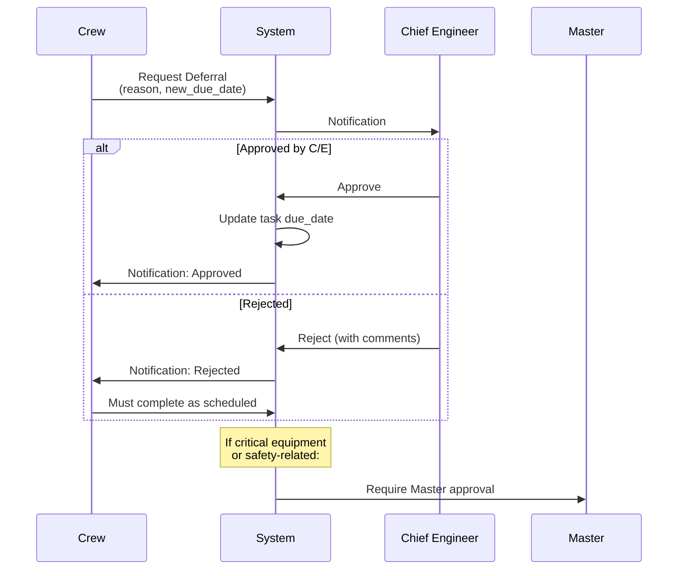
```mermaid
sequenceDiagram
    participant Crew
    participant System
    participant CE as Chief Engineer
    participant Master
    
    Crew->>System: Request Deferral<br/>(reason, new_due_date)
    System->>CE: Notification
    
    alt Approved by C/E
        CE->>System: Approve
        System->>System: Update task due_date
        System->>Crew: Notification: Approved
    else Rejected
        CE->>System: Reject (with comments)
        System->>Crew: Notification: Rejected
        Crew->>System: Must complete as scheduled
    end
    
    Note over System: If critical equipment<br/>or safety-related:
    System->>Master: Require Master approval
```

**Phần 6: Gantt Chart & Planning**

- Hiển thị timeline tất cả tasks
- Filter: By category, By priority, By crew
- Drag & drop để reschedule (if not auto-generated)
- Color coding:
  - 🔴 Overdue
  - 🟡 Due soon (< 7 days)
  - 🟢 On schedule
  - ⚪ Completed

**Phần 7: Low Stock Alerts**

- `GET /api/materials/low-stock` - Danh sách phụ tùng sắp hết
- Logic:
  ```sql
  SELECT * FROM materials
  WHERE quantity < minimum_stock
  ORDER BY (quantity / minimum_stock) ASC
  ```
- Notification khi < 50% minimum stock
- Email order request tự động
- **Database:** 6 bảng (equipment_assets, maintenance_schedules, schedule_spare_parts, maintenance_histories, equipment_groups, equipment_group_members)
- **Controllers:** MaintenanceController, MaintenanceScheduleController, EquipmentAssetController, TaskWorkflowController
- **Services:** MaintenanceSchedulerService (chạy 6 giờ/lần)

#### 4.1.3. Fuel Analytics (Phân Tích Nhiên Liệu)
- **Chức năng:**
  - Theo dõi tiêu thụ nhiên liệu thời gian thực
  - Tính toán hiệu suất (MT/NM, MT/h, SFOC g/kWh)
  - Tính phát thải CO2 (IMO emission factors)
  - Đánh giá CII Rating (A-E theo IMO MEPC.328(76))
  - Tính EEOI (Energy Efficiency Operational Indicator)
  - So sánh hiệu suất giữa các chuyến đi
  - Dự đoán tiêu thụ nhiên liệu
- **Tuân thủ:** IMO DCS, EU MRV, ISO 19030
- **Controllers:** FuelAnalyticsController
- **Endpoints:** 10+ API endpoints

#### 4.1.4. Crew Management (Quản Lý Thủy Thủ Đoàn)

**Tổng quan:** Module quản lý toàn diện thông tin thủy thủ đoàn, tuân thủ tiêu chuẩn STCW về đào tạo và chứng chỉ.

**Cấu trúc Database:**
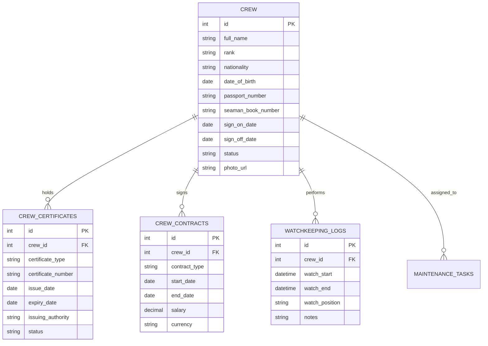
```mermaid
erDiagram
    CREW ||--o{ CREW_CERTIFICATES : holds
    CREW ||--o{ CREW_CONTRACTS : signs
    CREW ||--o{ WATCHKEEPING_LOGS : performs
    CREW ||--o{ MAINTENANCE_TASKS : assigned_to
    
    CREW {
        int id PK
        string full_name
        string rank
        string nationality
        date date_of_birth
        string passport_number
        string seaman_book_number
        date sign_on_date
        date sign_off_date
        string status
        string photo_url
    }
    
    CREW_CERTIFICATES {
        int id PK
        int crew_id FK
        string certificate_type
        string certificate_number
        date issue_date
        date expiry_date
        string issuing_authority
        string status
    }
    
    CREW_CONTRACTS {
        int id PK
        int crew_id FK
        string contract_type
        date start_date
        date end_date
        decimal salary
        string currency
    }
    
    WATCHKEEPING_LOGS {
        int id PK
        int crew_id FK
        datetime watch_start
        datetime watch_end
        string watch_position
        string notes
    }
```

**Tác vụ chính:**

1. **Quản lý hồ sơ thủy thủ (Crew Profile Management)**
   - `GET /api/crew` - Danh sách tất cả thủy thủ đoàn
   - `GET /api/crew/onboard` - Danh sách thủy thủ đang trên tàu
   - `GET /api/crew/{id}` - Xem chi tiết hồ sơ cá nhân
   - `POST /api/crew` - Thêm thành viên mới
   - `PUT /api/crew/{id}` - Cập nhật thông tin
   - `DELETE /api/crew/{id}` - Xóa (soft delete)
   - **Thông tin quản lý:** Họ tên, chức danh, quốc적, ngày sinh, passport, sổ thủy thủ, ảnh 3x4

2. **Quản lý chứng chỉ STCW (Certificate Management)**
   - `GET /api/crew/{id}/certificates` - Danh sách chứng chỉ của thủy thủ
   - `POST /api/crew/{id}/certificates` - Thêm chứng chỉ mới
   - `PUT /api/crew/certificates/{certId}` - Cập nhật chứng chỉ
   - `GET /api/crew/certificates/expiring` - Chứng chỉ sắp hết hạn (< 90 ngày)
   - `GET /api/crew/certificates/expired` - Chứng chỉ đã hết hạn
   - **Loại chứng chỉ:** 
     - Certificate of Competency (COC)
     - Basic Safety Training (BST)
     - Advanced Fire Fighting (AFF)
     - Medical First Aid (MFA)
     - GMDSS Radio Operator
     - Ship Security Officer (SSO)
     - Tanker Safety (for oil/gas tankers)
   - **Cảnh báo tự động:** Email/notification trước 90, 60, 30 ngày hết hạn

3. **Lên lịch trực ca (Watchkeeping Scheduling)**
   - `GET /api/watchkeeping/schedule` - Lịch trực ca hiện tại
   - `POST /api/watchkeeping/schedule` - Tạo lịch trực mới
   - `GET /api/watchkeeping/logs` - Lịch sử trực ca
   - `POST /api/watchkeeping/logs` - Ghi nhận ca trực
   - **Ca trực:** 
     - 00:00-04:00 (Night Watch)
     - 04:00-08:00 (Morning Watch)
     - 08:00-12:00 (Forenoon Watch)
     - 12:00-16:00 (Afternoon Watch)
     - 16:00-20:00 (First Dog Watch)
     - 20:00-00:00 (Second Dog Watch)
   - **Vị trí:** Officer on Watch (OOW), Lookout, Engine Room Watch

4. **Quản lý hợp đồng (Contract Management)**
   - `GET /api/crew/{id}/contracts` - Danh sách hợp đồng
   - `POST /api/crew/{id}/contracts` - Tạo hợp đồng mới
   - `PUT /api/crew/contracts/{id}` - Cập nhật hợp đồng
   - `GET /api/crew/contracts/ending-soon` - Hợp đồng sắp hết hạn
   - **Thông tin:** Loại hợp đồng, ngày bắt đầu/kết thúc, lương, tiền tệ

5. **Báo cáo thủy thủ đoàn (Crew Reporting)**
   - `GET /api/crew/reports/composition` - Báo cáo cơ cấu thủy thủ
   - `GET /api/crew/reports/certificates-summary` - Tổng hợp chứng chỉ
   - `GET /api/crew/reports/watchkeeping-hours` - Báo cáo giờ trực
   - `POST /api/crew/reports/monthly` - Báo cáo tháng (tự động)

**Workflow ký tàu (Sign On/Off):**
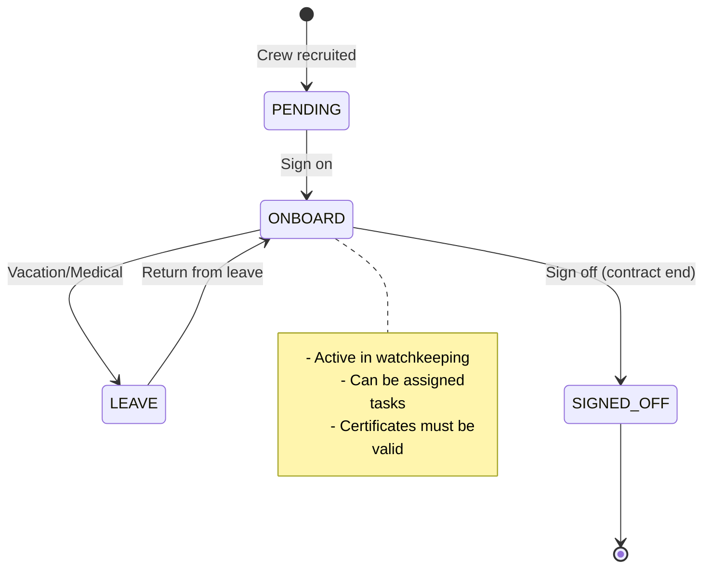
```mermaid
stateDiagram-v2
    [*] --> PENDING: Crew recruited
    PENDING --> ONBOARD: Sign on
    ONBOARD --> LEAVE: Vacation/Medical
    LEAVE --> ONBOARD: Return from leave
    ONBOARD --> SIGNED_OFF: Sign off (contract end)
    SIGNED_OFF --> [*]
    
    note right of ONBOARD
        - Active in watchkeeping
        - Can be assigned tasks
        - Certificates must be valid
    end note
```

**Dashboard Crew Management:**
- **Tab 1: Onboard Crew** - Danh sách thủy thủ đang trên tàu
- **Tab 2: All Crew** - Tất cả thủy thủ (bao gồm đã sign off)
- **Tab 3: Certificates** - Quản lý chứng chỉ với filter (Expiring/Expired/Valid)
- **Tab 4: Reports** - Báo cáo và thống kê

**Controllers:** CrewController, WatchkeepingController
**Tuân thủ:** STCW Convention, MLC 2006 (Maritime Labour Convention)

#### 4.1.5. Voyage Management (Quản Lý Hành Trình)
- **Chức năng:**
  - Lập kế hoạch hành trình
  - Nhật ký hành trình (Voyage Log)
  - Theo dõi hàng hóa (Cargo)
  - Quản lý cảng đến/đi
  - Tính toán quãng đường và thời gian
- **Controllers:** VoyageController, VoyageLogController

#### 4.1.6. Safety Alarms (Cảnh Báo An Toàn)
- **Chức năng:**
  - Hệ thống cảnh báo tự động
  - Phân loại mức độ (Critical, Warning, Info)
  - Ghi nhận và xác nhận cảnh báo
  - Thông báo push cho mobile app
- **Controllers:** AlarmsController

#### 4.1.7. Reporting System (Báo Cáo)

**Tổng quan:** Hệ thống báo cáo tự động và manual, tuân thủ IMO, MARPOL, với khả năng export Excel/PDF.

**Cấu trúc Database:**
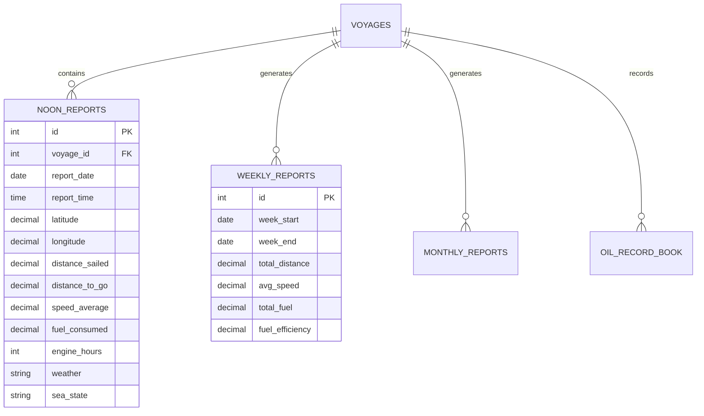
```mermaid
erDiagram
    VOYAGES ||--o{ NOON_REPORTS : contains
    VOYAGES ||--o{ WEEKLY_REPORTS : generates
    VOYAGES ||--o{ MONTHLY_REPORTS : generates
    VOYAGES ||--o{ OIL_RECORD_BOOK : records
    
    NOON_REPORTS {
        int id PK
        int voyage_id FK
        date report_date
        time report_time
        decimal latitude
        decimal longitude
        decimal distance_sailed
        decimal distance_to_go
        decimal speed_average
        decimal fuel_consumed
        int engine_hours
        string weather
        string sea_state
    }
    
    WEEKLY_REPORTS {
        int id PK
        date week_start
        date week_end
        decimal total_distance
        decimal avg_speed
        decimal total_fuel
        decimal fuel_efficiency
    }
```

**Phần 1: Noon Reports (Báo cáo Giữa Trưa)**

**Tác vụ:**
- `GET /api/noon-reports` - Danh sách báo cáo
- `GET /api/noon-reports/{id}` - Chi tiết báo cáo
- `POST /api/noon-reports` - Tạo báo cáo mới
- `PUT /api/noon-reports/{id}` - Cập nhật báo cáo
- `POST /api/noon-reports/{id}/submit` - Submit to shore
- `GET /api/noon-reports/template` - Template form

**Thời gian báo cáo:** Mỗi ngày lúc 12:00 (noon) ship time

**Nội dung Noon Report:**

```json
{
  "report_date": "2025-12-24",
  "report_time": "12:00",
  
  "position": {
    "latitude": 1.2345,
    "longitude": 103.5678,
    "position_text": "01°14.07'N, 103°34.07'E"
  },
  
  "voyage_info": {
    "course": 135,
    "speed_average": 14.5,
    "distance_sailed_24h": 348,
    "distance_to_next_port": 1250,
    "eta_next_port": "2025-12-28 08:00"
  },
  
  "engine_performance": {
    "main_engine_hours": 15234.5,
    "rpm_average": 72,
    "output_average_kw": 8500,
    "generator_1_hours": 12,
    "generator_2_hours": 12,
    "generator_3_hours": 0
  },
  
  "fuel_consumption_24h": {
    "hfo_main_engine": 28.5,
    "hfo_generators": 2.1,
    "mdo_main_engine": 0.5,
    "mdo_generators": 0.3,
    "total_fo": 31.4
  },
  
  "fuel_rob": {
    "hfo_rob": 450.2,
    "mdo_rob": 85.5,
    "lube_oil_rob": 15.3
  },
  
  "weather": {
    "wind_direction": "NE",
    "wind_force_bft": 4,
    "sea_state_douglas": 3,
    "swell_direction": "E",
    "swell_height": 1.5,
    "air_temp": 28.5,
    "sea_temp": 27.8,
    "barometer": 1012.5
  },
  
  "remarks": "All systems normal. Fair weather."
}
```

**Auto-calculations trong Noon Report:**

1. **Fuel Efficiency:**
   ```
   Efficiency (MT/NM) = Total Fuel Consumed / Distance Sailed
   ```

2. **SFOC (Specific Fuel Oil Consumption):**
   ```
   SFOC (g/kWh) = (Fuel × 1000000) / (Power × Hours)
   ```

3. **Speed Performance:**
   ```
   Speed Loss = Design Speed - Actual Speed
   ```

4. **ETA Calculation:**
   ```
   ETA = Current Time + (Distance to Go / Average Speed)
   ```

**Workflow Noon Report:**
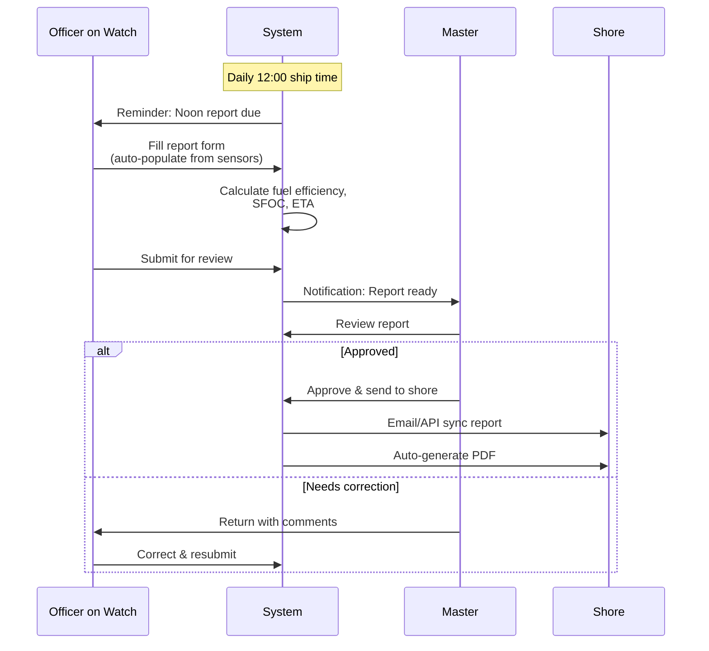
```mermaid
sequenceDiagram
    participant OOW as Officer on Watch
    participant System
    participant Master
    participant Shore
    
    Note over System: Daily 12:00 ship time
    System->>OOW: Reminder: Noon report due
    
    OOW->>System: Fill report form<br/>(auto-populate from sensors)
    System->>System: Calculate fuel efficiency,<br/>SFOC, ETA
    OOW->>System: Submit for review
    
    System->>Master: Notification: Report ready
    Master->>System: Review report
    
    alt Approved
        Master->>System: Approve & send to shore
        System->>Shore: Email/API sync report
        System->>Shore: Auto-generate PDF
    else Needs correction
        Master->>OOW: Return with comments
        OOW->>System: Correct & resubmit
    end
```

**Phần 2: Weekly Aggregate Reports**

**Tác vụ:**
- `GET /api/reports/weekly` - Danh sách báo cáo tuần
- `GET /api/reports/weekly/{id}` - Chi tiết báo cáo
- `POST /api/reports/weekly/generate` - Tạo báo cáo (auto)
- `GET /api/reports/weekly/current` - Báo cáo tuần hiện tại

**Chu kỳ:** Mỗi tuần (Sunday 23:59 → Monday 00:00)

**Nội dung Weekly Report:**

```json
{
  "week_start": "2025-12-15",
  "week_end": "2025-12-21",
  "vessel_name": "MV Ocean Star",
  
  "summary": {
    "total_distance_nm": 2450,
    "average_speed_knots": 14.6,
    "steaming_days": 7,
    "port_days": 0,
    "total_fuel_consumed_mt": 220.5,
    "fuel_efficiency_mt_per_nm": 0.090
  },
  
  "fuel_breakdown": {
    "hfo_main_engine": 195.5,
    "hfo_generators": 15.2,
    "mdo_main_engine": 3.5,
    "mdo_generators": 2.1,
    "lube_oil_consumed": 4.2
  },
  
  "engine_performance": {
    "main_engine_hours": 168,
    "average_rpm": 73,
    "average_power_kw": 8750,
    "generator_1_hours": 84,
    "generator_2_hours": 84,
    "generator_3_hours": 0
  },
  
  "environmental": {
    "co2_emissions_tons": 695.6,
    "eeoi_g_per_ton_nm": 12.5,
    "cii_rating": "B"
  },
  
  "maintenance": {
    "tasks_completed": 12,
    "tasks_pending": 5,
    "tasks_overdue": 0,
    "spare_parts_used": 25
  },
  
  "safety": {
    "alarms_total": 45,
    "alarms_critical": 0,
    "alarms_warning": 3,
    "drills_conducted": 1,
    "incidents": 0
  },
  
  "crew": {
    "onboard_count": 22,
    "certificates_expiring_30d": 2,
    "sick_leave_hours": 0,
    "overtime_hours": 35
  }
}
```

**SQL Aggregation (Optimized):**
```sql
-- Fuel consumption summary
SELECT 
  SUM(hfo_main_engine) as total_hfo_me,
  SUM(mdo_main_engine) as total_mdo_me,
  AVG(speed_average) as avg_speed,
  SUM(distance_sailed) as total_distance
FROM noon_reports
WHERE report_date BETWEEN @week_start AND @week_end
GROUP BY 1; -- Single aggregation

-- Performance: 200-300ms (vs 800ms before optimization)
```

**Phần 3: Monthly Aggregate Reports**

**Tác vụ:**
- `GET /api/reports/monthly` - Danh sách báo cáo tháng
- `GET /api/reports/monthly/{id}` - Chi tiết báo cáo
- `POST /api/reports/monthly/generate` - Tạo báo cáo

**Chu kỳ:** Cuối mỗi tháng (last day 23:59)

**Nội dung:** Tương tự Weekly nhưng:
- Aggregated data cho cả tháng
- Trend analysis (so với tháng trước)
- KPI tracking
- Budget vs actual comparison

**Additional sections:**
```json
{
  "performance_trends": {
    "fuel_efficiency_trend": "↓ 5% improvement",
    "speed_loss_trend": "↑ 2% increased",
    "maintenance_completion_rate": "95%"
  },
  
  "budget_analysis": {
    "fuel_budget_mt": 950,
    "fuel_actual_mt": 920,
    "variance": -30,
    "savings_usd": 18000
  },
  
  "compliance": {
    "imo_dcs_reported": true,
    "oil_record_book_updated": true,
    "crew_certificates_valid": true,
    "solas_drills_completed": true
  }
}
```

**Phần 4: Oil Record Book (MARPOL Annex I)**

**Tác vụ:**
- `GET /api/oil-record-book` - Danh sách entries
- `POST /api/oil-record-book` - Tạo entry mới
- `GET /api/oil-record-book/export` - Export to PDF (official format)

**Loại entry:**

1. **Code A - Ballasting/Cleaning of Cargo Tanks**
2. **Code B - Non-automatic discharge of bilge water**
3. **Code C - Discharge from machinery space**
4. **Code D - Bunkering operations**
5. **Code E - Transfer of oil cargo**
6. **Code F - Accidental discharge**

**Format entry:**
```json
{
  "entry_number": "2025-001",
  "entry_date": "2025-12-24",
  "entry_time": "14:30",
  "code": "D",
  "operation": "Bunkering - HFO",
  "position": "01°14'N, 103°34'E",
  "quantity_loaded": 250.5,
  "quantity_transferred": 0,
  "quantity_retained": 250.5,
  "tank_from": "Shore",
  "tank_to": "Fuel Oil Tank No.2",
  "authorized_by": "Chief Engineer",
  "signature": "[Digital signature]"
}
```

**Phần 5: Export Functionality**

**Excel Export:**
- `GET /api/reports/{id}/export/excel`
- Library: EPPlus (C#)
- Format: .xlsx
- Features:
  - Multiple sheets
  - Charts included
  - Formatted tables
  - Auto-fit columns

**PDF Export:**
- `GET /api/reports/{id}/export/pdf`
- Library: iTextSharp / QuestPDF
- Format: Professional maritime report
- Features:
  - Company logo/header
  - Digital signature
  - Page numbers
  - Table of contents

**Email Auto-send:**
```csharp
// After report generation
if (report.AutoSendToShore) {
  var pdf = GeneratePDF(report);
  await emailService.SendAsync(
    to: "fleet@company.com",
    subject: $"Weekly Report - {vesselName}",
    attachments: [pdf]
  );
}
```

**Phần 6: Performance Optimization**

**Before:**
```csharp
// ❌ Slow: Multiple queries + in-memory aggregation
var reports = await db.NoonReports
  .Where(r => r.Date >= startDate && r.Date <= endDate)
  .ToListAsync(); // Load all to memory

var totalFuel = reports.Sum(r => r.FuelConsumed);
var avgSpeed = reports.Average(r => r.Speed);
// 800-1000ms
```

**After:**
```csharp
// ✅ Fast: Single SQL-side aggregation
var summary = await db.NoonReports
  .Where(r => r.Date >= startDate && r.Date <= endDate)
  .GroupBy(r => 1) // Aggregate all
  .Select(g => new {
    TotalFuel = g.Sum(r => r.FuelConsumed),
    AvgSpeed = g.Average(r => r.Speed),
    TotalDistance = g.Sum(r => r.Distance)
  })
  .FirstOrDefaultAsync();
// 200-300ms (60-70% faster)
```

**Parallel Queries:**
```csharp
var tasks = await Task.WhenAll(
  GetFuelSummary(startDate, endDate),
  GetMaintenanceSummary(startDate, endDate),
  GetSafetySummary(startDate, endDate)
);
// Run 3 independent queries in parallel
```

**Dashboard Reporting:**
- **Tab 1: Noon Reports** - Daily reports list
- **Tab 2: Weekly Reports** - Weekly aggregates
- **Tab 3: Monthly Reports** - Monthly summaries
- **Tab 4: Oil Record Book** - MARPOL entries
- **Tab 5: Export** - Download options

**Controllers:** ReportingController, AggregateReportController, OilRecordBookController
**Tối ưu:** SQL-side aggregation, Parallel queries, 60-70% faster

#### 4.1.8. Materials Management (Quản Lý Vật Tư)

**Tổng quan:** Hệ thống quản lý kho vật tư, phụ tùng thay thế, theo dõi nhập/xuất và cảnh báo tồn kho.

**Cấu trúc Database:**
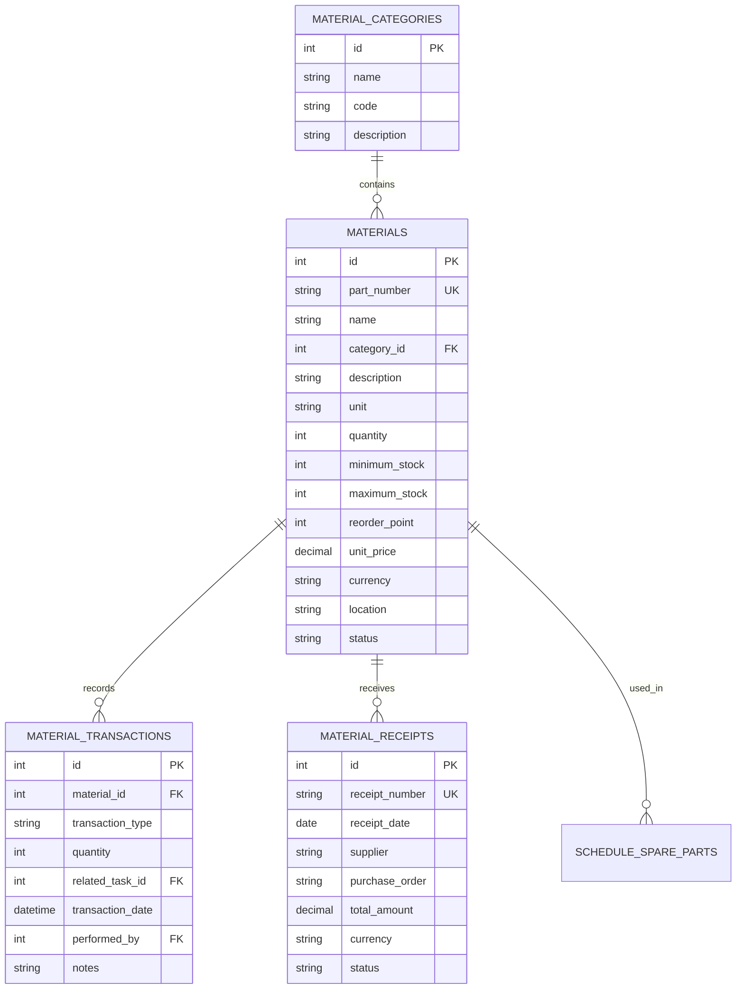
```mermaid
erDiagram
    MATERIAL_CATEGORIES ||--o{ MATERIALS : contains
    MATERIALS ||--o{ MATERIAL_TRANSACTIONS : records
    MATERIALS ||--o{ MATERIAL_RECEIPTS : receives
    MATERIALS ||--o{ SCHEDULE_SPARE_PARTS : used_in
    
    MATERIALS {
        int id PK
        string part_number UK
        string name
        int category_id FK
        string description
        string unit
        int quantity
        int minimum_stock
        int maximum_stock
        int reorder_point
        decimal unit_price
        string currency
        string location
        string status
    }
    
    MATERIAL_CATEGORIES {
        int id PK
        string name
        string code
        string description
    }
    
    MATERIAL_TRANSACTIONS {
        int id PK
        int material_id FK
        string transaction_type
        int quantity
        int related_task_id FK
        datetime transaction_date
        int performed_by FK
        string notes
    }
    
    MATERIAL_RECEIPTS {
        int id PK
        string receipt_number UK
        date receipt_date
        string supplier
        string purchase_order
        decimal total_amount
        string currency
        string status
    }
```

**Phần 1: Materials Catalog (Danh mục Vật tư)**

**Tác vụ:**
- `GET /api/materials` - Danh sách vật tư (có pagination)
- `GET /api/materials?category={id}` - Lọc theo danh mục
- `GET /api/materials?search={keyword}` - Tìm kiếm
- `GET /api/materials/{id}` - Chi tiết vật tư
- `POST /api/materials` - Thêm vật tư mới
- `PUT /api/materials/{id}` - Cập nhật thông tin
- `DELETE /api/materials/{id}` - Xóa (soft delete)
- `POST /api/materials/import` - Import từ Excel

**Danh mục vật tư (Categories):**

1. **Lubricants** - Dầu nhớt
   - Engine oil, Hydraulic oil, Gear oil
   - Cylinder oil, Compressor oil
   
2. **Filters** - Bộ lọc
   - Oil filters, Fuel filters, Air filters
   - Water filters, Hydraulic filters

3. **Bearings** - Ổ bi, ổ trục

4. **Seals & Gaskets** - Gioăng, phớt

5. **Belts & Hoses** - Dây đai, ống mềm

6. **Electrical Components** - Linh kiện điện
   - Fuses, Relays, Contactors
   - Circuit breakers, Lamps

7. **Valves** - Van
   - Safety valves, Control valves
   - Check valves, Ball valves

8. **Pumps & Spare Parts** - Bơm và phụ tùng

9. **Engine Spare Parts** - Phụ tùng động cơ
   - Piston rings, Fuel injectors
   - Turbocharger parts

10. **Safety Equipment** - Thiết bị an toàn
    - Life jackets, Fire extinguishers
    - Emergency lights

11. **Navigation Spares** - Phụ tùng hàng hải

12. **Paints & Chemicals** - Sơn và hóa chất

**Thông tin mỗi vật tư:**
```json
{
  "part_number": "ME-OIL-15W40",
  "name": "Main Engine Oil SAE 15W-40",
  "category_id": 1,
  "description": "Mineral lubricating oil for main engine",
  "unit": "liters",
  "quantity": 800,
  "minimum_stock": 500,
  "maximum_stock": 2000,
  "reorder_point": 600,
  "unit_price": 5.50,
  "currency": "USD",
  "location": "Store Room A, Shelf 3",
  "manufacturer": "Shell",
  "status": "IN_STOCK"
}
```

**Phần 2: Stock Management (Quản lý Tồn kho)**

**Real-time Inventory:**
- `GET /api/materials/stock-status` - Tổng quan tồn kho
  - Total items
  - Low stock items
  - Out of stock items
  - Overstocked items

**Stock Levels:**
```
🔴 Out of Stock: quantity = 0
🟡 Low Stock: quantity < minimum_stock
🟢 Optimal Stock: minimum_stock ≤ quantity ≤ maximum_stock
🟠 Overstocked: quantity > maximum_stock
```

**Reorder Point:**
```
Reorder Point = (Average Daily Usage × Lead Time) + Safety Stock

Example:
- Average daily usage = 10 liters
- Lead time = 30 days (port to port)
- Safety stock = 300 liters
→ Reorder point = (10 × 30) + 300 = 600 liters
```

**Low Stock Alerts:**
- `GET /api/materials/low-stock` - Vật tư dưới mức tối thiểu
- Notification:
  - Email to C/E và Purchasing dept
  - Dashboard warning badge
  - Daily report (8:00 AM ship time)

**Phần 3: Material Transactions (Giao dịch Nhập/Xuất)**

**Tác vụ:**
- `GET /api/materials/{id}/transactions` - Lịch sử giao dịch
- `POST /api/materials/transactions` - Ghi nhận giao dịch
- `GET /api/materials/transactions/summary` - Báo cáo tổng hợp

**Loại giao dịch:**

1. **RECEIPT** - Nhập kho
   - Khi nhận hàng từ port
   - Quantity tăng (+)
   - Ghi nhận receipt number, supplier

2. **ISSUE** - Xuất kho (thủ công)
   - Crew lấy vật tư cho công việc
   - Quantity giảm (-)
   - Ghi nhận người lấy, mục đích

3. **AUTO_DEDUCT** - Trừ tự động
   - Khi PMS task completed
   - Quantity giảm (-)
   - Link với task_id

4. **ADJUSTMENT** - Điều chỉnh
   - Inventory reconciliation
   - Có thể + hoặc -
   - Ghi nhận lý do

5. **TRANSFER** - Chuyển kho
   - Di chuyển giữa các vị trí
   - Quantity không đổi, location thay đổi

6. **RETURN** - Trả lại
   - Vật tư không sử dụng hết
   - Quantity tăng (+)

**Workflow Issue Material:**
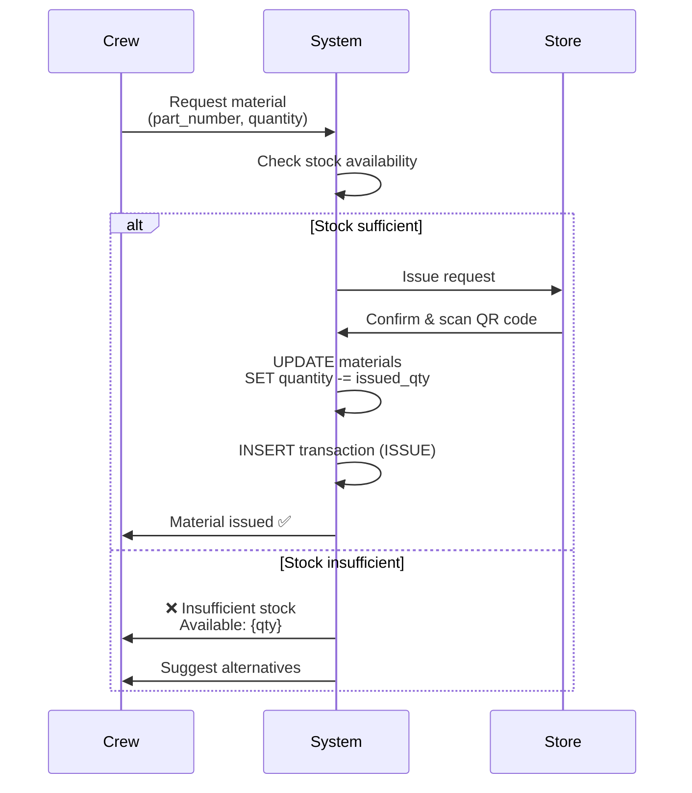
```mermaid
sequenceDiagram
    participant Crew
    participant System
    participant Store
    
    Crew->>System: Request material<br/>(part_number, quantity)
    System->>System: Check stock availability
    
    alt Stock sufficient
        System->>Store: Issue request
        Store->>System: Confirm & scan QR code
        System->>System: UPDATE materials<br/>SET quantity -= issued_qty
        System->>System: INSERT transaction (ISSUE)
        System->>Crew: Material issued ✅
    else Stock insufficient
        System->>Crew: ❌ Insufficient stock<br/>Available: {qty}
        System->>Crew: Suggest alternatives
    end
```

**Phần 4: Material Receipts (Phiếu Nhập Kho)**

**Tác vụ:**
- `GET /api/material-receipts` - Danh sách phiếu nhập
- `GET /api/material-receipts/{id}` - Chi tiết phiếu
- `POST /api/material-receipts` - Tạo phiếu nhập mới
- `PUT /api/material-receipts/{id}` - Cập nhật phiếu
- `POST /api/material-receipts/{id}/items` - Thêm item vào phiếu
- `POST /api/material-receipts/{id}/confirm` - Xác nhận nhận hàng

**Workflow Receipt:**

1. **Create Receipt Draft:**
   ```json
   POST /api/material-receipts
   {
     "receipt_number": "REC-2025-001",
     "receipt_date": "2025-12-24",
     "supplier": "Marine Supply Co.",
     "purchase_order": "PO-2025-123",
     "port": "Singapore",
     "items": [
       {
         "material_id": 1,
         "quantity": 500,
         "unit_price": 5.50
       },
       {
         "material_id": 2,
         "quantity": 100,
         "unit_price": 12.00
       }
     ]
   }
   ```

2. **Review & Inspect:**
   - C/E hoặc Store Keeper kiểm tra hàng
   - So sánh với Purchase Order
   - Check chất lượng

3. **Confirm Receipt:**
   ```
   POST /api/material-receipts/{id}/confirm
   ```
   - Status → CONFIRMED
   - Update stock:
     ```sql
     FOR each item:
       UPDATE materials
       SET quantity = quantity + item.quantity
       WHERE id = item.material_id
     ```
   - Create transactions (RECEIPT type)

4. **Generate Report:**
   - PDF receipt document
   - Email to Purchasing dept
   - Archive in system

**Phần 5: Import from Excel**

**Format Excel template:**
```
| Part Number | Name | Category | Unit | Quantity | Min Stock | Location |
|-------------|------|----------|------|----------|-----------|----------|
| ME-OIL-001  | ...  | Lubri... | L    | 500      | 300       | Store A  |
```

**Tác vụ:**
- `POST /api/materials/import`
- Validation:
  - Part number unique
  - Category exists
  - Quantity >= 0
  - Required fields not empty
- Error handling:
  - Row-by-row validation
  - Skip invalid rows
  - Return error report

**Phần 6: Reports & Analytics**

1. **Stock Valuation Report:**
   ```
   Total Value = Σ(quantity × unit_price)
   ```
   - By category
   - By location

2. **Consumption Report:**
   - Material usage per month
   - Top 10 consumed items
   - Trend analysis

3. **Purchase History:**
   - Suppliers performance
   - Price trends
   - Lead time analysis

4. **Inventory Turnover:**
   ```
   Turnover = Cost of Goods Issued / Average Inventory Value
   ```

**Dashboard Materials:**
- **Tab 1: Inventory** - Danh sách vật tư với real-time stock
- **Tab 2: Transactions** - Lịch sử nhập/xuất
- **Tab 3: Receipts** - Phiếu nhập kho
- **Tab 4: Low Stock** - Cảnh báo tồn kho thấp
- **Tab 5: Reports** - Báo cáo và thống kê

**Controllers:** MaterialController, MaterialReceiptsController

#### 4.1.9. Compliance Management (Tuân Thủ)
- **Chức năng:**
  - Theo dõi tuân thủ IMO
  - Báo cáo SOLAS
  - Báo cáo MARPOL
  - ISM Code compliance
- **Controllers:** ComplianceController

#### 4.1.10. Sync System (Đồng Bộ Tàu-Bờ)
- **Chức năng:**
  - Queue-based synchronization
  - Priority-based sync (Critical > Operational > Low)
  - Delta sync (82% bandwidth savings)
  - Retry mechanism
  - Store-and-forward
- **Controllers:** SyncController
- **Chiến lược:** Offline-first architecture

### 4.2. Module Shore System (Trên Bờ)

#### 4.2.1. Fleet Management
- Quản lý đội tàu từ trung tâm
- Multi-vessel monitoring
- Comparative analytics

#### 4.2.2. Port Integration
- Tích hợp với hệ thống cảng
- EDI messaging
- Customs clearance

#### 4.2.3. Regulatory Reporting
- Báo cáo tuân thủ tự động
- IMO DCS submission
- EU MRV reporting

---

## 5. TÍNH NĂNG ĐÃ TRIỂN KHAI

### 5.1. Dashboard Overview

#### Edge Dashboard (9 Pages Implemented)

| Page | Trạng thái | Mô Tả |
|------|-----------|-------|
| **Dashboard** | ✅ Completed | Live telemetry với real-time updates |
| **Crew Management** | ✅ Completed | 4 tabs (Onboard/All/Certificates/Reports) |
| **Maintenance PMS** | ✅ Completed | 4 tabs (Pending/Overdue/All/Calendar) |
| **Fuel Analytics** | ✅ Completed | Dashboard, CII Rating, Monthly Comparison |
| **Voyage Management** | ✅ Completed | Voyage planning & tracking |
| **Reporting** | ✅ Completed | Weekly/Monthly/Noon reports |
| **Materials** | ✅ Completed | Inventory & receipts |
| **Navigation** | 🚧 Stub | Map & position tracking |
| **Engine Monitor** | 🚧 Stub | Engine performance charts |
| **Alarms** | 🚧 Stub | Alert management |
| **Sync Status** | 🚧 Stub | Data synchronization |

### 5.2. Mobile App (Flutter)

| Tính Năng | Trạng thái | Mô Tả |
|-----------|-----------|-------|
| **Authentication** | ✅ | JWT-based login |
| **My Tasks** | ✅ | Danh sách task được giao |
| **Task Details** | ✅ | Xem chi tiết task |
| **Start Task** | ✅ | Bắt đầu làm task |
| **Complete Task** | ⚠️ | Cần update workflow (Submit flow) |
| **Checklist Items** | ✅ | Tick các mục checklist |
| **Photo Upload** | ⚠️ | Cần validation |
| **Alarms** | ✅ | Xem và xác nhận cảnh báo |
| **Profile** | ✅ | Thông tin cá nhân |
| **Offline Mode** | ✅ | Hive local storage |
| **Push Notifications** | ❌ | Chưa triển khai |

### 5.3. API Endpoints Summary

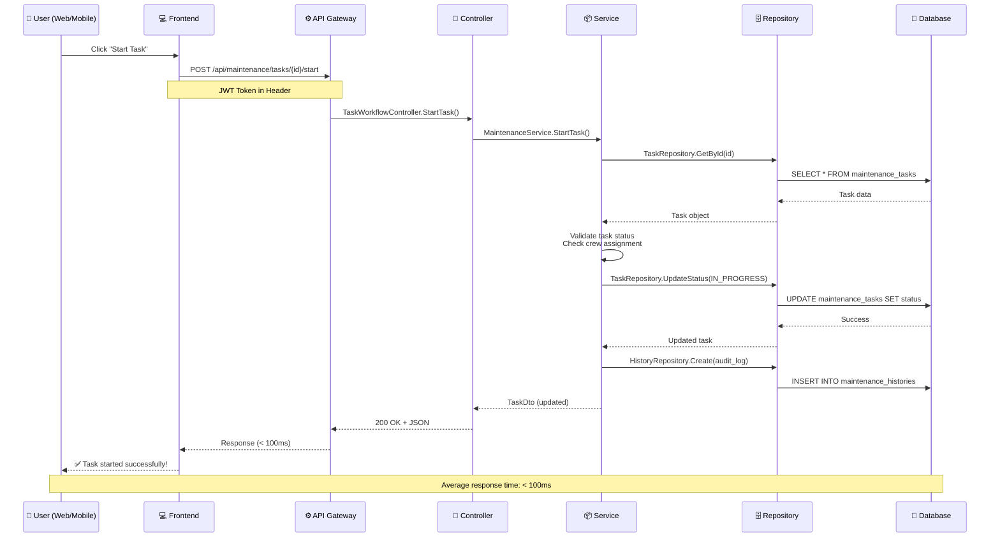
```mermaid
sequenceDiagram
    participant U as 👤 User (Web/Mobile)
    participant F as 💻 Frontend
    participant A as ⚙️ API Gateway
    participant C as 🎯 Controller
    participant S as 📦 Service
    participant R as 🗄️ Repository
    participant D as 💾 Database
    
    U->>F: Click "Start Task"
    F->>A: POST /api/maintenance/tasks/{id}/start
    Note over F,A: JWT Token in Header
    
    A->>C: TaskWorkflowController.StartTask()
    C->>S: MaintenanceService.StartTask()
    
    S->>R: TaskRepository.GetById(id)
    R->>D: SELECT * FROM maintenance_tasks
    D-->>R: Task data
    R-->>S: Task object
    
    S->>S: Validate task status<br/>Check crew assignment
    
    S->>R: TaskRepository.UpdateStatus(IN_PROGRESS)
    R->>D: UPDATE maintenance_tasks SET status
    D-->>R: Success
    R-->>S: Updated task
    
    S->>R: HistoryRepository.Create(audit_log)
    R->>D: INSERT INTO maintenance_histories
    
    S-->>C: TaskDto (updated)
    C-->>A: 200 OK + JSON
    A-->>F: Response (< 100ms)
    F-->>U: ✅ Task started successfully!
    
    Note over U,D: Average response time: < 100ms
```

#### Edge Backend APIs (25+ Controllers)

| Controller | Số Endpoints | Chức Năng Chính |
|------------|--------------|-----------------|
| TelemetryController | 8 | Vessel telemetry data |
| MaintenanceController | 12 | Task CRUD operations |
| TaskWorkflowController | 6 | Workflow actions (submit, approve, defer) |
| EquipmentAssetController | 8 | Equipment catalog |
| MaintenanceScheduleController | 5 | Schedule management |
| FuelAnalyticsController | 10+ | Fuel efficiency analysis |
| CrewController | 10 | Crew management |
| VoyageController | 8 | Voyage planning |
| VoyageLogController | 6 | Voyage log entries |
| AlarmsController | 7 | Alarm management |
| MaterialController | 12 | Material inventory |
| ReportingController | 8 | Report generation |
| AggregateReportController | 4 | Weekly/Monthly reports |
| DeferralRequestController | 7 | Deferral system |
| WatchkeepingController | 6 | Watch scheduling |
| SyncController | 5 | Data synchronization |
| AuthController | 4 | Authentication |
| **TOTAL** | **125+** | **25+ Controllers** |

### 5.4. Database Schema

#### Edge Database (48 Tables)

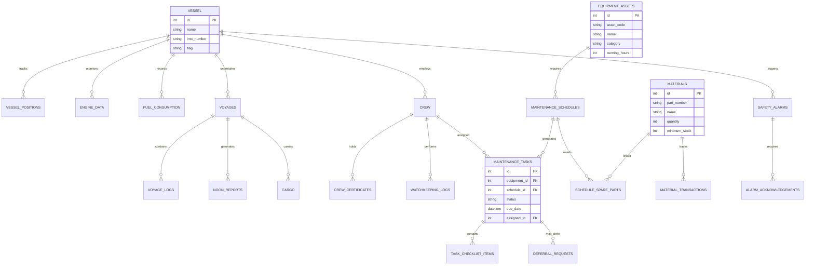
```mermaid
erDiagram
    VESSEL ||--o{ VESSEL_POSITIONS : tracks
    VESSEL ||--o{ ENGINE_DATA : monitors
    VESSEL ||--o{ FUEL_CONSUMPTION : records
    VESSEL ||--o{ VOYAGES : undertakes
    
    VOYAGES ||--o{ VOYAGE_LOGS : contains
    VOYAGES ||--o{ NOON_REPORTS : generates
    VOYAGES ||--o{ CARGO : carries
    
    VESSEL ||--o{ CREW : employs
    CREW ||--o{ CREW_CERTIFICATES : holds
    CREW ||--o{ WATCHKEEPING_LOGS : performs
    CREW ||--o{ MAINTENANCE_TASKS : assigned
    
    EQUIPMENT_ASSETS ||--o{ MAINTENANCE_SCHEDULES : requires
    MAINTENANCE_SCHEDULES ||--o{ MAINTENANCE_TASKS : generates
    MAINTENANCE_TASKS ||--o{ TASK_CHECKLIST_ITEMS : contains
    MAINTENANCE_TASKS ||--o{ DEFERRAL_REQUESTS : may_defer
    
    MAINTENANCE_SCHEDULES ||--o{ SCHEDULE_SPARE_PARTS : needs
    MATERIALS ||--o{ SCHEDULE_SPARE_PARTS : linked
    MATERIALS ||--o{ MATERIAL_TRANSACTIONS : tracks
    
    VESSEL ||--o{ SAFETY_ALARMS : triggers
    SAFETY_ALARMS ||--o{ ALARM_ACKNOWLEDGEMENTS : requires
    
    VESSEL {
        int id PK
        string name
        string imo_number
        string flag
    }
    
    MAINTENANCE_TASKS {
        int id PK
        int equipment_id FK
        int schedule_id FK
        string status
        datetime due_date
        int assigned_to FK
    }
    
    EQUIPMENT_ASSETS {
        int id PK
        string asset_code
        string name
        string category
        int running_hours
    }
    
    MATERIALS {
        int id PK
        string part_number
        string name
        int quantity
        int minimum_stock
    }
```

| Nhóm | Số Bảng | Bảng Chính |
|------|---------|-----------|
| **Telemetry** | 10 | vessel_positions, engine_data, generator_data, fuel_consumption, tank_levels, environmental_data |
| **Navigation** | 3 | ais_data, voyages, cargo |
| **Crew** | 4 | crew, crew_certificates, crew_contracts, watchkeeping_logs |
| **Maintenance** | 12 | maintenance_tasks, equipment_assets, maintenance_schedules, schedule_spare_parts, maintenance_histories, equipment_groups |
| **Materials** | 4 | materials, material_categories, material_transactions, material_receipts |
| **Safety** | 3 | safety_alarms, alarm_acknowledgements |
| **Logbooks** | 5 | oil_record_book, noon_reports, voyage_logs |
| **Compliance** | 2 | compliance_records |
| **Deferral** | 3 | deferral_requests, deferral_approvals |
| **Sync** | 2 | sync_queue, sync_logs |
| **TOTAL** | **48** | - |

---

## 6. TUÂN THỦ TIÊU CHUẨN QUỐC TẾ

### 6.1. IMO Standards

| Tiêu Chuẩn | Mô Tả | Triển Khai |
|-----------|-------|-----------|
| **IMO DCS** | Data Collection System - Fuel consumption reporting | ✅ Fuel Analytics Module |
| **IMO MEPC.328(76)** | Carbon Intensity Indicator (CII) Rating | ✅ CII A-E Rating calculation |
| **IMO MEPC.1/Circ.684** | Energy Efficiency Operational Indicator (EEOI) | ✅ EEOI tracking |
| **MARPOL Annex I** | Prevention of Oil Pollution | ✅ Oil Record Book |
| **MARPOL Annex VI** | Air Pollution Prevention | ✅ CO2 emissions tracking |
| **SOLAS** | Safety of Life at Sea | ✅ Safety alarms, crew certificates |
| **STCW** | Standards of Training, Certification and Watchkeeping | ✅ Crew management |
| **ISM Code** | International Safety Management | ✅ PMS compliance |

### 6.2. EU Regulations

| Quy Định | Mô Tả | Triển Khai |
|---------|-------|-----------|
| **EU MRV** | Monitoring, Reporting, Verification of CO2 emissions | ✅ Fuel Analytics |

### 6.3. ISO Standards

| Tiêu Chuẩn | Mô Tả | Triển Khai |
|-----------|-------|-----------|
| **ISO 19030** | Ship and marine technology - Measurement of hull and propeller performance | ✅ Performance metrics |

---

## 7. KẾT QUẢ ĐẠT ĐƯỢC

### 7.1. Chỉ Số Kỹ Thuật

| Chỉ Số | Giá Trị | Ghi Chú |
|--------|---------|---------|
| **Total Lines of Code** | ~50,000+ | Backend + Frontend + Mobile |
| **Backend Controllers** | 25+ | Edge System |
| **API Endpoints** | 125+ | RESTful APIs |
| **Database Tables** | 48 | Edge Database |
| **Frontend Pages** | 9 | Edge Dashboard |
| **Mobile Screens** | 15+ | Flutter App |
| **Background Services** | 3 | TelemetrySimulator, MaintenanceScheduler, SyncService |
| **Real-time Update Interval** | 5 seconds | Telemetry collection |
| **PMS Auto Generation** | 7 days before | Task creation |
| **Scheduler Run Interval** | 6 hours | MaintenanceScheduler |

### 7.2. Hiệu Năng Hệ Thống

| Tính Năng | Hiệu Năng | Cải Thiện |
|-----------|-----------|-----------|
| **Weekly Report Generation** | 200-300ms | 60% faster (SQL-side aggregation) |
| **Monthly Report Generation** | 400-600ms | 70% faster |
| **API Response Time** | < 100ms | Report listing (20 items) |
| **Data Sync Bandwidth** | 82% savings | Delta sync strategy |
| **Database Query** | < 150ms | Statistics with caching |
| **Form Validation** | < 50ms | Client-side validation |

### 7.3. Tính Năng Nổi Bật

#### ✨ Các Điểm Mạnh

1. **Offline-First Architecture**
   - Hoạt động độc lập không cần internet
   - Queue-based sync với retry mechanism
   - Priority-based data synchronization

2. **Real-time Monitoring**
   - Telemetry cập nhật mỗi 5 giây
   - Live dashboard với auto-refresh
   - Background services tự động

3. **Automated PMS**
   - Tự động tạo task trước 7 ngày
   - Auto-deduct spare parts
   - Workflow approval system

4. **Fuel Optimization**
   - CII Rating calculation (A-E)
   - EEOI tracking
   - Predictive fuel consumption

5. **Compliance Ready**
   - IMO DCS reporting
   - MARPOL Oil Record Book
   - STCW crew certificates

6. **Developer-Friendly**
   - Swagger API documentation
   - TypeScript type safety
   - Docker containerization
   - Comprehensive logging

### 7.4. Tài Liệu Kỹ Thuật

| Tài Liệu | Số Trang | Mô Tả |
|----------|----------|-------|
| README.md | 888 dòng | Hướng dẫn tổng quan |
| PMS_IMPLEMENTATION_COMPLETE.md | 871 dòng | PMS system guide |
| QUICK_START_GUIDE.md | 457 dòng | Quick start instructions |
| MOBILE_PMS_IMPLEMENTATION_PLAN_V2.md | 1162 dòng | Mobile app roadmap |
| FUEL_ANALYTICS_MODULE.md | 612 dòng | Fuel analytics docs |
| FUTURE_DIRECTIONS_STRATEGIC_ROADMAP.md | 743 dòng | Strategic planning |
| **TOTAL** | **4733+ dòng** | **Comprehensive documentation** |

---

## 8. HƯỚNG PHÁT TRIỂN TƯƠNG LAI

### 8.1. Ngắn Hạn (3-6 tháng)

#### Phase 1: Mobile App Enhancement
- ✅ Hoàn thiện PMS Workflow v2.0 (8 tuần)
  - Submit/Approve/Rectify flow
  - Deferral system
  - Photo validation
  - Push notifications (7 types)
- ✅ Offline sync improvement
- ✅ UI/UX polish

#### Phase 2: AI Integration
- 🔄 Predictive maintenance using ML
- 🔄 Fuel consumption prediction models
- 🔄 Anomaly detection for sensors

#### Phase 3: Performance Optimization
- 🔄 Database indexing optimization
- 🔄 API response caching
- 🔄 Frontend lazy loading

### 8.2. Trung Hạn (6-12 tháng)

#### Direction 1: Decarbonization & Environmental Excellence
- 🌿 Alternative fuel monitoring (LNG, Methanol, Hydrogen, Ammonia)
- 🌿 Enhanced CII optimization recommendations
- 🌿 EU ETS (Emissions Trading System) integration
- 🌿 FuelEU Maritime compliance

#### Direction 2: Voyage Optimization
- 🚢 Weather routing integration (ECMWF, NOAA)
- 🚢 Route optimization algorithms
- 🚢 Just-in-Time arrival
- 🚢 Speed optimization

#### Direction 3: Cybersecurity Enhancement
- 🛡️ IMO MSC.428(98) compliance
- 🛡️ OT security monitoring
- 🛡️ SIEM integration
- 🛡️ Incident response procedures

### 8.3. Dài Hạn (1-2 năm)

#### Direction 4: Autonomous System Integration
- 🤖 Semi-autonomous navigation
- 🤖 AI-powered decision support
- 🤖 Digital twin technology
- 🤖 Remote vessel monitoring

#### Direction 5: Fleet Intelligence
- 📊 Cross-fleet benchmarking
- 📊 Predictive analytics
- 📊 Business intelligence dashboards
- 📊 KPI tracking

#### Direction 6: Port & Supply Chain Integration
- 🏢 Port call optimization
- 🏢 EDI integration (EDIFACT, XML)
- 🏢 Supply chain visibility
- 🏢 Customs clearance automation

### 8.4. Roadmap Timeline

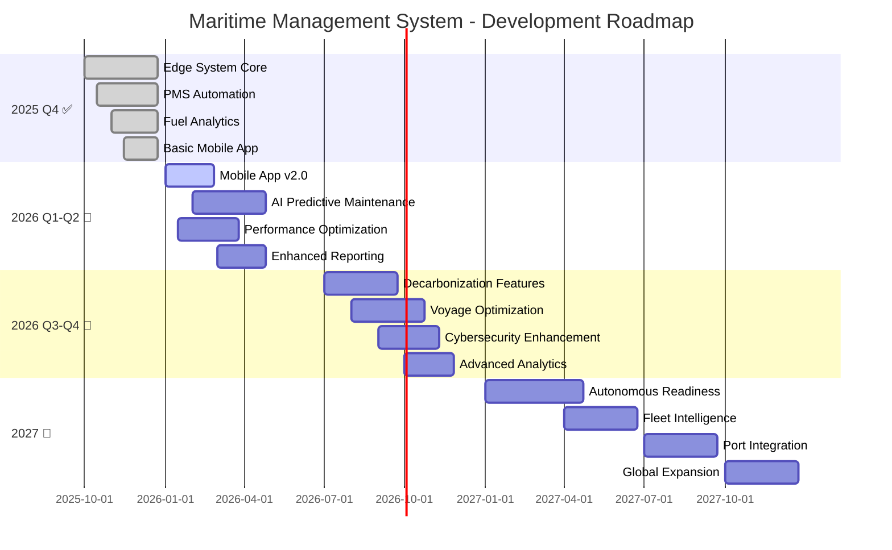
```mermaid
gantt
    title Maritime Management System - Development Roadmap
    dateFormat YYYY-MM-DD
    
    section 2025 Q4 ✅
    Edge System Core           :done, core1, 2025-10-01, 2025-12-24
    PMS Automation            :done, pms1, 2025-10-15, 2025-12-24
    Fuel Analytics            :done, fuel1, 2025-11-01, 2025-12-24
    Basic Mobile App          :done, mobile1, 2025-11-15, 2025-12-24
    
    section 2026 Q1-Q2 🔄
    Mobile App v2.0           :active, mobile2, 2026-01-01, 8w
    AI Predictive Maintenance :ai1, 2026-02-01, 12w
    Performance Optimization  :perf1, 2026-01-15, 10w
    Enhanced Reporting        :report1, 2026-03-01, 8w
    
    section 2026 Q3-Q4 🌿
    Decarbonization Features  :decarb1, 2026-07-01, 12w
    Voyage Optimization       :voyage1, 2026-08-01, 12w
    Cybersecurity Enhancement :cyber1, 2026-09-01, 10w
    Advanced Analytics        :analytics1, 2026-10-01, 8w
    
    section 2027 🤖
    Autonomous Readiness      :auto1, 2027-01-01, 16w
    Fleet Intelligence        :fleet1, 2027-04-01, 12w
    Port Integration          :port1, 2027-07-01, 12w
    Global Expansion          :global1, 2027-10-01, 12w
```

---

## 9. CẤU TRÚC THƯ MỤC DỰ ÁN

```
Martime_product_v1.1/
│
├── backend/                          # Shore Backend (.NET 8)
│   ├── Controllers/                  # API Controllers
│   ├── Models/                       # Data models
│   ├── Services/                     # Business logic
│   ├── Migrations/                   # EF migrations
│   └── appsettings.json             # Configuration
│
├── frontend/                         # Shore Frontend (React)
│   ├── src/
│   │   ├── pages/                    # Pages
│   │   ├── components/               # Reusable components
│   │   ├── services/                 # API calls
│   │   └── types/                    # TypeScript types
│   └── package.json
│
├── edge-services/                    # Edge Backend (.NET 8)
│   ├── Controllers/                  # 25+ Controllers
│   ├── Models/                       # EdgeModels.cs (48 tables)
│   ├── Services/                     # Business logic
│   ├── Repositories/                 # Data access layer
│   ├── DTOs/                         # Data transfer objects
│   ├── Migrations/                   # Database migrations
│   ├── docker-compose.yml            # Docker setup
│   └── Program.cs                    # Entry point
│
├── frontend-edge/                    # Edge Frontend (React 19)
│   ├── src/
│   │   ├── pages/                    # 9 implemented pages
│   │   │   ├── Dashboard/
│   │   │   ├── Crew/
│   │   │   ├── Maintenance/
│   │   │   ├── FuelAnalytics/
│   │   │   ├── Voyage/
│   │   │   ├── Reporting/
│   │   │   └── Materials/
│   │   ├── components/               # UI components
│   │   ├── services/                 # API services
│   │   └── types/                    # TypeScript types
│   └── package.json
│
├── frontend-mobile/                  # Mobile App (Flutter)
│   ├── lib/
│   │   ├── core/                     # Core utilities
│   │   ├── data/                     # Data layer
│   │   │   ├── models/               # Data models
│   │   │   └── repositories/         # Repositories
│   │   └── presentation/             # UI layer
│   │       └── screens/              # 15+ screens
│   └── pubspec.yaml
│
├── init-scripts/                     # Database init scripts
│
├── *.md                              # 15+ documentation files
│   ├── README.md                     # Main documentation
│   ├── PMS_IMPLEMENTATION_COMPLETE.md
│   ├── FUEL_ANALYTICS_MODULE.md
│   ├── MOBILE_PMS_IMPLEMENTATION_PLAN_V2.md
│   └── FUTURE_DIRECTIONS_STRATEGIC_ROADMAP.md
│
└── docker-compose.yml                # Main docker setup
```

---

## 10. HƯỚNG DẪN DEMO CHO THUYẾT TRÌNH

### 10.1. Script Demo (15-20 phút)

#### Phần 1: Giới Thiệu (2 phút)
```
SLIDE 1: Title Slide
- Tên dự án: Maritime Management System
- Logo, badges

SLIDE 2: Vấn Đề & Giải Pháp
- Bảng so sánh vấn đề truyền thống vs giải pháp
```

#### Phần 2: Kiến Trúc (3 phút)
```
SLIDE 3: Edge-Shore Architecture
- Diagram tàu-bờ
- So sánh Edge vs Shore

SLIDE 4: Công Nghệ
- Technology stack table
- Logos công nghệ
```

#### Phần 3: Demo Live (8 phút)
```
DEMO 1: Edge Dashboard (3 phút)
1. Mở http://localhost:3002
2. Xem Dashboard với real-time telemetry
3. Vào Crew Management → Certificates (sắp hết hạn)
4. Vào Maintenance → Pending Tasks

DEMO 2: PMS Workflow (2 phút)
1. Xem Equipment Assets catalog
2. Xem Maintenance Schedules
3. Xem auto-generated tasks
4. Gantt chart

DEMO 3: Fuel Analytics (2 phút)
1. Dashboard metrics
2. CII Rating (A-E)
3. Monthly comparison chart

DEMO 4: Mobile App (1 phút)
1. Login
2. My Tasks
3. Start task
```

#### Phần 4: Kết Quả (3 phút)
```
SLIDE 5: Chỉ Số Kỹ Thuật
- 50,000+ lines of code
- 125+ API endpoints
- 48 database tables

SLIDE 6: Tuân Thủ Quốc Tế
- IMO standards checklist
- EU regulations

SLIDE 7: Hiệu Năng
- Performance benchmarks
- Optimization results
```

#### Phần 5: Tương Lai (2 phút)
```
SLIDE 8: Roadmap
- Timeline 2025-2027
- Key directions

SLIDE 9: Q&A
```

### 10.2. Câu Hỏi Thường Gặp (FAQs)

**Q1: Hệ thống có hoạt động offline không?**
- A: Có, Edge System thiết kế offline-first, tàu có thể hoạt động độc lập, sau đó sync về bờ khi có mạng.

**Q2: Tàu đồng bộ dữ liệu về bờ như thế nào?**
- A: Sử dụng Delta Sync với priority-based queue, tiết kiệm 82% băng thông.

**Q3: Hệ thống tuân thủ tiêu chuẩn IMO nào?**
- A: IMO DCS, CII Rating, EEOI, MARPOL, SOLAS, STCW, ISM Code.

**Q4: PMS tự động tạo task như thế nào?**
- A: MaintenanceSchedulerService chạy mỗi 6 giờ, kiểm tra schedules và tạo task trước 7 ngày.

**Q5: Có thể mở rộng cho nhiều tàu không?**
- A: Có, Shore System thiết kế để quản lý đội tàu, nhận dữ liệu từ nhiều Edge Systems.

**Q6: Mobile app hỗ trợ nền tảng nào?**
- A: Flutter cross-platform: iOS, Android, Windows, Web.

**Q7: Hiệu năng hệ thống ra sao?**
- A: API response < 100ms, weekly report 200-300ms, real-time update 5 giây/lần.

**Q8: Có thể tích hợp cảm biến thật không?**
- A: Có, hiện tại đang giả lập NMEA/Modbus, có thể thay bằng real sensor data.

---

## 11. KẾT LUẬN

### 11.1. Tóm Tắt Đóng Góp

Dự án **Maritime Management System** đã triển khai thành công một hệ thống quản lý hạm đội tàu chuyên nghiệp với các đóng góp chính:

1. **Kiến Trúc Edge-Shore Đột Phá**
   - Offline-first design cho môi trường hàng hải
   - Delta sync tiết kiệm 82% băng thông
   - Priority-based synchronization

2. **Tự Động Hóa Toàn Diện**
   - PMS tự động tạo task trước 7 ngày
   - Auto-deduct spare parts
   - Real-time telemetry collection (5s interval)
   - Background services tự động

3. **Tuân Thủ Tiêu Chuẩn Quốc Tế**
   - 8 tiêu chuẩn IMO đã triển khai
   - EU MRV compliance
   - ISO 19030 performance metrics

4. **Công Nghệ Hiện Đại**
   - .NET 8, React 19, Flutter
   - PostgreSQL 15, Redis 7
   - Docker containerization
   - 125+ RESTful APIs

5. **Hiệu Năng Cao**
   - SQL-side aggregation (60-70% faster)
   - API response < 100ms
   - Optimized database queries

### 11.2. Giá Trị Thực Tiễn

- **Cho Công Ty Tàu:**
  - Giảm chi phí vận hành 15-25% (theo roadmap AI)
  - Tăng tuân thủ IMO
  - Quản lý đội tàu hiệu quả

- **Cho Thuyền Trưởng:**
  - Dashboard trực quan thời gian thực
  - PMS tự động, không bỏ sót bảo trì
  - Báo cáo nhanh chóng

- **Cho Thủy Thủ Đoàn:**
  - Mobile app dễ sử dụng
  - Task workflow rõ ràng
  - Offline capability

- **Cho Cơ Quan Quản Lý:**
  - Báo cáo tuân thủ tự động
  - Audit trail đầy đủ
  - Compliance ready

### 11.3. Điểm Mạnh Của Dự Án

| Tiêu Chí | Đánh Giá |
|----------|----------|
| **Tính Đầy Đủ** | ⭐⭐⭐⭐⭐ 125+ APIs, 48 tables, 9 pages |
| **Chất Lượng Code** | ⭐⭐⭐⭐⭐ TypeScript, clean architecture, documented |
| **Hiệu Năng** | ⭐⭐⭐⭐⭐ < 100ms response, optimized queries |
| **Tuân Thủ** | ⭐⭐⭐⭐⭐ 8 IMO standards, EU MRV |
| **Tài Liệu** | ⭐⭐⭐⭐⭐ 4733+ lines documentation |
| **Khả Năng Mở Rộng** | ⭐⭐⭐⭐⭐ Microservices-ready, Docker |

### 11.4. Khả Năng Ứng Dụng

- ✅ Công ty vận tải biển
- ✅ Đội tàu thương mại
- ✅ Tàu chở khách (cruise)
- ✅ Tàu chở dầu/LNG
- ✅ Cơ quan hàng hải
- ✅ Nghiên cứu học thuật

### 11.5. Lời Kết

Dự án đã đạt được mục tiêu xây dựng một hệ thống quản lý hạm đội tàu **chuyên nghiệp, toàn diện và tuân thủ tiêu chuẩn quốc tế**. Với kiến trúc Edge-Shore độc đáo, PMS tự động hóa, fuel analytics thông minh, và mobile app tiện lợi, hệ thống sẵn sàng triển khai thực tế và mở rộng theo các hướng phát triển tương lai (AI, Autonomous, Decarbonization).

---

## 📞 THÔNG TIN LIÊN HỆ

**Dự án:** Maritime Management System v1.1  
**Repository:** https://github.com/hieubuiVMUS2K4/sampleProduct  
**Tài liệu:** Xem thư mục gốc dự án (15+ files .md)

---

**© 2025 Maritime Management System - NCKH Project**

*Tài liệu này được tạo tự động phục vụ thuyết trình PowerPoint.*
