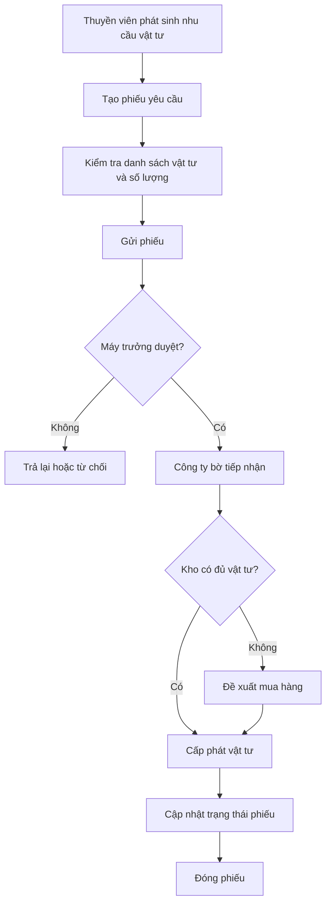
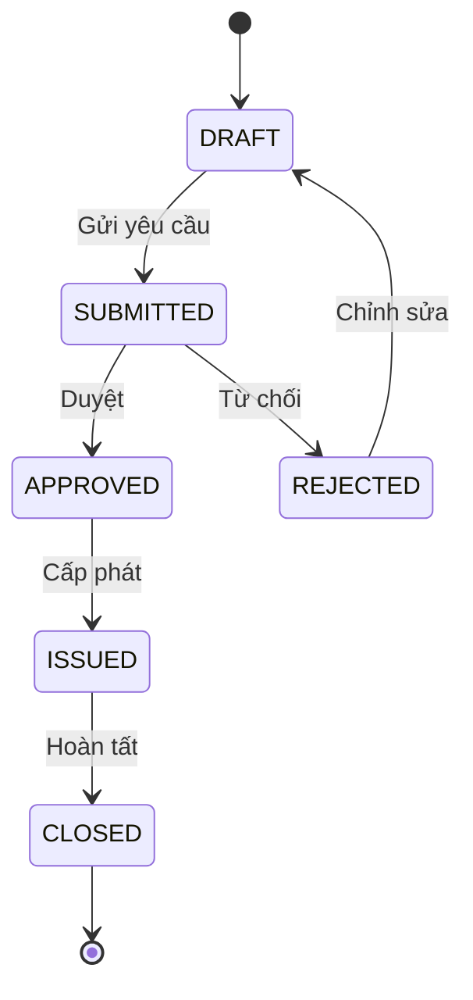
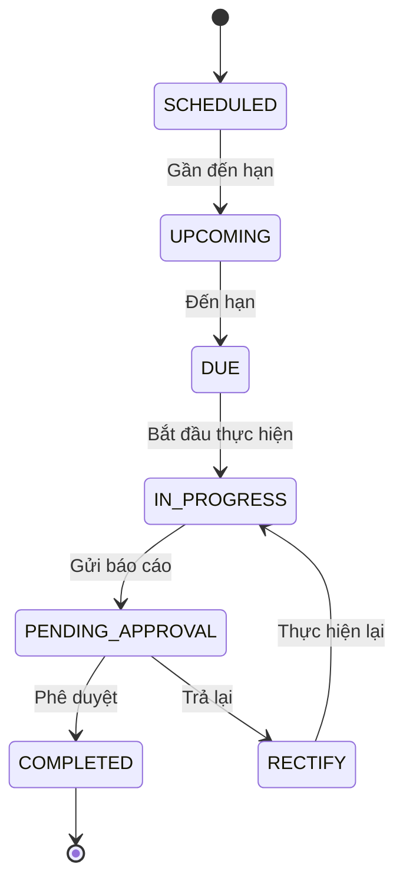
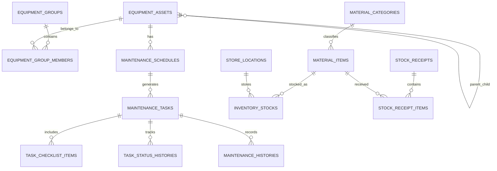
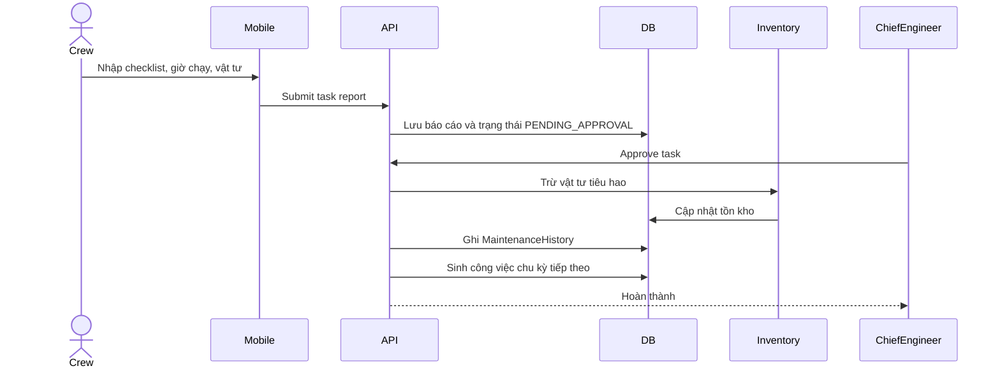
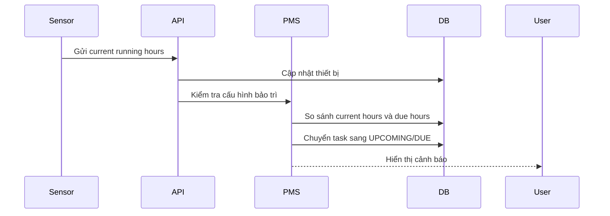

# PHÂN TÍCH VÀ THIẾT KẾ PHÂN HỆ PMS TRONG HỆ THỐNG QUẢN LÝ VẬN HÀNH VÀ HỒ SƠ TÀU THỦY

## 1. Giới thiệu chung

Trong lĩnh vực hàng hải, hoạt động khai thác tàu biển luôn gắn liền với yêu cầu duy trì trạng thái kỹ thuật an toàn, ổn định và tuân thủ các quy định của cơ quan đăng kiểm, chủ tàu, công ty quản lý tàu cũng như các chuẩn mực quốc tế như ISM Code, SOLAS, MARPOL và các yêu cầu nội bộ về quản lý an toàn. Một con tàu không chỉ là phương tiện vận tải mà còn là một hệ thống kỹ thuật phức tạp, bao gồm nhiều nhóm thiết bị cơ khí, điện, tự động hóa, hàng hải, cứu sinh, phòng cháy chữa cháy, thiết bị boong và thiết bị phụ trợ. Mỗi thiết bị đều có vòng đời vận hành, chu kỳ bảo trì, yêu cầu kiểm tra, phụ tùng thay thế và hồ sơ kỹ thuật riêng.

Trong bối cảnh đó, PMS, viết tắt của Planned Maintenance System, là phân hệ có vai trò trọng tâm trong việc quản lý bảo trì có kế hoạch. PMS giúp doanh nghiệp quản lý đội tàu chuyển từ cách làm thủ công, rời rạc và phụ thuộc nhiều vào kinh nghiệm cá nhân sang một mô hình quản trị dữ liệu có cấu trúc, có cảnh báo, có lịch sử, có bằng chứng thực hiện và có khả năng đồng bộ giữa tàu và bờ. Đối với đề tài xây dựng hệ thống quản lý vận hành và hồ sơ tàu thủy, phân hệ PMS không chỉ là một chức năng độc lập mà còn là điểm giao nhau giữa quản lý thiết bị, quản lý vật tư, quản lý tồn kho, quản lý công việc, quản lý thuyền viên, quản lý báo cáo và đồng bộ dữ liệu.

Mục tiêu của tài liệu này là phân tích và thiết kế phân hệ PMS theo góc nhìn nghiệp vụ, hệ thống và kiến trúc giải pháp. Tài liệu được trình bày theo phong cách báo cáo đồ án tốt nghiệp, tập trung vào khả năng sử dụng thực tế trong doanh nghiệp quản lý đội tàu, đồng thời đủ chi tiết để làm cơ sở xây dựng cơ sở dữ liệu, API backend, giao diện web, ứng dụng mobile và luồng đồng bộ giữa tàu và bờ.

## 2. Bối cảnh nghiệp vụ và vấn đề cần giải quyết

Doanh nghiệp quản lý đội tàu thường phải theo dõi nhiều tàu cùng lúc. Mỗi tàu có cấu hình thiết bị khác nhau, thời gian khai thác khác nhau, đội ngũ thuyền viên khác nhau và điều kiện vận hành khác nhau. Nếu quản lý bảo trì bằng Excel, giấy tờ hoặc ghi chú rời rạc, doanh nghiệp dễ gặp các vấn đề như bỏ sót công việc đến hạn, không biết chính xác lịch sử bảo trì của thiết bị, khó kiểm chứng việc thuyền viên đã thực hiện công việc hay chưa, không liên kết được nhu cầu phụ tùng với tồn kho, khó lập kế hoạch mua hàng và khó cung cấp hồ sơ khi kiểm tra.

Một hệ thống PMS cần giải quyết các bài toán cốt lõi sau:

- Quản lý danh mục thiết bị theo cấu trúc phân cấp, phản ánh đúng cấu trúc kỹ thuật của tàu.
- Cấu hình công việc bảo trì theo chu kỳ lịch hoặc theo giờ chạy.
- Tự động sinh công việc khi đến hạn hoặc sắp đến hạn.
- Cho phép thuyền viên thực hiện công việc trên mobile, ghi nhận checklist, ảnh minh chứng, giờ chạy, vật tư tiêu hao và ghi chú.
- Cho phép cấp quản lý như máy trưởng, thuyền trưởng hoặc văn phòng bờ kiểm tra, phê duyệt và theo dõi trạng thái công việc.
- Tự động trừ vật tư tiêu hao khỏi tồn kho khi công việc được xác nhận hoàn thành.
- Lưu lịch sử bảo trì để phục vụ phân tích, truy vết và kiểm tra.
- Hỗ trợ làm việc trong môi trường tàu có kết nối Internet không ổn định thông qua cơ chế lưu tạm và đồng bộ.

PMS không chỉ giúp "nhắc việc" mà còn tạo thành một hệ thống kiểm soát kỹ thuật. Khi một thiết bị như máy chính, máy phát điện, nồi hơi hoặc bơm làm mát có lịch bảo trì rõ ràng, hệ thống có thể hỗ trợ giảm rủi ro hỏng hóc đột xuất, giảm thời gian dừng tàu, tối ưu chi phí phụ tùng và tăng tính minh bạch trong quản lý kỹ thuật.

## 3. Mục tiêu của phân hệ PMS

### 3.1. Mục tiêu nghiệp vụ

Mục tiêu nghiệp vụ của PMS là đảm bảo toàn bộ thiết bị trên tàu được bảo trì đúng thời điểm, đúng quy trình, đúng người chịu trách nhiệm và có hồ sơ chứng minh. Hệ thống phải giúp doanh nghiệp biết được thiết bị nào đang hoạt động bình thường, thiết bị nào sắp đến hạn bảo trì, công việc nào đang chậm, công việc nào cần phê duyệt và vật tư nào đã được sử dụng.

PMS cũng phải hỗ trợ công tác lập kế hoạch. Ví dụ, nếu máy chính hiện có 4.500 giờ chạy và chu kỳ bảo trì tiếp theo là 5.000 giờ, hệ thống cần tính còn 500 giờ nữa đến hạn. Nếu tàu trung bình chạy 20 giờ mỗi ngày, hệ thống có thể ước lượng còn khoảng 25 ngày nữa công việc sẽ đến hạn. Khi đó, doanh nghiệp có thời gian chuẩn bị nhân lực, phụ tùng và kế hoạch dừng máy phù hợp.

### 3.2. Mục tiêu hệ thống

Về mặt hệ thống phần mềm, PMS cần cung cấp các chức năng quản lý dữ liệu có cấu trúc, API rõ ràng, giao diện dễ sử dụng và khả năng mở rộng. Dữ liệu phải được thiết kế theo mô hình quan hệ để đảm bảo tính toàn vẹn, nhưng cũng cần hỗ trợ các trường linh hoạt như checklist, ghi chú, ảnh minh chứng hoặc vật tư sử dụng dưới dạng dữ liệu có cấu trúc.

Hệ thống phải phân biệt rõ giữa cấu hình công việc và công việc phát sinh. Cấu hình công việc là mẫu định nghĩa chu kỳ bảo trì, còn công việc phát sinh là instance cụ thể cần thực hiện trong một thời điểm nhất định. Cách tách này giúp hệ thống tái sử dụng cấu hình, tự động sinh công việc lặp lại và lưu lịch sử thực hiện theo từng lần.

### 3.3. Mục tiêu người dùng

Đối với thuyền viên, PMS phải đơn giản, rõ ràng và phù hợp với môi trường làm việc thực tế trên tàu. Người dùng mobile cần nhìn thấy danh sách công việc được giao, mở chi tiết, kiểm tra checklist, nhập kết quả, chụp ảnh và gửi báo cáo. Giao diện không nên yêu cầu thao tác phức tạp vì thuyền viên có thể đang làm việc trong buồng máy, boong tàu hoặc khu vực hạn chế.

Đối với máy trưởng hoặc người quản lý kỹ thuật, PMS cần cung cấp cái nhìn tổng quan: công việc nào đã hoàn thành, công việc nào đang chờ duyệt, công việc nào quá hạn, thiết bị nào có nguy cơ hỏng hóc, vật tư nào sắp thiếu. Đối với công ty bờ, PMS cần hỗ trợ kiểm soát đội tàu, phân tích lịch sử và ra quyết định mua sắm hoặc điều phối.

## 4. Phạm vi phân hệ PMS

Phân hệ PMS trong hệ thống được phân tích theo các nhóm chức năng sau:

1. Danh mục thiết bị.
2. Danh mục vật tư.
3. Danh mục kho và vị trí lưu trữ.
4. Phiếu yêu cầu vật tư.
5. Phiếu nhập kho.
6. Quản lý tồn kho.
7. Danh sách công việc PMS.
8. Cấu hình công việc bảo trì.
9. Mobile app PMS.
10. Báo cáo, lịch sử và đồng bộ dữ liệu.

Các chức năng này có quan hệ chặt chẽ. Danh mục thiết bị là nền tảng để tạo lịch bảo trì. Danh mục vật tư và tồn kho giúp công việc bảo trì có dữ liệu phụ tùng đi kèm. Mobile app là kênh thực hiện công việc thực tế. Lịch sử bảo trì là kết quả cuối cùng để chứng minh hệ thống vận hành đúng.

## 5. Danh mục thiết bị

### 5.1. Mục đích

Danh mục thiết bị là nơi lưu trữ toàn bộ tài sản kỹ thuật cần quản lý bảo trì trên tàu. Một tàu có thể có hàng trăm thiết bị, từ các thiết bị lớn như máy chính, máy phát điện, nồi hơi đến các thiết bị nhỏ hơn như bơm, van, cảm biến, bảng điện, thiết bị cứu sinh hoặc thiết bị phòng cháy chữa cháy. Nếu không có danh mục thiết bị chuẩn, hệ thống không thể tạo lịch bảo trì chính xác, không thể gắn vật tư theo thiết bị và không thể truy vết lịch sử.

Danh mục thiết bị cần phản ánh cấu trúc thực tế trên tàu. Ví dụ, nhóm "Engine Room" có thể chứa "Main Engine", bên trong Main Engine có các bộ phận như turbocharger, fuel pump, lube oil cooler, cylinder unit. Một thiết bị có thể là cha của các thiết bị con. Mô hình dạng cây giúp người dùng dễ tìm kiếm, dễ hiểu cấu trúc và phù hợp với hồ sơ kỹ thuật.

### 5.2. Vai trò

Danh mục thiết bị đóng vai trò là dữ liệu gốc cho PMS. Khi cấu hình một công việc bảo trì, người dùng phải chọn thiết bị hoặc nhóm thiết bị. Khi thuyền viên thực hiện công việc, báo cáo cũng gắn với thiết bị. Khi xem lịch sử, hệ thống có thể lọc theo thiết bị để biết thiết bị đó đã được bảo trì bao nhiêu lần, lần gần nhất khi nào, ai thực hiện và sử dụng vật tư gì.

Ngoài ra, danh mục thiết bị còn hỗ trợ quản lý trạng thái kỹ thuật. Một thiết bị có thể đang hoạt động, đang bảo trì, hỏng, chờ phụ tùng hoặc ngừng sử dụng. Trạng thái này giúp bộ phận kỹ thuật đánh giá khả năng khai thác của tàu.

### 5.3. Quy trình quản lý

Quy trình quản lý thiết bị thường gồm các bước:

1. Khởi tạo nhóm thiết bị theo cấu trúc tàu.
2. Thêm thiết bị cha và thiết bị con.
3. Nhập thông tin kỹ thuật như mã thiết bị, tên thiết bị, vị trí, nhà sản xuất, model, serial number, năm lắp đặt, giờ chạy hiện tại.
4. Gắn thiết bị với bộ phận phụ trách như máy, boong, điện hoặc an toàn.
5. Cấu hình công việc bảo trì cho thiết bị.
6. Theo dõi lịch sử bảo trì và trạng thái thiết bị.

Trong thực tế, dữ liệu thiết bị có thể được nhập thủ công, import từ Excel hoặc đồng bộ từ hệ thống quản lý tài sản khác. Tuy nhiên, dù nhập bằng cách nào, hệ thống phải kiểm tra trùng mã thiết bị, kiểm tra quan hệ cha con và đảm bảo thiết bị con không tự tham chiếu chính nó.

### 5.4. Cấu trúc dữ liệu đề xuất

| Bảng | Mục đích |
|---|---|
| equipment_groups | Quản lý nhóm thiết bị theo chức năng hoặc khu vực |
| equipment_assets | Quản lý từng thiết bị cụ thể |
| equipment_group_members | Gắn thiết bị vào nhóm |
| equipment_locations | Quản lý vị trí lắp đặt |
| manufacturers | Quản lý nhà sản xuất |

Các thuộc tính quan trọng của `equipment_assets`:

| Cột | Kiểu dữ liệu | Ý nghĩa |
|---|---|---|
| id | UUID | Khóa chính |
| asset_code | varchar | Mã thiết bị, duy nhất trên tàu |
| asset_name | varchar | Tên thiết bị |
| parent_asset_id | UUID nullable | Thiết bị cha |
| group_id | UUID nullable | Nhóm thiết bị |
| location | varchar | Vị trí lắp đặt |
| manufacturer | varchar | Nhà sản xuất |
| model | varchar | Model |
| serial_number | varchar | Số serial |
| current_running_hours | double | Giờ chạy hiện tại |
| status | varchar | Trạng thái thiết bị |
| notes | text | Ghi chú |
| created_at | timestamp | Ngày tạo |
| updated_at | timestamp | Ngày cập nhật |

### 5.5. Quan hệ dữ liệu

Một thiết bị có thể thuộc một nhóm thiết bị. Một nhóm có thể chứa nhiều thiết bị. Một thiết bị cũng có thể có thiết bị con, tạo thành cấu trúc cây. Quan hệ này cần được thiết kế cẩn thận để tránh vòng lặp. Khi xóa thiết bị cha, hệ thống không nên xóa tự động thiết bị con nếu chưa có xác nhận, vì điều đó có thể làm mất lịch sử bảo trì.

## 6. Danh mục vật tư

### 6.1. Mục đích

Danh mục vật tư lưu trữ thông tin về phụ tùng, vật tư tiêu hao và các hạng mục cần sử dụng trong quá trình bảo trì. Trong PMS, vật tư không chỉ phục vụ quản lý kho mà còn gắn trực tiếp với công việc bảo trì. Ví dụ, thay lọc dầu máy chính cần lọc dầu, gioăng, dầu bôi trơn; bảo dưỡng bơm có thể cần phớt, vòng bi, mỡ bôi trơn.

Nếu không quản lý vật tư cùng PMS, doanh nghiệp có thể biết công việc đến hạn nhưng không biết có đủ phụ tùng để thực hiện hay không. Điều này làm giảm hiệu quả lập kế hoạch và có thể khiến tàu bị chậm bảo trì do thiếu vật tư.

### 6.2. Phân loại vật tư

Vật tư trong tàu biển có thể chia thành:

- Phụ tùng thay thế: spare parts như bearing, filter, seal, valve, sensor.
- Vật tư tiêu hao: consumables như dầu mỡ, giẻ lau, hóa chất, sơn, vật liệu vệ sinh.
- Dụng cụ hỗ trợ: tools hoặc special tools.
- Vật tư an toàn: safety equipment hoặc items phục vụ kiểm tra định kỳ.

Hệ thống cần cho phép phân loại vật tư để tìm kiếm, thống kê và cảnh báo tồn kho. Mỗi vật tư cần có mã vật tư, tên, đơn vị tính, loại, mức tồn kho tối thiểu, đơn giá tham khảo và trạng thái sử dụng.

### 6.3. Cấu trúc dữ liệu đề xuất

| Cột | Kiểu dữ liệu | Ý nghĩa |
|---|---|---|
| id | UUID | Khóa chính |
| item_code | varchar | Mã vật tư |
| name | varchar | Tên vật tư |
| category_id | UUID | Loại vật tư |
| unit | varchar | Đơn vị tính |
| min_stock | double | Mức tồn tối thiểu |
| on_hand_quantity | double | Tổng tồn hiện tại |
| unit_cost | decimal | Đơn giá |
| notes | text | Ghi chú |
| is_active | boolean | Còn sử dụng hay không |

Danh mục vật tư cần hỗ trợ import Excel vì số lượng vật tư có thể lớn. Khi import, hệ thống phải kiểm tra trùng mã, chuẩn hóa đơn vị tính và báo lỗi rõ ràng cho các dòng không hợp lệ.

## 7. Danh mục kho và mô hình quản lý kho nhiều tàu

### 7.1. Bối cảnh

Trong doanh nghiệp quản lý đội tàu, kho không chỉ nằm ở văn phòng hoặc kho tổng trên bờ. Mỗi tàu cũng có kho riêng, ví dụ kho máy, kho boong, kho vật tư an toàn, kho sơn, kho dầu mỡ. Vì vậy, hệ thống cần hỗ trợ mô hình nhiều tàu, nhiều kho và nhiều vị trí lưu trữ.

Kho tổng công ty có vai trò mua sắm, tập kết và cấp phát vật tư. Kho trên tàu phục vụ nhu cầu sử dụng trực tiếp. Khi tàu yêu cầu vật tư, công ty có thể cấp phát từ kho bờ hoặc điều chuyển từ tàu khác nếu phù hợp.

### 7.2. Thiết kế kho

Mô hình kho đề xuất gồm:

- `warehouses`: đại diện cho kho cấp cao, có thể là kho bờ hoặc kho tàu.
- `store_locations`: đại diện cho vị trí lưu trữ chi tiết trong kho.
- `inventory_stocks`: đại diện cho số lượng tồn của từng vật tư tại từng vị trí.

| Bảng | Vai trò |
|---|---|
| warehouses | Quản lý kho tổng hoặc kho tàu |
| store_locations | Quản lý vị trí lưu trữ chi tiết |
| inventory_stocks | Quản lý số lượng tồn theo vật tư và vị trí |

Thuộc tính của kho:

| Cột | Kiểu dữ liệu | Ý nghĩa |
|---|---|---|
| id | UUID | Khóa chính |
| warehouse_code | varchar | Mã kho |
| warehouse_name | varchar | Tên kho |
| vessel_id | UUID nullable | Tàu liên quan nếu là kho tàu |
| type | varchar | SHORE hoặc VESSEL |
| status | varchar | ACTIVE, INACTIVE |

### 7.3. Quản lý tồn theo vị trí

Một vật tư có thể tồn ở nhiều vị trí. Ví dụ, lọc dầu có thể nằm ở kho máy và kho phụ tùng dự phòng. Vì vậy, tồn kho không nên chỉ lưu trực tiếp trên vật tư mà cần lưu theo bảng `inventory_stocks`. Trường `on_hand_quantity` trong vật tư có thể là giá trị tổng hợp để hiển thị nhanh, nhưng nguồn dữ liệu chính nên là tổng số lượng tại các vị trí kho.

Công thức:

```text
Tồn hiện tại của vật tư = Tổng số lượng nhập - Tổng số lượng xuất + Điều chỉnh tăng - Điều chỉnh giảm
```

Hoặc theo vị trí:

```text
Tồn vật tư A tại vị trí X = Tổng nhập A vào X - Tổng xuất A từ X + Điều chỉnh A tại X
```

## 8. Phiếu yêu cầu vật tư

### 8.1. Phân tích nghiệp vụ

Phiếu yêu cầu vật tư là chức năng cho phép thuyền viên hoặc bộ phận kỹ thuật trên tàu đề xuất nhu cầu vật tư. Nhu cầu có thể phát sinh từ công việc bảo trì, từ kiểm tra thực tế hoặc từ kế hoạch dự trữ. Quy trình điển hình:

```text
Thuyền viên tạo yêu cầu
→ Máy trưởng kiểm tra
→ Thuyền trưởng hoặc quản lý duyệt
→ Công ty bờ tiếp nhận
→ Cấp phát hoặc mua bổ sung
```

Trong PMS, phiếu yêu cầu vật tư giúp liên kết giữa công việc bảo trì và chuỗi cung ứng. Nếu một công việc sắp đến hạn nhưng vật tư không đủ, hệ thống có thể đề xuất tạo yêu cầu mua hoặc yêu cầu cấp phát.

### 8.2. Trạng thái chứng từ

| Trạng thái | Ý nghĩa |
|---|---|
| DRAFT | Phiếu mới tạo, chưa gửi |
| SUBMITTED | Đã gửi duyệt |
| APPROVED | Đã được duyệt |
| REJECTED | Bị từ chối |
| ISSUED | Đã cấp phát |
| CLOSED | Hoàn tất |

### 8.3. Activity Diagram



### 8.4. State Diagram



### 8.5. Thiết kế dữ liệu

Header phiếu:

| Cột | Kiểu dữ liệu | Ý nghĩa |
|---|---|---|
| id | UUID | Khóa chính |
| request_no | varchar | Số phiếu |
| vessel_id | UUID | Tàu yêu cầu |
| requested_by | varchar | Người tạo |
| request_date | timestamp | Ngày tạo |
| status | varchar | Trạng thái |
| notes | text | Ghi chú |

Detail phiếu:

| Cột | Kiểu dữ liệu | Ý nghĩa |
|---|---|---|
| id | UUID | Khóa chính |
| request_id | UUID | Phiếu cha |
| material_item_id | UUID | Vật tư |
| quantity_requested | decimal | Số lượng yêu cầu |
| quantity_approved | decimal | Số lượng duyệt |
| notes | text | Ghi chú |

## 9. Phiếu nhập kho

### 9.1. Mục đích

Phiếu nhập kho ghi nhận vật tư được đưa vào kho. Nguồn nhập có thể đến từ mua hàng, điều chuyển từ kho khác, nhận bổ sung từ công ty hoặc điều chỉnh sau kiểm kê. Phiếu nhập là chứng từ quan trọng vì nó làm tăng tồn kho và tạo cơ sở truy vết nguồn gốc vật tư.

### 9.2. Nguồn nhập

- Nhập từ mua hàng: vật tư được mua từ nhà cung cấp.
- Nhập từ điều chuyển: vật tư chuyển từ kho bờ sang tàu hoặc từ tàu này sang tàu khác.
- Nhập bổ sung: cập nhật sau kiểm kê hoặc phát hiện tồn thực tế.

### 9.3. Thiết kế header-detail

Phiếu nhập nên được thiết kế theo mô hình header-detail. Header chứa thông tin chung như số phiếu, ngày nhập, nhà cung cấp, kho nhận, người nhận. Detail chứa từng dòng vật tư, số lượng, đơn giá, vị trí lưu trữ và ghi chú.

Khi phiếu nhập được hoàn tất, hệ thống cần:

1. Tăng số lượng trong `inventory_stocks`.
2. Cập nhật tổng tồn trong `material_items`.
3. Ghi nhận lịch sử tồn kho với loại giao dịch `IN`.
4. Lưu thông tin chứng từ để truy vết.

## 10. Quản lý tồn kho

### 10.1. Nhập, xuất, tồn

Quản lý tồn kho là chức năng theo dõi số lượng vật tư tại các kho. Trong PMS, tồn kho không chỉ là dữ liệu kế toán mà còn ảnh hưởng trực tiếp đến khả năng thực hiện bảo trì. Nếu một công việc yêu cầu lọc dầu nhưng tồn kho bằng 0, hệ thống cần cảnh báo để người quản lý chuẩn bị vật tư trước khi đến hạn.

Các loại giao dịch tồn kho:

- Nhập: tăng tồn.
- Xuất: giảm tồn.
- Điều chỉnh tăng: tăng tồn do kiểm kê.
- Điều chỉnh giảm: giảm tồn do hỏng, mất, sai lệch.
- Tiêu hao bảo trì: giảm tồn khi công việc PMS sử dụng vật tư.

### 10.2. Nhật ký tồn kho

Nhật ký tồn kho giúp truy vết mọi thay đổi số lượng. Một bản ghi nhật ký cần có ngày, loại giao dịch, mã vật tư, tên vật tư, số lượng, kho, vị trí, chứng từ liên quan và ghi chú. Đối với PMS, khi công việc bảo trì được phê duyệt hoàn thành, hệ thống nên tự động ghi một dòng xuất kho với ghi chú "Tiêu hao vật tư bảo trì".

### 10.3. Cảnh báo tồn tối thiểu

Mỗi vật tư có thể cấu hình mức tồn tối thiểu. Khi tồn hiện tại nhỏ hơn mức tối thiểu, hệ thống sinh cảnh báo. Cảnh báo này có thể hiển thị trên dashboard hoặc trong danh sách vật tư. Mục tiêu là giúp doanh nghiệp chủ động mua hàng thay vì chờ đến khi công việc bảo trì bị đình trệ.

## 11. Danh sách công việc PMS

### 11.1. Vai trò của danh sách công việc

Danh sách công việc PMS là màn hình trung tâm để theo dõi toàn bộ công việc bảo trì. Mỗi công việc là một instance cụ thể được sinh ra từ cấu hình hoặc được tạo thủ công. Công việc có thể ở nhiều trạng thái như sắp đến hạn, đến hạn, đang thực hiện, chờ phê duyệt, hoàn thành, quá hạn hoặc bị trả lại.

Danh sách dạng bảng phù hợp cho người quản lý cần lọc, tìm kiếm và thao tác nhanh. Các cột chính gồm mã công việc, thiết bị, tên công việc, ngày đến hạn, giờ chạy đến hạn, trạng thái, mức ưu tiên và người phụ trách.

### 11.2. Dạng bảng

| Cột | Ý nghĩa |
|---|---|
| Mã công việc | Định danh công việc |
| Thiết bị | Thiết bị liên quan |
| Công việc | Nội dung bảo trì |
| Ngày đến hạn | Hạn theo lịch |
| Giờ chạy đến hạn | Hạn theo running hours |
| Trạng thái | DUE, IN_PROGRESS, COMPLETED... |
| Ưu tiên | CRITICAL, HIGH, MEDIUM, LOW |

### 11.3. Calendar View

Calendar View giúp người dùng nhìn công việc theo ngày, tuần hoặc tháng. Dạng hiển thị này phù hợp cho lập kế hoạch nhân lực và phân bổ thời gian. Ví dụ, nếu trong cùng một ngày có nhiều công việc bảo trì liên quan đến máy chính, máy trưởng có thể điều chỉnh lịch để tránh quá tải hoặc trùng với thời điểm tàu đang khai thác.

### 11.4. Gantt Chart

Gantt Chart giúp theo dõi tiến độ bảo trì theo thời gian. Mỗi công việc được biểu diễn bằng một thanh có ngày bắt đầu, ngày kết thúc và tiến độ. Gantt phù hợp với các công việc kéo dài nhiều ngày, ví dụ đại tu máy phát điện, bảo dưỡng nồi hơi hoặc kiểm tra hệ thống cứu sinh.

Các thuộc tính cần có:

- Start Date: ngày bắt đầu dự kiến hoặc thực tế.
- End Date: ngày kết thúc dự kiến hoặc thực tế.
- Progress: phần trăm hoàn thành.
- Dependency: quan hệ phụ thuộc giữa các công việc nếu có.

### 11.5. Counter và thuật toán Running Hours

Counter là thành phần quan trọng cho bảo trì theo giờ chạy. Không phải thiết bị nào cũng nên bảo trì theo lịch cố định. Một thiết bị hoạt động nhiều cần bảo trì sớm hơn thiết bị ít hoạt động. Ví dụ, hai máy phát điện cùng loại nhưng một máy chạy 20 giờ/ngày, máy còn lại chỉ chạy 5 giờ/ngày. Nếu chỉ dùng lịch tháng, hệ thống sẽ không phản ánh đúng mức độ hao mòn.

Thuật toán cơ bản:

```text
remaining_hours = next_due_running_hours - current_running_hours
```

Nếu `remaining_hours <= 0`, công việc chuyển sang trạng thái đến hạn. Nếu `remaining_hours` nhỏ hơn ngưỡng cảnh báo, công việc chuyển sang trạng thái sắp đến hạn.

Ví dụ:

```text
Máy chính hiện tại: 4.500 giờ
Mốc bảo trì tiếp theo: 5.000 giờ
Còn lại: 500 giờ
Nếu trung bình chạy 20 giờ/ngày, còn khoảng 25 ngày
```

Khi công việc hoàn thành tại 5.020 giờ, hệ thống cập nhật lần thực hiện cuối là 5.020 giờ. Nếu chu kỳ là 500 giờ, mốc tiếp theo là 5.520 giờ.

## 12. Cấu hình công việc bảo trì

### 12.1. Mục đích

Cấu hình công việc là nơi định nghĩa quy tắc sinh công việc. Một cấu hình có thể áp dụng cho thiết bị cụ thể hoặc nhóm thiết bị. Ví dụ, "Thay lọc dầu máy chính mỗi 500 giờ" là một cấu hình. Khi hệ thống phát hiện máy chính đạt ngưỡng, nó tạo công việc cụ thể để thuyền viên thực hiện.

### 12.2. Loại cấu hình

Có hai loại chính:

1. Running Hours: dựa trên giờ hoạt động.
2. Calendar Based: dựa trên ngày, tuần, tháng hoặc năm.

Một số hệ thống nâng cao có thể hỗ trợ Hybrid, tức là đến hạn khi một trong hai điều kiện xảy ra trước. Ví dụ, bảo trì mỗi 500 giờ hoặc 3 tháng, tùy điều kiện nào đến trước.

### 12.3. Quy tắc sinh công việc

Với Running Hours:

```text
Nếu current_running_hours >= next_due_running_hours
→ sinh hoặc chuyển công việc sang DUE
```

Với Calendar:

```text
Nếu current_date >= next_due_date
→ sinh hoặc chuyển công việc sang DUE
```

Với cảnh báo trước:

```text
Nếu next_due_date - current_date <= warning_days
→ trạng thái UPCOMING
```

Hoặc:

```text
Nếu next_due_running_hours - current_running_hours <= warning_hours
→ trạng thái UPCOMING
```

### 12.4. Workflow công việc



Workflow này giúp kiểm soát trách nhiệm. Thuyền viên không tự chuyển công việc thành hoàn thành cuối cùng nếu hệ thống yêu cầu phê duyệt. Người có thẩm quyền kiểm tra báo cáo, checklist, ảnh và vật tư sử dụng trước khi xác nhận.

## 13. Mobile App PMS

### 13.1. Vai trò của mobile app

Mobile app là kênh làm việc trực tiếp của thuyền viên. Trong môi trường tàu biển, thuyền viên không phải lúc nào cũng ngồi trước máy tính. Công việc bảo trì diễn ra tại buồng máy, boong, kho, phòng bơm, khu vực cứu sinh hoặc các vị trí kỹ thuật khác. Vì vậy, mobile app giúp người dùng tiếp cận công việc tại hiện trường.

### 13.2. Chức năng chính

Mobile app PMS cần hỗ trợ:

- Xem danh sách công việc được giao.
- Nhận thông báo công việc sắp đến hạn hoặc quá hạn.
- Mở chi tiết công việc.
- Xem thông tin thiết bị và mô tả công việc.
- Thực hiện checklist.
- Nhập kết quả đo nếu checklist yêu cầu.
- Chụp ảnh minh chứng.
- Nhập giờ chạy tại thời điểm bảo trì.
- Nhập thời gian thực hiện.
- Khai báo vật tư thực tế đã sử dụng.
- Gửi báo cáo hoàn thành.

### 13.3. Luồng sử dụng thực tế

Một luồng sử dụng điển hình:

1. Thuyền viên đăng nhập mobile app.
2. App tải danh sách công việc được giao.
3. Thuyền viên chọn công việc "Bảo dưỡng bơm nước làm mát".
4. App hiển thị thông tin thiết bị, hạn bảo trì và checklist.
5. Thuyền viên bắt đầu công việc.
6. Trong quá trình thực hiện, thuyền viên tick checklist, nhập thông số đo, chụp ảnh.
7. Nếu sử dụng vật tư, thuyền viên chọn vật tư và nhập số lượng.
8. Thuyền viên nhập giờ chạy hiện tại của thiết bị và thời gian thực hiện.
9. Thuyền viên gửi báo cáo.
10. Máy trưởng kiểm tra và phê duyệt.
11. Hệ thống trừ tồn kho và lưu lịch sử bảo trì.

### 13.4. Làm việc khi mất Internet

Tàu biển có thể mất Internet hoặc kết nối không ổn định. Vì vậy, mobile app nên hỗ trợ lưu tạm dữ liệu cục bộ. Khi không có mạng, báo cáo được lưu vào hàng đợi đồng bộ. Khi có mạng trở lại, app gửi dữ liệu lên backend. Cơ chế này giúp công việc không bị gián đoạn.

## 14. Functional Requirements

| Mã | Mô tả | Actor |
|---|---|---|
| PMS-FR-01 | Quản lý danh mục thiết bị dạng cây | Admin, Technical Officer |
| PMS-FR-02 | Import thiết bị từ Excel | Admin |
| PMS-FR-03 | Quản lý danh mục vật tư | Admin, Storekeeper |
| PMS-FR-04 | Quản lý kho và vị trí lưu trữ | Storekeeper |
| PMS-FR-05 | Tạo phiếu yêu cầu vật tư | Crew |
| PMS-FR-06 | Duyệt phiếu yêu cầu vật tư | Chief Engineer, Master |
| PMS-FR-07 | Tạo phiếu nhập kho | Storekeeper |
| PMS-FR-08 | Theo dõi tồn kho theo vị trí | Storekeeper, Manager |
| PMS-FR-09 | Cấu hình công việc bảo trì theo lịch | Technical Officer |
| PMS-FR-10 | Cấu hình công việc theo giờ chạy | Technical Officer |
| PMS-FR-11 | Tự động cảnh báo công việc đến hạn | System |
| PMS-FR-12 | Tự động sinh công việc PMS | System |
| PMS-FR-13 | Thực hiện công việc trên mobile | Crew |
| PMS-FR-14 | Gửi báo cáo hoàn thành | Crew |
| PMS-FR-15 | Phê duyệt hoặc trả lại công việc | Chief Engineer |
| PMS-FR-16 | Tự động trừ vật tư tiêu hao | System |
| PMS-FR-17 | Lưu lịch sử bảo trì | System |
| PMS-FR-18 | Hiển thị calendar view | Manager |
| PMS-FR-19 | Hiển thị Gantt chart | Manager |
| PMS-FR-20 | Đồng bộ dữ liệu tàu-bờ | System |

## 15. Use Case tiêu biểu

### 15.1. Use Case: Cấu hình công việc bảo trì

| Thành phần | Nội dung |
|---|---|
| Use Case Name | Cấu hình công việc bảo trì |
| Actor | Technical Officer |
| Preconditions | Thiết bị đã tồn tại trong danh mục |
| Main Flow | Chọn thiết bị, nhập tên công việc, chọn loại chu kỳ, nhập interval, chọn checklist, chọn vật tư yêu cầu, lưu cấu hình |
| Alternative Flow | Nếu thiếu thiết bị hoặc interval không hợp lệ, hệ thống báo lỗi |
| Postconditions | Cấu hình được lưu và sẵn sàng sinh công việc |

### 15.2. Use Case: Thực hiện công việc bảo trì trên mobile

| Thành phần | Nội dung |
|---|---|
| Use Case Name | Thực hiện công việc bảo trì |
| Actor | Crew |
| Preconditions | Công việc ở trạng thái DUE hoặc IN_PROGRESS |
| Main Flow | Mở công việc, bắt đầu, tick checklist, nhập thông số, nhập vật tư, chụp ảnh, gửi báo cáo |
| Alternative Flow | Nếu mất mạng, app lưu vào hàng đợi đồng bộ |
| Postconditions | Công việc chuyển sang PENDING_APPROVAL |

### 15.3. Use Case: Phê duyệt công việc

| Thành phần | Nội dung |
|---|---|
| Use Case Name | Phê duyệt công việc PMS |
| Actor | Chief Engineer |
| Preconditions | Công việc đã được gửi báo cáo |
| Main Flow | Mở chi tiết, kiểm tra checklist, ảnh, vật tư, ghi chú, chọn phê duyệt |
| Alternative Flow | Nếu kết quả chưa đạt, trả lại yêu cầu chỉnh sửa |
| Postconditions | Công việc chuyển COMPLETED hoặc RECTIFY |

### 15.4. Use Case: Tự động trừ vật tư

| Thành phần | Nội dung |
|---|---|
| Use Case Name | Trừ vật tư khi hoàn thành bảo trì |
| Actor | System |
| Preconditions | Công việc có khai báo vật tư sử dụng |
| Main Flow | Lấy danh sách vật tư, kiểm tra tồn, trừ tồn kho, cập nhật tổng tồn, ghi lịch sử xuất |
| Alternative Flow | Nếu tồn không đủ, hệ thống cảnh báo và ghi nhận ngoại lệ |
| Postconditions | Tồn kho được cập nhật |

## 16. Database Design tổng quan

### 16.1. Thiết bị

| Bảng | Cột chính | Khóa |
|---|---|---|
| equipment_assets | id, asset_code, asset_name, parent_asset_id, current_running_hours | PK id, FK parent_asset_id |
| equipment_groups | id, group_code, group_name | PK id |
| equipment_group_members | group_id, asset_id | PK composite, FK group_id, asset_id |

### 16.2. Vật tư và kho

| Bảng | Cột chính | Khóa |
|---|---|---|
| material_items | id, item_code, name, unit, min_stock, on_hand_quantity | PK id |
| material_categories | id, category_code, category_name | PK id |
| store_locations | id, location_code, location_name, warehouse_id | PK id |
| inventory_stocks | id, material_item_id, store_location_id, quantity | PK id, FK material_item_id |
| stock_receipts | id, receipt_no, received_date, supplier_name | PK id |
| stock_receipt_items | id, receipt_id, material_item_id, quantity_received | PK id, FK receipt_id |

### 16.3. PMS

| Bảng | Cột chính | Khóa |
|---|---|---|
| maintenance_schedules | id, schedule_code, task_name, interval_type, interval_days, interval_hours | PK id |
| maintenance_tasks | id, task_id, schedule_id, equipment_asset_id, status, next_due_at | PK id, FK schedule_id |
| task_checklist_items | id, task_id, checkpoint_description, is_completed | PK id, FK task_id |
| task_status_histories | id, task_id, from_status, to_status, changed_by | PK id, FK task_id |
| maintenance_histories | id, schedule_id, task_id, executed_at, executed_running_hours | PK id |

## 17. ERD bằng Mermaid



## 18. Sequence Diagram

### 18.1. Luồng hoàn thành công việc bảo trì



### 18.2. Luồng tự động cảnh báo running hours



## 19. Kiến trúc giải pháp

Phân hệ PMS nên được triển khai theo kiến trúc nhiều lớp:

- Frontend web: quản lý danh mục, cấu hình, kế hoạch, phê duyệt, báo cáo.
- Mobile app: thực hiện công việc tại hiện trường.
- Backend API: xử lý nghiệp vụ, kiểm tra quyền, lưu dữ liệu, sinh lịch.
- Database: lưu dữ liệu PMS, thiết bị, vật tư, kho, lịch sử.
- Sync service: đồng bộ giữa tàu và bờ.

Kiến trúc này giúp phân tách trách nhiệm. Web phù hợp cho người quản lý, mobile phù hợp cho thuyền viên, backend đảm bảo nghiệp vụ tập trung, database đảm bảo toàn vẹn dữ liệu. Trong môi trường hàng hải, edge server trên tàu có thể hoạt động độc lập khi mất mạng và đồng bộ về shore server khi có kết nối.

## 20. Các vấn đề nghiệp vụ cần chú ý

### 20.1. Không đồng nhất dữ liệu giữa tàu và bờ

Do tàu có thể mất kết nối, dữ liệu ở tàu và bờ có thể lệch trong một khoảng thời gian. Hệ thống cần có cơ chế đánh dấu `is_synced`, `origin_node`, thời gian cập nhật và xử lý xung đột.

### 20.2. Trừ kho theo vật tư thực tế sử dụng

Công việc bảo trì có thể cấu hình vật tư dự kiến, nhưng khi thực hiện thực tế, số lượng sử dụng có thể khác. Do đó, tồn kho phải trừ theo vật tư thực tế đã dùng, không chỉ theo cấu hình ban đầu.

### 20.3. Bằng chứng thực hiện

Để phục vụ kiểm tra, mỗi công việc nên có checklist, ảnh, ghi chú, người thực hiện và thời điểm thực hiện. Điều này giúp giảm tranh cãi và tăng tính minh bạch.

### 20.4. Phân quyền

Không phải người dùng nào cũng có quyền cấu hình lịch bảo trì hoặc phê duyệt công việc. Hệ thống cần phân quyền theo vai trò như Admin, Crew, Chief Engineer, Master, Shore Manager.

## 21. Câu hỏi hội đồng có thể hỏi về PMS

### 1. Tại sao cần PMS?

PMS giúp quản lý bảo trì có kế hoạch, tránh bỏ sót công việc, giảm rủi ro hỏng hóc và tạo hồ sơ chứng minh việc bảo trì.

### 2. PMS khác gì so với Excel?

Excel chỉ lưu dữ liệu thủ công, còn PMS có cảnh báo tự động, workflow, phân quyền, lịch sử, đồng bộ và liên kết tồn kho.

### 3. Tại sao cần quản lý thiết bị dạng cây?

Vì cấu trúc thiết bị trên tàu có tính phân cấp. Dạng cây giúp phản ánh đúng quan hệ giữa hệ thống, thiết bị và bộ phận.

### 4. Tại sao cần Counter?

Counter giúp bảo trì theo mức độ sử dụng thực tế của thiết bị, đặc biệt với máy móc có giờ chạy khác nhau.

### 5. Khi nào dùng bảo trì theo lịch?

Dùng cho công việc cần thực hiện định kỳ theo ngày, tháng, năm như kiểm tra cứu sinh, kiểm tra an toàn hoặc vệ sinh định kỳ.

### 6. Khi nào dùng bảo trì theo giờ chạy?

Dùng cho thiết bị hao mòn theo thời gian hoạt động như máy chính, máy phát, bơm hoặc máy nén khí.

### 7. Vì sao cần quản lý vật tư cùng PMS?

Vì bảo trì thường cần phụ tùng. Nếu không liên kết vật tư, công việc có thể đến hạn nhưng không đủ vật tư để thực hiện.

### 8. Vì sao cần Gantt Chart?

Gantt giúp quản lý kế hoạch bảo trì theo thời gian, nhìn được tiến độ và tránh trùng lịch công việc quan trọng.

### 9. Nếu tàu mất Internet thì sao?

Hệ thống edge trên tàu và mobile app có thể lưu dữ liệu cục bộ, sau đó đồng bộ khi có kết nối.

### 10. Làm thế nào tránh bỏ sót bảo trì?

Hệ thống tự động tính hạn theo lịch hoặc giờ chạy, cảnh báo trước và tạo công việc khi đến hạn.

### 11. Ai là người phê duyệt công việc?

Thông thường máy trưởng hoặc người có thẩm quyền kỹ thuật phê duyệt, tùy quy trình của doanh nghiệp.

### 12. Tại sao phải có checklist?

Checklist chuẩn hóa quy trình thực hiện, giúp thuyền viên không bỏ sót bước kiểm tra quan trọng.

### 13. Tại sao cần ảnh minh chứng?

Ảnh giúp xác thực hiện trường, phục vụ kiểm tra và tăng độ tin cậy của báo cáo bảo trì.

### 14. PMS có hỗ trợ kiểm tra đăng kiểm không?

Có. PMS lưu lịch sử bảo trì, người thực hiện, thời gian, checklist và minh chứng, giúp chuẩn bị hồ sơ khi kiểm tra.

### 15. Làm sao xử lý công việc bị trả lại?

Công việc chuyển sang trạng thái RECTIFY, thuyền viên thực hiện bổ sung và gửi lại để phê duyệt.

### 16. Tại sao không trừ kho ngay khi thuyền viên nhập vật tư?

Nên trừ kho khi công việc được phê duyệt để tránh trừ sai nếu báo cáo bị trả lại hoặc chỉnh sửa.

### 17. Nếu tồn kho không đủ thì sao?

Hệ thống cảnh báo thiếu vật tư và có thể đề xuất tạo phiếu yêu cầu hoặc mua bổ sung.

### 18. Vì sao cần lịch sử trạng thái?

Lịch sử trạng thái giúp truy vết ai đã chuyển trạng thái, lúc nào và lý do gì.

### 19. PMS có dùng cho nhiều tàu được không?

Có. Dữ liệu cần gắn với vessel_id hoặc origin_node để phân biệt tàu và hỗ trợ đồng bộ đội tàu.

### 20. Vì sao cần phân quyền?

Vì người tạo công việc, người thực hiện và người phê duyệt có trách nhiệm khác nhau. Phân quyền giúp kiểm soát nghiệp vụ.

### 21. Nếu giờ chạy nhập sai thì sao?

Hệ thống nên kiểm tra không cho nhập nhỏ hơn giờ chạy trước đó hoặc yêu cầu xác nhận nếu giá trị bất thường.

### 22. PMS có thay thế hoàn toàn con người không?

Không. PMS hỗ trợ quản lý và cảnh báo, còn quyết định kỹ thuật cuối cùng vẫn thuộc về người có chuyên môn.

### 23. Vì sao cần lưu cả cấu hình và công việc phát sinh?

Cấu hình là mẫu lặp lại, công việc phát sinh là lần thực hiện cụ thể. Tách hai phần giúp quản lý chu kỳ và lịch sử rõ ràng.

### 24. Calendar View và Gantt khác nhau thế nào?

Calendar tập trung vào ngày thực hiện, còn Gantt tập trung vào tiến độ, thời lượng và kế hoạch tổng thể.

### 25. Vì sao cần phiếu yêu cầu vật tư?

Phiếu yêu cầu giúp quy trình xin cấp vật tư có kiểm soát, có trạng thái và có phê duyệt.

### 26. Vì sao cần phiếu nhập kho?

Phiếu nhập là chứng từ làm tăng tồn kho và truy vết nguồn gốc vật tư.

### 27. Làm thế nào PMS hỗ trợ doanh nghiệp quản lý đội tàu?

PMS cung cấp dữ liệu tập trung về tình trạng bảo trì, tồn kho, công việc quá hạn và hiệu quả thực hiện trên từng tàu.

### 28. Dữ liệu PMS nào quan trọng nhất?

Thiết bị, cấu hình bảo trì, công việc phát sinh, lịch sử bảo trì, vật tư sử dụng và tồn kho là các nhóm dữ liệu quan trọng nhất.

### 29. Nếu hai người cùng sửa một công việc thì sao?

Hệ thống cần dùng thời gian cập nhật, trạng thái hiện tại và kiểm soát quyền để tránh ghi đè dữ liệu không mong muốn.

### 30. Tại sao PMS phù hợp với đồ án này?

Vì PMS kết hợp nhiều khía cạnh: nghiệp vụ hàng hải, quản lý kỹ thuật, cơ sở dữ liệu, web, mobile, API, đồng bộ và bảo mật.

### 31. Có thể mở rộng PMS như thế nào?

Có thể mở rộng thêm dự báo hỏng hóc, phân tích chi phí, tích hợp cảm biến IoT, tích hợp ERP và báo cáo đăng kiểm.

### 32. Làm thế nào đánh giá hiệu quả PMS?

Có thể đo bằng số công việc quá hạn giảm, thời gian dừng thiết bị giảm, tỷ lệ hoàn thành đúng hạn tăng và chi phí vật tư được kiểm soát tốt hơn.

## 22. Kết luận

Phân hệ PMS là một thành phần quan trọng trong hệ thống quản lý vận hành và hồ sơ tàu thủy. PMS không chỉ giải quyết bài toán nhắc lịch bảo trì mà còn tạo ra một quy trình quản lý kỹ thuật khép kín: từ danh mục thiết bị, cấu hình chu kỳ, sinh công việc, thực hiện trên mobile, phê duyệt, trừ vật tư, cập nhật tồn kho đến lưu lịch sử. Với doanh nghiệp quản lý đội tàu, PMS giúp chuẩn hóa quy trình, tăng tính minh bạch, giảm rủi ro kỹ thuật và hỗ trợ ra quyết định.

Về mặt thiết kế hệ thống, PMS yêu cầu mô hình dữ liệu rõ ràng, workflow trạng thái chặt chẽ, khả năng hoạt động trong môi trường kết nối không ổn định và tích hợp với các phân hệ vật tư, kho, báo cáo và đồng bộ. Đây là một bài toán phù hợp với đồ án tốt nghiệp vì thể hiện được cả chiều sâu nghiệp vụ hàng hải, năng lực phân tích hệ thống và khả năng triển khai phần mềm thực tế.

