# ERD chia theo module (chi bang + quan he)

Nguon schema: mau/schema_only.txt

Quy uoc:
- `||--o{` = 1-N
- `}o--o{` = N-N (quan he khai niem, thuong qua bang trung gian)

## 1) Module Crew, Chuc danh, Chung chi, User

```mermaid
erDiagram
    crew_members
    ranks
    countries
    certificates
    crew_certificates
    rank_certificates
    country_certificates
    employment_documents
    seafarer_documents
    travel_documents
    health_documents
    service_records
    roles
    users
    user_sessions

    ranks ||--o{ crew_members : 1-N
    countries ||--o{ crew_members : 1-N

    crew_members ||--o{ crew_certificates : 1-N
    certificates ||--o{ crew_certificates : 1-N
    countries ||--o{ crew_certificates : 1-N

    ranks ||--o{ rank_certificates : 1-N
    certificates ||--o{ rank_certificates : 1-N

    countries ||--o{ country_certificates : 1-N
    certificates ||--o{ country_certificates : 1-N

    crew_members ||--o{ employment_documents : 1-N
    countries ||--o{ employment_documents : 1-N

    crew_members ||--o{ seafarer_documents : 1-N
    countries ||--o{ seafarer_documents : 1-N

    crew_members ||--o{ travel_documents : 1-N
    countries ||--o{ travel_documents : 1-N

    crew_members ||--o{ health_documents : 1-N
    crew_members ||--o{ service_records : 1-N

    crew_members ||--o{ users : 1-N
    roles ||--o{ users : 1-N
    users ||--o{ user_sessions : 1-N
```

## 2) Module Voyage Core va Planning

```mermaid
erDiagram
    voyage_records
    voyage_plan_legs
    voyage_status_history
    voyage_log_entries
    ports
    port_calls
    voyage_crew_assignments
    voyage_crew_change_plans
    voyage_cargo_plans
    voyage_bunker_plans
    crew_members
    ranks

    voyage_records ||--o{ voyage_plan_legs : 1-N
    voyage_records ||--o{ voyage_status_history : 1-N
    voyage_records ||--o{ voyage_log_entries : 1-N
    voyage_plan_legs ||--o{ voyage_log_entries : 1-N

    voyage_records ||--o{ port_calls : 1-N
    voyage_plan_legs ||--o{ port_calls : 1-N
    ports ||--o{ port_calls : 1-N

    voyage_records ||--o{ voyage_crew_assignments : 1-N
    crew_members ||--o{ voyage_crew_assignments : 1-N
    ranks ||--o{ voyage_crew_assignments : 1-N

    voyage_records ||--o{ voyage_crew_change_plans : 1-N
    voyage_plan_legs ||--o{ voyage_crew_change_plans : 1-N
    crew_members ||--o{ voyage_crew_change_plans : 1-N
    ranks ||--o{ voyage_crew_change_plans : 1-N

    voyage_records ||--o{ voyage_cargo_plans : 1-N
    voyage_plan_legs ||--o{ voyage_cargo_plans : 1-N

    voyage_records ||--o{ voyage_bunker_plans : 1-N
    voyage_plan_legs ||--o{ voyage_bunker_plans : 1-N
```

## 3) Module Voyage Finance

```mermaid
erDiagram
    voyage_records
    voyage_cost_estimates
    voyage_revenue_estimates
    voyage_actual_revenues
    voyage_expense_requests
    voyage_advance_payments
    voyage_disbursements
    voyage_settlements

    voyage_records ||--o{ voyage_cost_estimates : 1-N
    voyage_records ||--o{ voyage_revenue_estimates : 1-N
    voyage_records ||--o{ voyage_actual_revenues : 1-N
    voyage_records ||--o{ voyage_expense_requests : 1-N
    voyage_records ||--o{ voyage_advance_payments : 1-N
    voyage_records ||--o{ voyage_disbursements : 1-N
    voyage_expense_requests ||--o{ voyage_disbursements : 1-N
    voyage_advance_payments ||--o{ voyage_disbursements : 1-N
    voyage_records ||--o{ voyage_settlements : 1-N
```

## 4) Module Maritime Reports

```mermaid
erDiagram
    report_types
    maritime_reports
    arrival_reports
    departure_reports
    noon_reports
    position_reports
    bunker_reports
    report_attachments
    report_transmission_logs
    report_distributions
    voyage_records

    voyage_records ||--o{ maritime_reports : 1-N
    report_types ||--o{ maritime_reports : 1-N

    maritime_reports ||--o{ arrival_reports : 1-N
    maritime_reports ||--o{ departure_reports : 1-N
    maritime_reports ||--o{ noon_reports : 1-N
    maritime_reports ||--o{ position_reports : 1-N
    maritime_reports ||--o{ bunker_reports : 1-N

    maritime_reports ||--o{ report_attachments : 1-N
    maritime_reports ||--o{ report_transmission_logs : 1-N

    report_types ||--o{ report_distributions : 1-N
```

## 5) Module PMS Equipment va Maintenance

```mermaid
erDiagram
    equipment_groups
    equipment_assets
    equipment_group_members
    maintenance_schedules
    maintenance_tasks
    maintenance_task_details
    schedule_checklist_templates
    task_checklist_items
    task_deferral_requests
    task_status_history

    equipment_assets ||--o{ equipment_assets : 1-N

    equipment_groups ||--o{ equipment_group_members : 1-N
    equipment_assets ||--o{ equipment_group_members : 1-N

    equipment_assets ||--o{ maintenance_schedules : 1-N
    equipment_groups ||--o{ maintenance_schedules : 1-N

    equipment_groups ||--o{ maintenance_tasks : 1-N
    maintenance_tasks ||--o{ maintenance_task_details : 1-N

    maintenance_schedules ||--o{ schedule_checklist_templates : 1-N

    maintenance_tasks ||--o{ task_checklist_items : 1-N
    equipment_assets ||--o{ task_checklist_items : 1-N

    maintenance_tasks ||--o{ task_deferral_requests : 1-N
    maintenance_tasks ||--o{ task_status_history : 1-N
```

## 6) Module Material, Kho, Receipt

```mermaid
erDiagram
    material_categories
    material_items
    material_requests
    material_request_items
    material_receipts
    material_receipt_items
    stock_receipts
    stock_receipt_items
    MaterialReceipts
    MaterialReceiptItems

    material_categories ||--o{ material_categories : 1-N
    material_categories ||--o{ material_items : 1-N

    material_requests ||--o{ material_request_items : 1-N

    material_receipts ||--o{ material_receipt_items : 1-N
    material_items ||--o{ material_receipt_items : 1-N

    material_requests ||--o{ stock_receipts : 1-N
    stock_receipts ||--o{ stock_receipt_items : 1-N

    MaterialReceipts ||--o{ MaterialReceiptItems : 1-N
    material_items ||--o{ MaterialReceiptItems : 1-N
```

## 7) Module Operational Logbook va Compliance

```mermaid
erDiagram
    voyage_records
    voyage_plan_legs
    deck_log_books
    engine_log_books
    watchkeeping_logs
    safety_alarms
    fuel_consumption
    oil_record_books
    garbage_record_books
    garbage_record_part_i
    garbage_record_part_ii
    ballast_water_record_books
    cargo_operations
    drill_types
    drill_schedules
    drill_logs
    crew_members

    voyage_records ||--o{ deck_log_books : 1-N
    voyage_plan_legs ||--o{ deck_log_books : 1-N

    voyage_records ||--o{ engine_log_books : 1-N
    voyage_plan_legs ||--o{ engine_log_books : 1-N

    voyage_records ||--o{ watchkeeping_logs : 1-N
    voyage_plan_legs ||--o{ watchkeeping_logs : 1-N

    voyage_records ||--o{ safety_alarms : 1-N
    voyage_plan_legs ||--o{ safety_alarms : 1-N

    voyage_records ||--o{ fuel_consumption : 1-N
    voyage_plan_legs ||--o{ fuel_consumption : 1-N

    voyage_records ||--o{ oil_record_books : 1-N
    voyage_plan_legs ||--o{ oil_record_books : 1-N

    voyage_records ||--o{ garbage_record_books : 1-N
    voyage_plan_legs ||--o{ garbage_record_books : 1-N

    voyage_records ||--o{ garbage_record_part_i : 1-N
    voyage_plan_legs ||--o{ garbage_record_part_i : 1-N

    voyage_records ||--o{ garbage_record_part_ii : 1-N
    voyage_plan_legs ||--o{ garbage_record_part_ii : 1-N

    voyage_records ||--o{ ballast_water_record_books : 1-N
    voyage_plan_legs ||--o{ ballast_water_record_books : 1-N

    voyage_records ||--o{ cargo_operations : 1-N

    drill_types ||--o{ drill_schedules : 1-N
    crew_members ||--o{ drill_schedules : 1-N

    drill_schedules ||--o{ drill_logs : 1-N
    drill_types ||--o{ drill_logs : 1-N
    crew_members ||--o{ drill_logs : 1-N
```

## 8) Module Ship Master Data

```mermaid
erDiagram
    ship_data
    ship_main_engines
    ship_auxiliary_engines
    ship_boilers
    ship_propellers
    ship_rudders
    ship_shaft_generators
    ship_bowthrusters
    ship_sternthrusters
    ship_load_lines
    ship_pilot_card_data

    ship_data ||--o{ ship_main_engines : 1-N
    ship_data ||--o{ ship_auxiliary_engines : 1-N
    ship_data ||--o{ ship_boilers : 1-N
    ship_data ||--o{ ship_propellers : 1-N
    ship_data ||--o{ ship_rudders : 1-N
    ship_data ||--o{ ship_shaft_generators : 1-N
    ship_data ||--o{ ship_bowthrusters : 1-N
    ship_data ||--o{ ship_sternthrusters : 1-N
    ship_data ||--o{ ship_load_lines : 1-N
    ship_data ||--o{ ship_pilot_card_data : 1-N
```

## 9) Module Abstract Log

```mermaid
erDiagram
    voyage_records
    abstract_log_voyages
    abstract_log_legs
    abstract_log_daily_entries

    voyage_records ||--o{ abstract_log_voyages : 1-N
    abstract_log_voyages ||--o{ abstract_log_legs : 1-N
    abstract_log_legs ||--o{ abstract_log_daily_entries : 1-N
```

## 10) Module Tech, Integration, Sync

```mermaid
erDiagram
    ais_data
    navigation_data
    position_data
    environmental_data
    engine_data
    generator_data
    nmea_raw_data
    tank_levels
    fuel_analytics_summaries
    fuel_efficiency_alerts
    inventory_stock
    sync_queue
    sync_state
    system_logs
    login_attempts
```



## Quan he N-N tieu bieu (muc nghiep vu)

- crew_members N-N certificates (qua crew_certificates)
- ranks N-N certificates (qua rank_certificates)
- countries N-N certificates (qua country_certificates)
- equipment_groups N-N equipment_assets (qua equipment_group_members)
