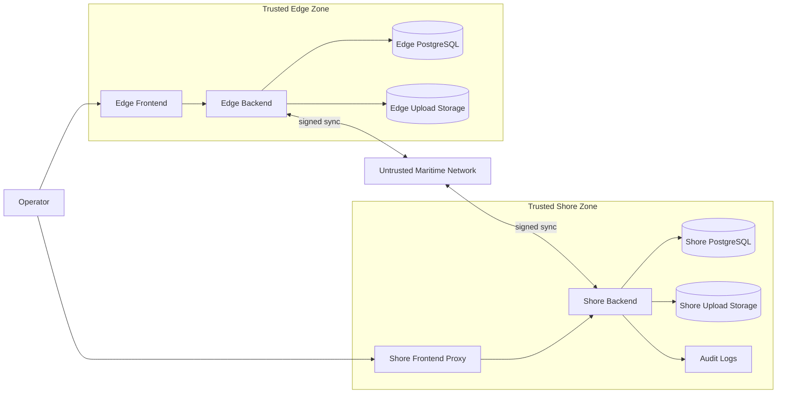
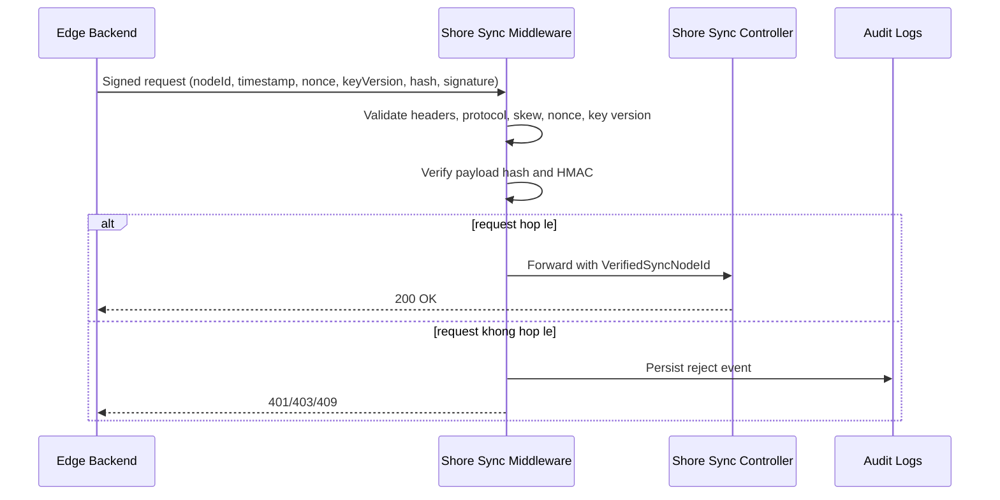

# Phase 3 Threat Model And Trust Boundary

## Muc tieu

Tai lieu nay chot threat model cho dot thuc nghiem sau khi Shore va Edge da duoc freeze o runtime. Muc tieu la bien cac claim bao mat cua Phase 1 va Phase 2 thanh cac gia thuyet co the kiem chung bang test scenario va metric.

## 1. Pham vi he thong

Pham vi danh gia gom:

- Shore backend va Shore frontend/reverse proxy.
- Edge backend va Edge frontend.
- Kenh dong bo Edge -> Shore va Shore -> Edge.
- PostgreSQL, file storage uploads va audit log.
- Nguoi dung van hanh tai Shore va Edge.
- Moi truong mang bien gom Shore WiFi, 4G, VSAT va mang suy giam.

Ngoai pham vi:

- Bao mat he dieu hanh host va hypervisor.
- Tan cong vat ly vao may chu va thiet bi tau.
- Chuoi cung ung package ben thu ba ngoai muc audit runtime hien tai.

## 2. Tai san can bao ve

### 2.1. Tai san nghiep vu

- Ho so thuyen vien, chung chi, travel documents, health documents.
- Voyage reports, maintenance data, ship data va planning data.
- Tep dinh kem dong bo hai chieu.

### 2.2. Tai san bao mat

- Node identity cua tung Edge.
- Signing key, internal API key, JWT key va database credentials.
- Audit trail trong `audit_logs`.
- Lich su outbox, inbox, ack va tracker cua sync.

### 2.3. Tai san van hanh

- Tinh san sang cua Shore sync endpoint.
- Tinh toan ven cua payload va file checksum.
- Kha nang truy vet nguon goc file va batch sync.

## 3. Tac nhan de doa

### 3.1. Network attacker

Co kha nang nghe len, sua goi tin, phat lai goi tin cu, lam tang delay, lam rot goi tin.

### 3.2. Compromised Edge node

Co kha nang gui payload hop le ve mat cu phap nhung co y gian lan node identity, replay nonce cu, su dung signing key cu sau revoke hoac rotate.

### 3.3. Malicious insider

Co kha nang truy cap vao giao dien Shore, dashboard, log, file uploads hoac secret provisioning theo quyen noi bo.

### 3.4. Token or secret thief

Co kha nang lay duoc token, internal key, signing key tu env, log, client storage hoac may tram.

## 4. Trust boundary

## 5. Luong giao tiep can bao ve

### 5.1. Shore frontend -> Shore backend

- Bao ve bang `X-Internal-Api-Key` va reverse proxy internal access.
- Rui ro chinh: lo internal key, bypass proxy, misuse endpoint observability.

### 5.2. Edge frontend -> Edge backend

- Bao ve bang auth layer va internal access cho endpoint van hanh.
- Rui ro chinh: token misuse, XSS/session misuse, internal endpoint abuse.

### 5.3. Edge <-> Shore signed sync

- Bao ve bang `X-Sync-Node-Id`, timestamp, nonce, key version, payload hash, protocol version va HMAC signature.
- Rui ro chinh: replay, tamper payload, forged ack, node spoofing, stale key usage.

## 6. Muc tieu bao mat va co che doi pho

| Muc tieu | Mo ta | Co che hien co | Bang chung can thu thap |
|---|---|---|---|
| Node authenticity | Chi node da provision moi sync duoc | DB-backed node registry, signing key, revoke/reactivate | log signed request, dashboard node security state |
| Message integrity | Payload va file khong bi sua ma khong bi phat hien | `X-Sync-Content-SHA256`, file checksum, provenance | reject log, file checksum mismatch evidence |
| Anti-replay | Batch cu/nonce cu bi tu choi | nonce TTL cache, timestamp skew window | replay rejection rate |
| Ownership binding | Payload khong gia mao `originNode` | verified node normalization tai Shore | conflict test evidence |
| Rotation safety | Doi key khong lam tat enforcement | key version, previous key grace, rollback | acknowledged key version, rotation scenario |
| Traceability | Co the truy vet su kien reject va file source | `audit_logs`, file provenance metadata | audit extract theo scenario |

## 7. Cac de doa uu tien cao

### T1. Gia mao node bang cach sua `nodeId` trong body/query

- Muc tieu cua attacker: day du lieu len Shore nhu mot tau khac.
- Giam nhe hien co: Shore rang buoc node da verify voi body/query va overwrite origin theo node da verify.
- Ky vong test: request bi tu choi hoac payload bi normalize ve node da verify.

### T2. Replay batch cu

- Muc tieu cua attacker: buoc Shore apply lai batch hop le truoc do.
- Giam nhe hien co: nonce TTL cache va timestamp skew validation.
- Ky vong test: request replay bi reject va co audit log reason `replay_detected`.

### T3. Sua payload sau khi ky

- Muc tieu cua attacker: chen hoac sua du lieu trong batch sync.
- Giam nhe hien co: payload hash va HMAC signature.
- Ky vong test: `payload_hash_mismatch` hoac `invalid_signature`.

### T4. Sua file dinh kem

- Muc tieu cua attacker: sua document sau khi dong bo hoac chen file doc hai.
- Giam nhe hien co: `FileChecksumSha256`, `FileSourceNodeId`, `FileSourcePath`, checksum verify truoc khi ghi file.
- Ky vong test: request bi fail va khong ghi file len node nhan.

### T5. Su dung node da revoke

- Muc tieu cua attacker: tiep tuc sync sau khi node bi vo hieu hoa.
- Giam nhe hien co: `IsRevoked`, revoke endpoint, verification middleware.
- Ky vong test: Shore tra 403 va ghi audit reject.

### T6. Su dung key cu sau rotate

- Muc tieu cua attacker: giu key cu qua han grace hoac tan dung rollback sai cach.
- Giam nhe hien co: `X-Sync-Key-Version`, previous-key grace window, rollback endpoint, acknowledged key version.
- Ky vong test: chi chap nhan key cu trong cua so grace da dinh, het grace thi reject.

## 8. Sequence diagram can kiem chung

## 9. Residual risk sau Phase 2

- Replay registry hien la memory-local, chua chia se da instance neu Shore scale out.
- Chua co mTLS giua Edge va Shore, hien dang dung request signing.
- Chua co secret rotation orchestration tap trung ngoai key rotation cho sync node.
- Ownership matrix cap domain cho voyage/maintenance/planning moi o muc can hoan thien them.

## 10. Cach su dung tai lieu nay trong Phase 3

- Dung muc 7 de anh xa threat -> scenario test trong test matrix.
- Dung muc 6 de anh xa security claim -> metric -> bang chung.
- Dung trust boundary va sequence diagram cho chuong kien truc va chuong danh gia trong bao cao.