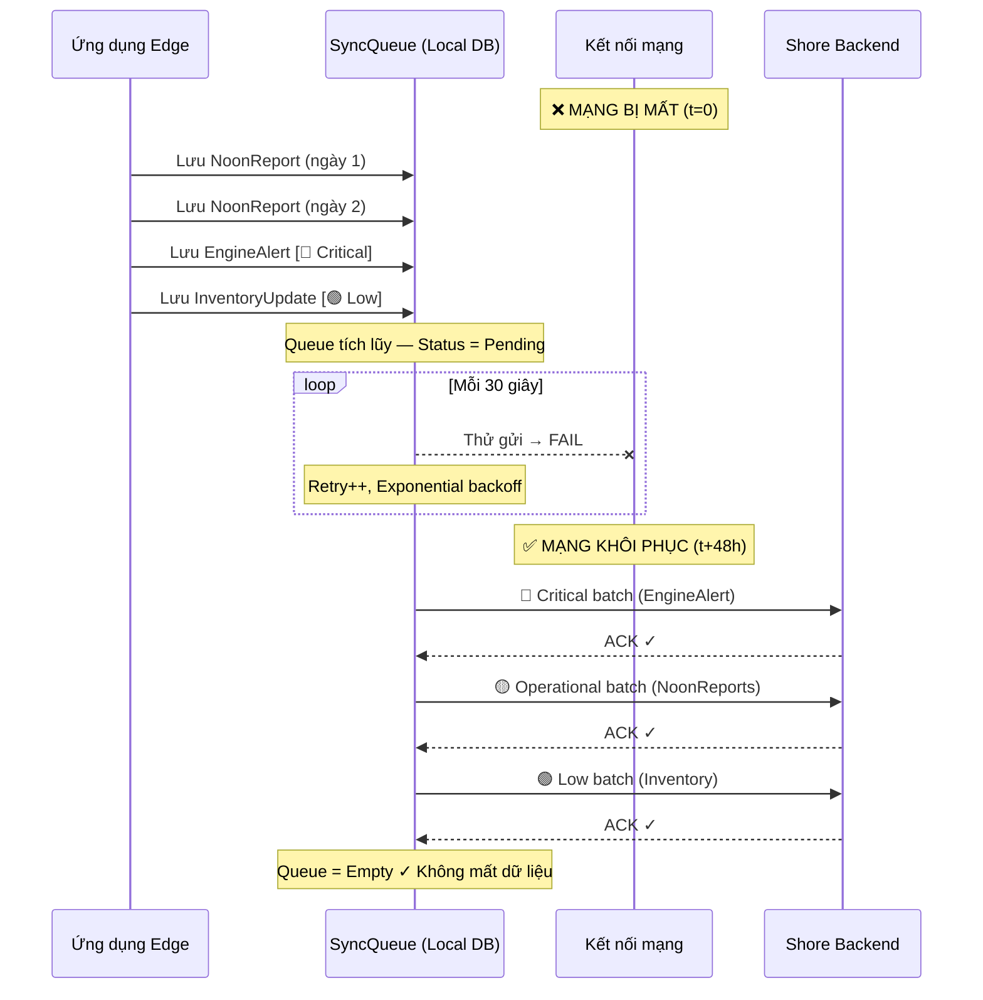
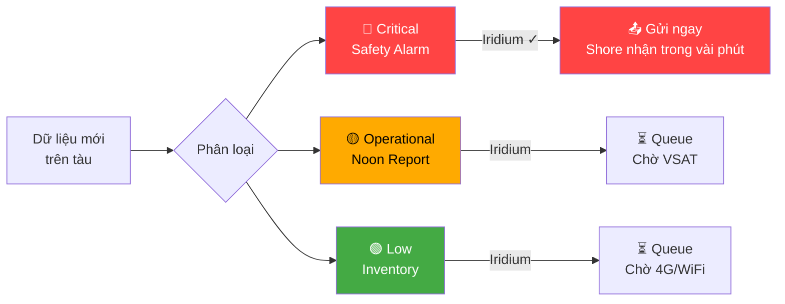
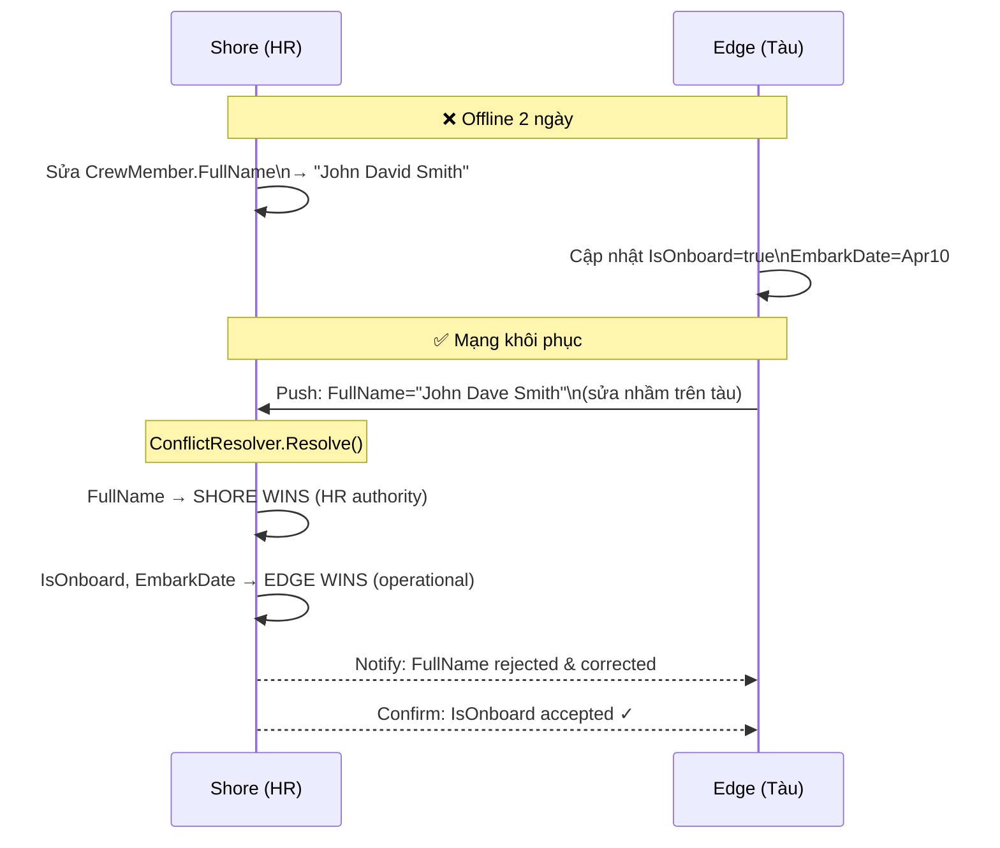

# 🚢 HỆ THỐNG QUẢN LÝ TÀU BIỂN — SLIDE TRÌNH BÀY

> **Buổi họp:** Giới thiệu hệ thống Shore–Edge & cơ chế đồng bộ dữ liệu
> **Ngày:** 17/04/2026

---

> ## CẤU TRÚC TRÌNH BÀY
>
> **Mở đầu** (Slide 1–5) — Bối cảnh · Bài toán · Giải pháp tổng thể
>
> **Phần 1 — Các chức năng đã triển khai** (Slide 6–12)
> → Quản lý thuyền viên · PMS · Hành trình · Báo cáo & Logbook
>
> **Phần 2 — Vấn đề đồng bộ Shore–Edge** (Slide 13–20)
> → Cơ chế sync · Kịch bản mất mạng · Xử lý xung đột

---

## SLIDE 1 — TIÊU ĐỀ

```
┌─────────────────────────────────────────────────────────┐
│                                                         │
│      HỆ THỐNG QUẢN LÝ HẠNG ĐỘI TÀU BIỂN              │
│          KIẾN TRÚC SHORE–EDGE COMPUTING                │
│                                                         │
│  🏢 Bờ ←──── Đồng bộ hai chiều ────→ 🚢 Tàu           │
│                                                         │
│        "Offline-First · Store-and-Forward"             │
│                                                         │
└─────────────────────────────────────────────────────────┘
```

---

## SLIDE 2 — BỐI CẢNH NGÀNH HÀNG HẢI

### Đặc thù vận hành tàu biển

```
  Tàu container       Tàu dầu / hóa chất       Tàu hàng rời
  ─────────────       ──────────────────        ─────────────
  Đa cảng, đa quốc    Tuân thủ MARPOL           Hải trình dài
  gia mỗi chuyến      Annex I/II nghiêm ngặt    Hàng tháng xa bờ
```

### Thách thức quản lý

- 👥 **Thuyền viên** đa quốc tịch, thay đổi liên tục, chứng chỉ có hạn
- ⚙️ **Máy móc** hàng trăm thiết bị — bảo trì theo ISM Code
- 📋 **Tuân thủ** SOLAS · MARPOL · MLC 2006 · STCW — tài liệu pháp lý
- 🌊 **Hải trình** xa bờ hàng tuần, liên lạc hạn chế
- 📊 **Chủ tàu / công ty** cần giám sát đa tàu từ đất liền

### Hiện trạng phổ biến

| Vấn đề | Cách làm cũ |
|---|---|
| Quản lý thuyền viên | Excel, email, giấy tờ |
| Báo cáo hành trình | Fax / email thủ công |
| Bảo trì máy móc | Sổ tay, nhắc nhở miệng |
| Giám sát từ bờ | Chờ tàu cập cảng |

---

## SLIDE 3 — BÀI TOÁN CẦN GIẢI QUYẾT

### 4 bài toán cốt lõi

```
  ❶ QUẢN LÝ THUYỀN VIÊN             ❷ BẢO TRÌ MÁY MÓC
  ────────────────────               ─────────────────
  · Hồ sơ phân tán, không            · Lịch bảo trì không
    đồng bộ bờ–tàu                     được theo dõi tập trung
  · Chứng chỉ hết hạn                · Vật tư thiếu, chờ đợi
    không được cảnh báo                lệnh từ bờ
  · Phân công thủ công               · Không có lịch sử
    dễ nhầm lẫn                        bảo trì đáng tin cậy

  ❸ QUẢN LÝ HÀNH TRÌNH              ❹ BÁO CÁO & TUÂN THỦ
  ─────────────────────              ─────────────────────
  · Kế hoạch bờ ≠ thực tế           · Báo cáo làm tay,
    trên tàu                           dễ sai sót
  · Chi phí / doanh thu              · Logbook không đồng bộ
    không khớp                         với thực tế
  · Không biết tàu đang              · Khó audit khi có
    ở đâu, làm gì                      sự cố / thanh tra
```

### Hệ quả

- ⚠️ Rủi ro pháp lý — vi phạm PSC / Port State Control
- 💰 Chi phí tăng — bảo trì khẩn cấp, phạt compliance
- 📉 Hiệu quả thấp — quyết định chậm vì thiếu dữ liệu

---

## SLIDE 4 — GIẢI PHÁP TỔNG THỂ

### Một hệ thống — hai nền tảng kết nối

```
┌────────────────────────────────────────────────────────────┐
│  🏢  SHORE (Trung tâm điều hành — Trên bờ)                │
│                                                            │
│  Crew HR  ·  Voyage Planning  ·  Fleet Overview           │
│  Compliance  ·  PMS Master  ·  Analytics  ·  Sync Monitor │
└──────────────────────┬─────────────────────────────────────┘
                       │  VSAT / 4G / Iridium
                       │  Đồng bộ hai chiều
                       │  (khi có kết nối)
┌──────────────────────┴─────────────────────────────────────┐
│  🚢  EDGE (Trên tàu — hoạt động 100% offline)             │
│                                                            │
│  Logbook  ·  Reports  ·  PMS thực thi  ·  Safety         │
│  Telemetry  ·  Crew onboard  ·  Kho vật tư  ·  Voyage    │
│                                          📱 Mobile App    │
└────────────────────────────────────────────────────────────┘
```

### Giải quyết 4 bài toán như thế nào?

| Bài toán | Giải pháp |
|---|---|
| ❶ Thuyền viên | Hồ sơ tập trung (Shore) · Trạng thái thực (Edge) · Cảnh báo tự động |
| ❷ Bảo trì | Master Schedule (Shore) · Checklist thực thi (Edge) · Kho vật tư số hóa |
| ❸ Hành trình | Voyage Plan (Shore) → Voyage Execution (Edge) · Dữ liệu thực tế sync về |
| ❹ Báo cáo | Form chuẩn IMO · Export PDF/Excel · Shore tổng hợp đa tàu |

---

## SLIDE 5 — KIẾN TRÚC KỸ THUẬT TỔNG QUAN

### Stack công nghệ

```
              SHORE                          EDGE
         ─────────────                  ─────────────
         React 19                       React 19
         ASP.NET Core 8                 ASP.NET Core 8        📱 Flutter
         PostgreSQL (110+ bảng)         PostgreSQL (60+ bảng)   Mobile
         29 Controllers                 51 Controllers
         35+ trang                      55+ trang
```

### Triết lý thiết kế

- 🔌 **Offline-First** — tàu không phụ thuộc kết nối để vận hành
- 📦 **Store-and-Forward** — dữ liệu không mất dù mạng đứt hàng ngày
- ⚖️ **Data Ownership** — mỗi loại dữ liệu có nguồn gốc rõ ràng
- 🔒 **Role-Based Access** — phân quyền theo chức danh hàng hải
- 📏 **IMO Compliant** — form, logbook, report đúng chuẩn quốc tế

---

---

# PHẦN 1 — CÁC CHỨC NĂNG ĐÃ TRIỂN KHAI

---

## SLIDE 3 — QUẢN LÝ THUYỀN VIÊN (CREW MANAGEMENT)

### Vấn đề

- Thuyền viên thay đổi liên tục theo chuyến đi — onboard/off liên tục
- Chứng chỉ STCW/MLC có hạn sử dụng — cần theo dõi tự động
- Phân công phức tạp: rank, cert phù hợp, vị trí trên tàu

### Giải pháp đã triển khai

```
SHORE (HR/Compliance)           EDGE (Trên tàu)
──────────────────              ───────────────
✦ Hồ sơ thuyền viên            ✦ Trạng thái onboard
  - Thông tin cá nhân             - EmbarkDate / DisembarkDate
  - Tài liệu: passport,           - Vị trí thực tế trên tàu
    seaman book, visa           ✦ Chứng chỉ (bản scan)
✦ Chứng chỉ (metadata)           - Upload file từ tàu
  - STCW, MLC, GMDSS           ✦ Lịch sử phục vụ
  - Ngày cấp / hết hạn            - ServiceRecord thực tế
✦ Phân công (Assignment)
  - Rank, vị trí, tàu
✦ Quy trình HR
  - Onboarding workflow
  - Travel request
  - Compliance evaluation
✦ Cảnh báo tự động
  - Cert hết hạn < 30 ngày
```

### Màn hình chính

- Danh sách crew · Chi tiết hồ sơ · Lịch sử phục vụ
- Ma trận chứng chỉ (STCW heatmap)
- Phân công tàu · Timeline onboard/off

---

## SLIDE 4 — PMS — BẢO TRÌ PHÒNG NGỪA

### Vấn đề

- Máy móc trên tàu cần bảo trì định kỳ theo ISM Code
- Hàng trăm đầu thiết bị, hàng nghìn công việc/năm
- Theo dõi tiến độ, vật tư, lịch sử bảo trì

### Giải pháp đã triển khai

```
SHORE                           EDGE
──────────────────              ───────────────
✦ Master Schedule               ✦ Thực hiện công việc
  - Lịch tổng thể toàn đội        - Checklist từng bước
  - Theo dõi compliance           - Cập nhật trạng thái real-time
✦ Equipment Assets              ✦ Lập lịch bảo trì
  - Hồ sơ thiết bị                - Kế hoạch định kỳ
  - Thông số kỹ thuật             - Deferral request (gia hạn)
✦ Work Planning (bờ duyệt)     ✦ Kho vật tư
  - Phê duyệt kế hoạch            - Inventory stock
  - Phân bổ nguồn lực             - Material request / receipt
                                  - Fuel analytics
```

### Luồng công việc

```
Shore tạo Master Plan  →  Sync xuống Edge  →  Thuyền viên thực hiện
       ↑                                              ↓
  Shore theo dõi  ←──────── Sync kết quả lên ─────────┘
  + Báo cáo compliance
```

### Màn hình chính

- Master Schedule (Gantt-style) · Equipment List
- Task checklist (drag & drop) · Maintenance history
- Inventory dashboard · Stock receipt

---

## SLIDE 5 — QUẢN LÝ HÀNH TRÌNH (VOYAGE MANAGEMENT)

### Vấn đề

- Mỗi chuyến đi gồm: lập kế hoạch (bờ) + thực thi (tàu)
- Dữ liệu thương mại (cargo, chi phí) do bờ quản lý
- Dữ liệu thực tế (giờ cập bến, tiêu thụ nhiên liệu) từ tàu

### Giải pháp đã triển khai

```
SHORE (Planning)                EDGE (Execution)
──────────────────              ───────────────
✦ Voyage Record                 ✦ Voyage Cockpit
  - Tuyến đường, cảng             - Dashboard real-time
  - ETD / ETA                     - Vị trí, tốc độ, heading
✦ Cargo Plan                    ✦ Voyage Log
  - Loại hàng, số lượng           - Ghi chú hành trình
  - Shipper/Consignee           ✦ PortCall thực tế
✦ Bunker Plan                     - ActualArrival/Departure
  - Kế hoạch tiếp nhiên liệu      - Cargo ops completed
✦ Cost Estimate                 ✦ Voyage Financial (Edge)
  - Chi phí dự kiến               - Chi phí thực tế
✦ Revenue / Settlement          ✦ Efficiency Tracking
  - Quyết toán chuyến đi          - Speed, fuel per mile
```

### Ownership dữ liệu

| Trường | Nguồn gốc | Ghi chú |
|---|---|---|
| VoyageNumber, Route, Ports | Shore | Commercial plan |
| ActualArrival, RealFuelBurned | Edge | Dữ liệu thực tế từ tàu |
| CargoPlan (quantity) | Shore | Hợp đồng thương mại |
| CargoOps (actual) | Edge | Thực hiện trên tàu |

---

## SLIDE 6 — BÁO CÁO & LOGBOOK

### Vấn đề

- Tàu phải nộp báo cáo định kỳ theo IMO/SOLAS/MARPOL
- Logbook là tài liệu pháp lý — không được sai sót
- Shore cần tổng hợp dữ liệu từ nhiều tàu

### Báo cáo vận hành (trên tàu)

| Loại báo cáo | Tần suất | Nội dung chính |
|---|---|---|
| **Noon Report** | Hàng ngày 12:00 | Vị trí, tốc độ, nhiên liệu, thời tiết |
| **Departure Report** | Mỗi lần rời cảng | Thông tin khởi hành, trạng thái tàu |
| **Arrival Report** | Mỗi lần cập cảng | Thời gian thực, hàng hóa, crew |
| **Bunker Report** | Sau tiếp nhiên liệu | Loại, số lượng, nhà cung cấp |
| **Position Report** | Theo yêu cầu | Tọa độ GPS + AIS |

### Logbook chính thức (SOLAS/MARPOL)

- 📒 **Deck Logbook** — hành trình, thời tiết, sự kiện
- ⚙️ **Engine Logbook** — máy móc, nhiên liệu, nhiệt độ
- 🛢️ **Oil Record Book** — xả thải theo MARPOL Annex I
- 🗑️ **Garbage Record** — quản lý rác thải MARPOL Annex V
- 💧 **Ballast Water Record** — BWMC 2004
- 👁️ **Watchkeeping Log** — ca trực, sĩ quan trực ban

### Tính năng

- Export **Excel / PDF** đúng mẫu IMO
- Shore tổng hợp **đa tàu** — so sánh hiệu suất
- **AI Evaluation** (đang triển khai) — phân tích Noon Report tự động

---

## SLIDE 7 — AN TOÀN & GIÁM SÁT REAL-TIME

### Safety Module (trên tàu)

```
┌─────────────────────────────────────────┐
│  Safety Alarms        Drill Management  │
│  ──────────────       ───────────────── │
│  · Phân loại theo     · Drill timeline  │
│    mức độ nguy hiểm   · Các loại: Fire, │
│  · Acknowledge &        Abandon Ship,   │
│    escalation           MOB, GMDSS      │
│  · Shore nhận ngay    · Ghi chép kết quả│
│    (Critical priority)  + đánh giá      │
└─────────────────────────────────────────┘
```

### Telemetry & Giám sát

- 📍 **GPS / AIS** — vị trí real-time, route tracking
- ⚙️ **Engine Data** — nhiệt độ, RPM, pressure, tải động cơ
- 🛢️ **Tank Level** — mức nhiên liệu, ballast, fresh water
- ⚡ **Generator** — công suất, tần số, fuel rate
- 📱 **Mobile App (Flutter)** — thuyền viên xem alarm & task trực tiếp

---

## SLIDE 8 — PHÂN QUYỀN & BẢO MẬT

### Role-based access — 9 vai trò

```
SHORE Roles                     EDGE Roles
───────────                     ──────────
Admin                           Master (Thuyền trưởng)
HRAdmin                         ChiefOfficer
CrewCoordinator                 Engineer
ComplianceOfficer               Crew (thuyền viên)
FleetManager
PortCaptain
SystemAdmin
```

### Kiểm soát truy cập

- JWT Bearer Token — mỗi phiên đăng nhập
- Mỗi endpoint được gán policy cụ thể
- Audit Log — ghi lại toàn bộ hành động quan trọng
- Internal API Key — bảo vệ kênh sync Shore ↔ Edge

---

## SLIDE 9 — TỔNG KẾT PHẦN 1

### Những gì đã có

```
  Crew Management     PMS                 Voyage              Reports
  ───────────────     ───────────         ───────             ───────
  ✅ Hồ sơ đầy đủ    ✅ Master Schedule  ✅ Planning (Shore) ✅ 5 loại báo cáo
  ✅ STCW/MLC certs  ✅ Equipment list   ✅ Execution (Edge) ✅ 9 loại logbook
  ✅ Phân công tàu   ✅ Work checklist   ✅ Cargo/Bunker     ✅ Export PDF/Excel
  ✅ Onboarding flow ✅ Kho vật tư       ✅ Settlement        ✅ Multi-ship view
  ✅ Compliance eval ✅ Fuel analytics   ✅ Real-time cockpit ✅ AI eval (WIP)
```

### Số liệu

| Thành phần | Shore | Edge |
|---|---|---|
| Controllers | 29 | 51 |
| Frontend pages | 35+ | 55+ |
| Database tables | 110+ | 60+ |
| Mobile App | — | Flutter (Android/iOS) |

---

---

# PHẦN 2 — VẤN ĐỀ ĐỒNG BỘ SHORE–EDGE

---

## SLIDE 10 — BÀI TOÁN ĐỒNG BỘ

### Tại sao đồng bộ là thách thức lớn?

- 🌊 Kết nối **không liên tục** — mất mạng hàng giờ, hàng ngày
- ✏️ **Hai đầu cùng sửa** một dữ liệu khi offline
- 📦 Dữ liệu **khác nhau về bản chất** — thương mại vs vận hành
- 📡 Băng thông **giới hạn và tốn kém** — không thể sync tất cả

### Các loại kết nối thực tế

| Kết nối | Băng thông | Chi phí | Vùng phủ |
|---|---|---|---|
| 🛰️ Iridium | 0.12 – 1 kbps | Rất cao | Toàn cầu |
| 🛰️ VSAT | 64 kbps – 2 Mbps | Cao | Gần toàn cầu |
| 📶 4G/LTE | 1 – 100 Mbps | Trung bình | Gần bờ |
| 📶 Shore WiFi | 10+ Mbps | Thấp | Tại cảng |

### Yêu cầu đặt ra

- ✅ Tàu **không bị gián đoạn** khi mất mạng
- ✅ Dữ liệu **không mất, không trùng** khi mạng trở lại
- ✅ Xung đột được **giải quyết đúng nghiệp vụ**
- ✅ **Tiết kiệm băng thông** — ưu tiên dữ liệu quan trọng

---

## SLIDE 11 — GIẢI PHÁP: OFFLINE-FIRST + STORE-AND-FORWARD

### Nguyên tắc thiết kế

- ✅ **Offline-First** — Edge hoạt động hoàn toàn độc lập
- ✅ **Store-and-Forward** — Queue lưu trữ, gửi khi có mạng
- ✅ **Network-Aware** — Lọc theo loại kết nối hiện tại
- ✅ **Idempotent** — Gửi lại nhiều lần không gây trùng lặp
- ✅ **Bidirectional** — Shore ↔ Edge hai chiều

### Luồng đồng bộ tổng quan

```
┌───────────────────────────────────────────────────────────┐
│  EDGE (Tàu)                              SHORE (Bờ)       │
│                                                           │
│  App lưu dữ liệu                                         │
│       │                                                   │
│       ▼                                                   │
│  SyncQueue ──── PUSH (30s) ───────────► SyncInboxService  │
│  (store-and-                             ConflictResolver  │
│   forward)                              IdempotencyCheck  │
│                                                  │        │
│  SyncWorker ◄───── PULL (30s) ──────── SyncOutbox        │
│  ApplyChanges        cursor pagination  (outgoing)        │
│  ConflictHandler                                          │
│       │                                                   │
│       └────── ACK ──────────────────► Mark Delivered      │
└───────────────────────────────────────────────────────────┘
```

---

## SLIDE 12 — ƯU TIÊN ĐỒNG BỘ THEO KẾT NỐI

### 3 mức ưu tiên

| Mức | Loại dữ liệu | Ví dụ |
|---|---|---|
| 🔴 **Critical** | An toàn, báo động khẩn | Safety alarms, Distress |
| 🟡 **Operational** | Vận hành, báo cáo | Noon reports, Crew, Position |
| 🟢 **Low** | Hành chính, kho | Inventory, Logbook, Documents |

### Ma trận kết nối × ưu tiên

```
                 🔴 Critical   🟡 Operational   🟢 Low
Iridium            ✅ Gửi         ⏳ Chờ          ⏳ Chờ
VSAT               ✅ Gửi         ✅ Gửi           ⏳ Chờ
4G / WiFi          ✅ Gửi         ✅ Gửi           ✅ Gửi
Không mạng         ❌ Queue       ❌ Queue         ❌ Queue
```

### Cơ chế retry

- Thất bại → **Exponential backoff** (tối đa 5 lần)
- Item lỗi không chặn các item tiếp theo trong queue

---

## SLIDE 13 — KỊCH BẢN: MẤT MẠNG HOÀN TOÀN 48 GIỜ

### Tình huống: Bão lớn — mất VSAT giữa biển



### Điểm quan trọng

- Tàu **không bị gián đoạn** suốt 48h — vẫn đủ chức năng
- Sau khi mạng trở lại → sync **tự động, đúng thứ tự**

---

## SLIDE 14 — KỊCH BẢN: CHỈ CÒN IRIDIUM (< 1 kbps)

### Tình huống: Vùng không có VSAT, chỉ có Iridium



### Kết quả thực tế

| Giai đoạn | Shore nhận được |
|---|---|
| Chỉ Iridium | ⚠️ Cảnh báo an toàn ngay lập tức |
| VSAT khôi phục | + Báo cáo hành trình, vị trí, crew |
| Cập cảng (WiFi) | + Toàn bộ logbook, kho, tài liệu |

---

## SLIDE 15 — KỊCH BẢN: XUNG ĐỘT DỮ LIỆU

### Tình huống: Shore và Edge cùng sửa khi offline



### Quy tắc giải quyết

| Loại dữ liệu | Quy tắc | Ví dụ |
|---|---|---|
| Master data (cert, rank) | Shore thắng | HR là nguồn gốc |
| Dữ liệu vận hành | Edge thắng | Noon, logbook, sensor |
| Crew record | Merge từng trường | FullName=Shore, IsOnboard=Edge |
| Timestamp thực tế | Edge thắng | ActualArrival, ActualDeparture |
| Fallback | Last-Write-Wins | Dựa trên UpdatedAt |

---

## SLIDE 16 — KỊCH BẢN ĐẦU ĐỦ: TÀU RỜI CẢNG → HÀNH TRÌNH → CẬP BẾN

```
[T=0] Tàu rời cảng Hải Phòng
   Shore: cập nhật VoyageRecord, Cargo Plan
   Edge: nhận qua PULL (4G tốt)

[T+2h] Ra khơi — mất 4G, chuyển VSAT
   Edge: ghi NoonReport, EngineLog
   Push thành công (🟡 Operational qua VSAT)

[T+8h] Bão — VSAT gián đoạn
   Edge: vẫn hoạt động bình thường (Offline-First)
   Queue tích lũy: 3 NoonReports + SafetyAlarm

[T+9h] Iridium vẫn hoạt động
   🔴 SafetyAlarm → gửi ngay qua Iridium
   Shore nhận cảnh báo, phản ứng kịp thời

[T+11h] VSAT khôi phục
   Auto-sync: 🔴 → 🟡 → 🟢 (đúng thứ tự)
   Shore nhận đủ dữ liệu, không bị lỗ

[T+36h] Cập cảng Singapore — WiFi cảng
   Sync toàn bộ: Logbook, Inventory, tài liệu
   Shore quyết toán chuyến đi, đánh giá hiệu suất
```

---

## SLIDE 17 — KẾT LUẬN & Q&A

### Tóm tắt

```
  PHẦN 1 — CHỨC NĂNG           PHẦN 2 — ĐỒNG BỘ
  ─────────────────             ─────────────────
  ✅ Crew Management            ✅ Offline-First
  ✅ PMS Bảo trì                ✅ Store-and-Forward
  ✅ Voyage Planning            ✅ Priority Filtering
  ✅ Báo cáo & Logbook          ✅ Conflict Resolution
  ✅ Safety & Telemetry         ✅ Idempotent Sync
```

### Giá trị cốt lõi

| Thách thức | Giải pháp | Kết quả |
|---|---|---|
| Mất mạng | Offline-First Edge | Không gián đoạn vận hành |
| Dữ liệu tích lũy | Store-and-Forward Queue | Không mất dữ liệu |
| Băng thông hạn chế | Priority × Network filtering | Tiết kiệm, đúng ưu tiên |
| Xung đột dữ liệu | Domain-based conflict rules | Đúng nghiệp vụ hàng hải |
| Quản lý đa tàu | Shore Sync Dashboard | Tổng quan toàn đội |

### Hướng tiếp theo

- 🤖 **AI Module** — đánh giá Noon Report tự động (Gemini API)
- 📊 **Fleet Analytics** — so sánh hiệu suất đa tàu
- 🔔 **Proactive Alerts** — cảnh báo chủ động từ sensor data

---

> **Thời lượng gợi ý:** ~60 phút (30' phần 1 · 20' phần 2 · 10' Q&A)
>
> **Thứ tự:** Slide 1–2 (Mở đầu) → **3–9 (Phần 1: Chức năng)** → **10–16 (Phần 2: Sync)** → 17 (Kết luận)
