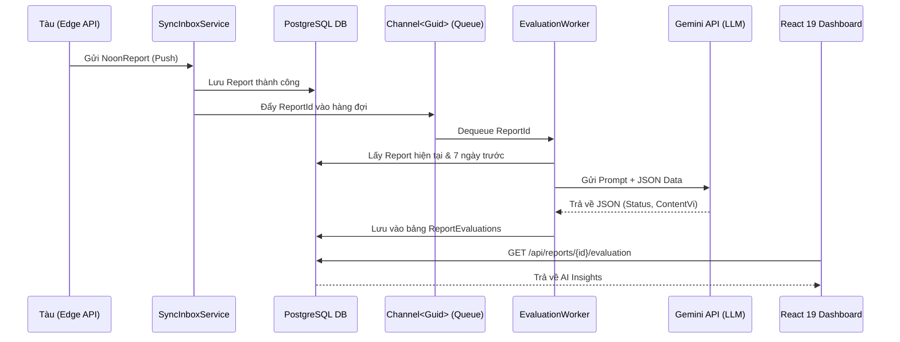

# Kế Hoạch Triển Khai Module AI Đánh Giá Báo Cáo (Shore System)

## 1. Đánh Giá Tính Khả Thi & Kiến Trúc Tổng Thể

Kế hoạch triển khai AI Module trên hệ thống bờ (Shore) là **RẤT KHẢ THI** và phù hợp với kiến trúc C# .NET 8 / React 19 hiện hành.

### 1.1 Sơ Đồ Kiến Trúc Hoạt Động


### 1.2 Giải Pháp Tối Ưu Hóa Thiết Kế
1. **Dependency Injection & Scoped Services:** Chú ý `IHostedService` là Singleton, trong khi `DbContext` là Scoped. Cần dùng `IServiceScopeFactory` trong Worker.
2. **Resilience & Fault Tolerance:** Gọi Gemini API có thể lỗi (Rate Limit 429, Timeout). Cần tích hợp thư viện **Polly** (Retry with Exponential Backoff).
3. **Structured Context:** Thay vì cắt chuỗi manual, tận dụng Entity Framework để Serialize ra đối tượng ẩn danh (Anonymous Type/DTO) rút gọn nhằm tiết kiệm token API.

---

## 2. Các Bước Triển Khai Chi Tiết

### Giai Đoạn 1: Chuẩn Bị Database & Entity (C# EF Core)

**1. Tạo Entity `ReportEvaluation`** (`shore_product/backend/Models/ReportEvaluation.cs`):
```csharp
using System.ComponentModel.DataAnnotations;
using System.ComponentModel.DataAnnotations.Schema;

namespace Maritime.Shore.Models
{
    public class ReportEvaluation
    {
        [Key]
        public Guid Id { get; set; }
        
        [Required]
        public Guid ReportId { get; set; }
        
        [ForeignKey("ReportId")]
        public virtual NoonReport Report { get; set; }
        
        [Required]
        [MaxLength(20)]
        public string Status { get; set; } // "Normal", "Warning", "Critical"
        
        [Required]
        public string ContentVi { get; set; } // Đánh giá chi tiết bằng tiếng Việt
        
        public DateTime CreatedDate { get; set; } = DateTime.UtcNow;
    }
}
```

**2. Cập Nhật DbContext & Migration:**
```csharp
// Trong ShoreDbContext.cs
public DbSet<ReportEvaluation> ReportEvaluations { get; set; }

protected override void OnModelCreating(ModelBuilder modelBuilder)
{
    // Đảm bảo quan hệ 1-1
    modelBuilder.Entity<ReportEvaluation>()
        .HasIndex(e => e.ReportId)
        .IsUnique();
}
```
Chạy lệnh: `dotnet ef migrations add AddReportEvaluations` và `dotnet ef database update`.

**3. Tạo Data Transfer Object (DTO) cho Prompt:**
```csharp
public class ShipMetricsDto
{
    public DateTime ReportDate { get; set; }
    public double EngineTemp { get; set; }
    public double FuelConsumption { get; set; }
    public double Rpm { get; set; }
    public double Speed { get; set; }
}
```

### Giai Đoạn 2: Xây Dựng AI Service (Gemini API Integration)

**1. Định nghĩa Models Output của LLM:**
```csharp
// Model map chính xác với cấu trúc JSON LLM sẽ trả về
public class AiEvaluationResponse
{
    public string Status { get; set; }
    public string ContentVi { get; set; }
}
```

**2. Triển khai `GeminiEvaluationService`:**
Nên đăng ký dưới dạng `Typed HttpClient` để dễ dàng áp dụng Polly.
```csharp
public class GeminiEvaluationService : IGeminiEvaluationService
{
    private readonly HttpClient _httpClient;
    private readonly IConfiguration _config;
    
    public GeminiEvaluationService(HttpClient httpClient, IConfiguration config)
    {
        _httpClient = httpClient;
        _config = config;
    }

    public async Task<AiEvaluationResponse> EvaluateReportAsync(string jsonData, CancellationToken token)
    {
        string apiKey = _config["Gemini:ApiKey"];
        string prompt = $@"
        Bạn là chuyên gia máy trưởng hàng hải. Dựa vào dữ liệu JSON sau, chứa báo cáo hôm nay và 7 ngày qua:
        {jsonData}
        Hãy phân tích bất thường về tiêu hao nhiên liệu, vòng tua (RPM), nhiệt độ máy.
        TRẢ VỀ DUY NHẤT MỘT OBJECT JSON VỚI CẤU TRÚC:
        {{
            ""status"": ""<Normal hoặc Warning hoặc Critical>"",
            ""contentVi"": ""<Nhận xét chi tiết tiếng Việt, ngắn gọn dưới 50 chữ>""
        }}";

        // Logic gọi Google Gemini REST API (Endpoint: v1beta/models/gemini-1.5-flash:generateContent)
        // ... (Parse và trả về đối tượng AiEvaluationResponse)
    }
}
```

### Giai Đoạn 3: Triển Khai Xử Lý Ngầm (Channel & BackgroundService)

**1. Thiết lập Singleton Channel Queue:**
```csharp
// ReportEvaluationQueue.cs
public class ReportEvaluationQueue
{
    private readonly Channel<Guid> _queue;
    public ReportEvaluationQueue()
    {
        _queue = Channel.CreateBounded<Guid>(new BoundedChannelOptions(1000) {
            FullMode = BoundedChannelFullMode.Wait
        });
    }
    public async ValueTask EnqueueAsync(Guid reportId, CancellationToken ct) => await _queue.Writer.WriteAsync(reportId, ct);
    public IAsyncEnumerable<Guid> ReadAllAsync(CancellationToken ct) => _queue.Reader.ReadAllAsync(ct);
}
```

**2. Background Worker chạy ngầm (`ReportEvaluationWorker.cs`):**
```csharp
public class ReportEvaluationWorker : BackgroundService
{
    private readonly ReportEvaluationQueue _queue;
    private readonly IServiceScopeFactory _scopeFactory;

    public ReportEvaluationWorker(ReportEvaluationQueue queue, IServiceScopeFactory scopeFactory)
    {
        _queue = queue;
        _scopeFactory = scopeFactory;
    }

    protected override async Task ExecuteAsync(CancellationToken stoppingToken)
    {
        await foreach (var reportId in _queue.ReadAllAsync(stoppingToken))
        {
            try
            {
                using var scope = _scopeFactory.CreateScope();
                var dbContext = scope.ServiceProvider.GetRequiredService<ShoreDbContext>();
                var aiService = scope.ServiceProvider.GetRequiredService<IGeminiEvaluationService>();
                
                // 1. Lấy dữ liệu (Hiện tại + 7 ngày)
                var report = await dbContext.Reports.FindAsync(reportId);
                var history = await dbContext.Reports
                    .Where(r => r.VesselId == report.VesselId && r.Date >= report.Date.AddDays(-7))
                    .Select(r => new ShipMetricsDto { /* mapping */ })
                    .ToListAsync();
                
                string jsonData = JsonSerializer.Serialize(history);

                // 2. Gọi AI (Có sẵn cơ chế Retry qua Polly từ Program.cs)
                var aiResult = await aiService.EvaluateReportAsync(jsonData, stoppingToken);

                // 3. Lưu vào DB
                dbContext.ReportEvaluations.Add(new ReportEvaluation
                {
                    Id = Guid.NewGuid(),
                    ReportId = reportId,
                    Status = aiResult.Status,
                    ContentVi = aiResult.ContentVi
                });
                await dbContext.SaveChangesAsync(stoppingToken);
            }
            catch (Exception ex)
            {
                // Log lỗi, có thể cân nhắc requeue item nếu lỗi là Transient
            }
            
            // Chống chạm Rate Limit (15 req/min -> Delay 4 giây mỗi nhịp)
            await Task.Delay(4000, stoppingToken); 
        }
    }
}
```

**3. Khơi mào luồng từ `SyncInboxService`:**
Ngay khi tiếp nhận Report thành công và gọi `SaveChanges`, ta chèn:
```csharp
await _reportEvaluationQueue.EnqueueAsync(newReport.Id, cancellationToken);
```

### Giai Đoạn 4: Phát Triển UI/UX (React 19 & Tailwind)

**1. Shore API Endpoint:**
Cung cấp endpoint `GET /api/reports/{id}/ai-insights` trả về Data DTO (nếu có).

**2. React Component (`AIInsights.tsx`):**
Sử dụng Radix UI Card và Lucide React.
```tsx
import React, { useEffect, useState } from 'react';
import { CheckCircle, AlertTriangle, AlertOctagon, BrainCircuit } from 'lucide-react';
import axios from 'axios';

interface IAiInsight {
  status: 'Normal' | 'Warning' | 'Critical';
  contentVi: string;
}

export const AIInsights = ({ reportId }: { reportId: string }) => {
  const [insight, setInsight] = useState<IAiInsight | null>(null);
  const [loading, setLoading] = useState(true);

  useEffect(() => {
    // Nên cân nhắc dùng React-Query (SWR) trong dự án thực tế
    axios.get(`/api/reports/${reportId}/ai-insights`)
      .then(res => setInsight(res.data))
      .catch(() => setInsight(null))
      .finally(() => setLoading(false));
  }, [reportId]);

  if (loading) return <div className="animate-pulse bg-gray-200 h-16 rounded-md"></div>;
  if (!insight) return null; // Fallback khi chưa có dữ liệu AI sinh ra kịp thời

  const getStyle = () => {
    switch(insight.status) {
      case 'Critical': return { color: 'text-red-600', bg: 'bg-red-50', icon: <AlertOctagon size={20} /> };
      case 'Warning': return { color: 'text-yellow-600', bg: 'bg-yellow-50', icon: <AlertTriangle size={20} /> };
      default: return { color: 'text-green-600', bg: 'bg-green-50', icon: <CheckCircle size={20} /> };
    }
  };

  const style = getStyle();

  return (
    <div className={`flex items-start gap-4 p-4 rounded-lg border ${style.bg} mb-4`}>
      <div className={`mt-1 ${style.color}`}>
        {style.icon}
      </div>
      <div>
        <h4 className={`font-semibold flex items-center gap-2 ${style.color}`}>
          <BrainCircuit size={16}/> Phân tích từ AI Hệ thống
        </h4>
        <p className="text-gray-700 text-sm mt-1">{insight.contentVi}</p>
      </div>
    </div>
  );
}
```

---

## 3. Kiến Trúc Mở Rộng & Bảo Mật (Giai Đoạn 5 & 6)

1. **Bảo Mật API Key:** `Gemini:ApiKey` KHÔNG được commit vào code. Sử dụng .NET User Secrets trên môi trường Dev (`dotnet user-secrets set "Gemini:ApiKey" "YOUR_KEY"`) và Environment Variables trên Docker (Production).
2. **Resilience với Polly:** Cấu hình trong `Program.cs` cho dịch vụ HTTP gọi AI.
   ```csharp
   builder.Services.AddHttpClient<IGeminiEvaluationService, GeminiEvaluationService>()
       .AddTransientHttpErrorPolicy(policy => policy.WaitAndRetryAsync(3, _ => TimeSpan.FromSeconds(5)));
   ```
3. **Graceful Degradation:** Nếu AI hỏng hoặc quá tải giới hạn Request, FrontEnd cần bắt lỗi âm thầm và bỏ qua (không hiện panel) thay vì báo vỡ giao diện hệ thống. Dashboard vẫn phải xem được báo cáo bình thường.
4. **Testing Strategy:**
   * *Unit Test:* Viết test cho hàm tạo prompt và parse JSON của thành phần `GeminiEvaluationService`.
   * *Integration Test:* Gửi dữ liệu giả lập vào biến bộ nhớ `Channel` và kiểm tra Record đánh giá có được sinh ra trong InMemory Database.
