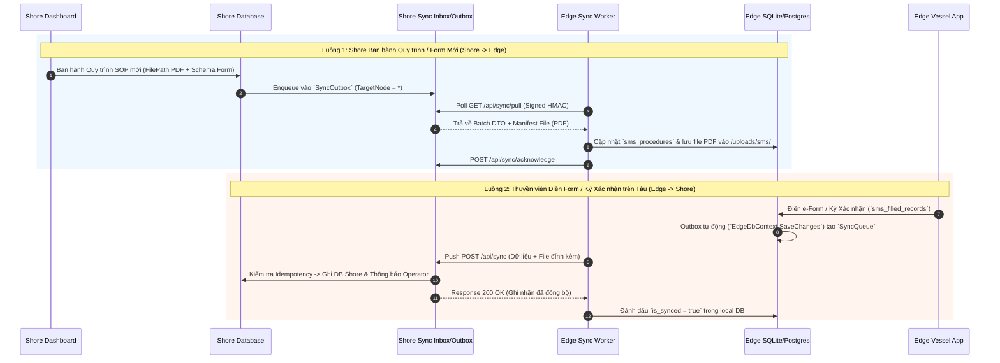

# QUY TRÌNH & CƠ CHẾ ĐỒNG BỘ DỮ LIỆU CỦA SMS SYSTEM (SHORE ⇄ EDGE)

## 1. TỔNG QUAN KIẾN TRÚC ĐỒNG BỘ (SYSTEM ARCHITECTURE)

Hệ thống Quản lý An toàn Hàng hải (Safety Management System - SMS) bao gồm các thực thể cốt lõi:
- **`ism_elements`**: 16 Chương tiêu chuẩn ISM Code.
- **`sms_procedures`**: Quy trình an toàn (SOP), hướng dẫn công việc, phiên bản (Version Bumping) & đính kèm file preview PDF.
- **`sms_form_templates`**: Biểu mẫu điện tử e-Form được gán theo quy trình.
- **`sms_filled_records`**: Các bản ghi e-Form do thuyền viên trên tàu điền, ký tên điện tử và nộp.
- **`sms_procedure_acknowledgements`**: Xác nhận đã đọc & hiểu quy trình của thuyền viên trên tàu.

Cơ chế đồng bộ tuân thủ mô hình **Hai chiều (Bi-directional Master-Edge Sync)** với phân định quyền sở hữu dữ liệu (Ownership Matrix):

---

## 2. MA TRẬN QUYỀN SỞ HỮU DỮ LIỆU (OWNERSHIP MATRIX)

| Thực thể | Nguồn khởi tạo (Origin) | Quyền tác động (Authority) | Hướng đồng bộ | Giải quyết Xung đột (Conflict Resolution) |
|---|---|---|---|---|
| `ism_elements` | Shore Master | Read-only trên Edge | Shore ➔ Edge | Shore Master Always Wins |
| `sms_procedures` | Shore Master | Shore sửa/ban hành bản mới | Shore ➔ Edge | Shore Master Always Wins |
| `sms_form_templates` | Shore Master | Shore gán/chỉnh sửa schema | Shore ➔ Edge | Shore Master Always Wins |
| `sms_filled_records` | Edge (Tàu) | Thuyền viên điền & ký | Edge ➔ Shore | Edge Append-Only (Tàu sở hữu bản ghi) |
| `sms_procedure_acknowledgements` | Edge (Tàu) | Thuyền viên xác nhận | Edge ➔ Shore | Edge Append-Only |

---

## 3. WORKFLOW QUY ĐỊNH CHI TIẾT

### Workflow A: Tạo mới / Ban hành Cập nhật Quy trình SMS (Shore ➔ Edge)
1. **Khởi tạo & Chuyển đổi PDF**:
   - Operator tại Shore tải lên file `.docx` quy trình.
   - Backend Shore sử dụng **Gotenberg Engine** chuyển đổi `.docx` thành PDF Preview và lưu trữ tại `uploads/sms/SMS_xxx.pdf`.
   - Chuẩn hóa văn bản Tiếng Việt bằng **NFC Normalization**.
2. **Lưu trữ & Đưa vào Outbox**:
   - Backend Shore tạo/update bản ghi trong `sms_procedures`.
   - `SyncOutboxService.BroadcastAsync` đóng gói bản ghi `sms_procedures` kèm đường dẫn file PDF vào `SyncOutbox` cho tất cả các tàu (`TargetNode = "*"`).
3. **Kéo dữ liệu từ Tàu (Edge Pull)**:
   - Worker `SyncService` trên tàu định kỳ (mặc định 60s) gửi yêu cầu `GET /api/sync/pull` có chữ ký bảo mật RSA/HMAC lên Shore.
   - Khi nhận bản ghi `sms_procedures`, Edge tự động tải file PDF tương ứng qua pipeline truyền file nhị phân (`SyncFileStorageService`).
   - Cập nhật quy trình vào SQLite/Postgres tại Edge và gửi Acknowledge xác nhận đã nhận thành công.

---

### Workflow B: Điền e-Form & Ký tên Điện tử trên Tàu (Edge ➔ Shore)
1. **Thực hiện trên Tàu**:
   - Thuyền viên chọn Form Template, điền dữ liệu theo Schema JSON và thực hiện ký tên kỹ thuật số.
   - Nhấn **Nộp báo cáo**, hệ thống lưu bản ghi vào `sms_filled_records` với `is_synced = false`.
2. **Tự động Outbox tại Edge**:
   - Interceptor `EdgeDbContext.SaveChangesAsync` tự động phát hiện bản ghi `sms_filled_records` mới và tạo 1 entry vào hàng đợi `SyncQueue` với độ ưu tiên **Operational**.
3. **Đẩy lên Shore (Push & Retry)**:
   - `SyncService` trên Edge gom dữ liệu theo batch (Adaptive Batch Size tùy thuộc đường truyền Viasat/4G/Wifi) gửi lên `POST /api/sync` ở Shore.
   - Nối chuyến tự động hỗ trợ Exponential Backoff + Jitter khi gặp sự cố mất mạng hải trình.
4. **Tiếp nhận & Xử lý tại Shore**:
   - `SyncInboxService` ở Shore nhận dữ liệu, kiểm tra tính duy nhất (Idempotency Key: `sms_filled_records:{id}:{version}`).
   - Ghi dữ liệu vào DB Shore, lưu file đính kèm (nếu có), và phát thông báo Real-time cho Trưởng phòng HSQE/DPA tại Shore.
   - Phản hồi 200 OK để Edge đánh dấu `is_synced = true`.

---

## 4. QUY TRÌNH XỬ LÝ FILE ĐÌNH KÈM & BẢO MẬT

1. **Truyền dẫn File Nhị phân (Binary File Sync)**:
   - Các thuộc tính file `FilePath` (file PDF preview quy trình) và `AttachmentPath` (bản scan/ảnh đính kèm e-Form) được đăng ký vào danh mục `_fileTableNames`.
   - Tiến trình đồng bộ tự động tạo Manifest SHA-256 mã hóa, cắt nhỏ file (chunking) và truyền qua HTTP/HTTPS an toàn.
2. **Tính Toàn vẹn Dữ liệu**:
   - Chữ ký điện tử của thuyền viên và nội dung e-Form sau khi nộp là **Immutable** (không thể sửa đổi trên Edge).
   - Mọi thay đổi quy trình từ Shore đều tạo phiên bản mới (`Version Bump`: Rev 1.0 -> Rev 2.0), lưu trữ lịch sử phục vụ kiểm toán ISM/PSC Audit.

---

## 5. HƯỚNG DẪN VẬN HÀNH & KIỂM TRA

- **Kiểm tra trạng thái đồng bộ**: Xem tại trang `/sync` (Sync Management Dashboard) ở Shore hoặc danh mục đồng bộ ở Edge.
- **Log đồng bộ**:
  - Edge Backend: Xem `SyncService` log trong `edge_run.log` hoặc Docker console.
  - Shore Backend: Xem `SyncInboxService` log trong `shore_run.log`.
