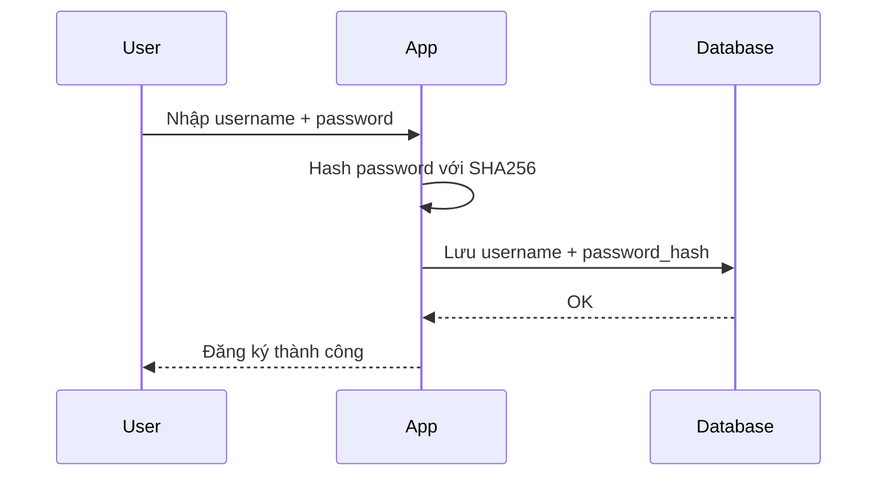
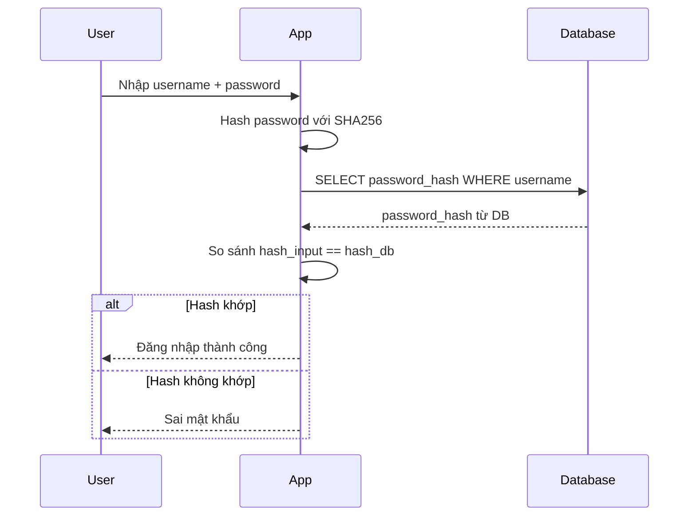

# Hướng Dẫn Bảo Mật Mật Khẩu - Password Security Guide

## 📋 Mục Lục
1. [Giới thiệu về Hash Password](#giới-thiệu-về-hash-password)
2. [SHA256 là gì?](#sha256-là-gì)
3. [Cách hoạt động trong hệ thống](#cách-hoạt-động-trong-hệ-thống)
4. [Ví dụ thực tế](#ví-dụ-thực-tế)
5. [So sánh các phương pháp hash](#so-sánh-các-phương-pháp-hash)
6. [Best Practices](#best-practices)
7. [Cách kiểm tra và đổi mật khẩu](#cách-kiểm-tra-và-đổi-mật-khẩu)

---


-- 5. Xem password hash của tất cả users kèm password gốc (nếu là ngày sinh)
SELECT 
    u.username,
    u.password_hash,
    cm.full_name,
    to_char(cm.date_of_birth, 'DDMMYYYY') as original_password,
    cm.date_of_birth,
    r.role_name
FROM users u
LEFT JOIN crew_members cm ON u.crew_id = cm.crew_id
LEFT JOIN roles r ON u.role_id = r.id
ORDER BY u.username;

## 🔐 Giới thiệu về Hash Password

### Tại sao không lưu mật khẩu trực tiếp?

**❌ KHÔNG BAO GIỜ** lưu mật khẩu dưới dạng plain text (văn bản thuần):
```sql
-- ❌ NGUY HIỂM - Không bao giờ làm như này!
INSERT INTO users (username, password) VALUES ('admin', 'admin123');
```

**Lý do:**
- Nếu database bị hack, tất cả mật khẩu bị lộ
- Admin hệ thống có thể thấy mật khẩu của người dùng
- Vi phạm quy định bảo mật dữ liệu (GDPR, ISO 27001)
- Người dùng thường dùng chung mật khẩu cho nhiều hệ thống

**✅ ĐÚNG** - Lưu mật khẩu đã được hash:
```sql
-- ✅ AN TOÀN
INSERT INTO users (username, password_hash) 
VALUES ('admin', '240be518fabd2724ddb6f04eeb1da5967448d7e831c08c8fa822809f74c720a9');
```

---

## 🔢 SHA256 là gì?

### Định nghĩa

**SHA256** (Secure Hash Algorithm 256-bit) là:
- Thuật toán hash một chiều (one-way hash function)
- Tạo ra chuỗi 256 bit (64 ký tự hex) từ bất kỳ input nào
- Được phát triển bởi NSA (National Security Agency)
- Là phần của họ SHA-2 (SHA-224, SHA-256, SHA-384, SHA-512)

### Đặc điểm chính

#### 1. **Một chiều (One-way)**
```
Input: "admin123" → SHA256 → Output: "240be518fabd2724ddb6f04eeb1da5967448d7e831c08c8fa822809f74c720a9"

❌ KHÔNG THỂ đảo ngược:
Output → SHA256 REVERSE → Input (KHÔNG THỂ!)
```

#### 2. **Deterministic (Xác định)**
```
Cùng input → LUÔN cho cùng output

"admin123" → "240be518fabd2724ddb6f04eeb1da5967448d7e831c08c8fa822809f74c720a9"
"admin123" → "240be518fabd2724ddb6f04eeb1da5967448d7e831c08c8fa822809f74c720a9"
"admin123" → "240be518fabd2724ddb6f04eeb1da5967448d7e831c08c8fa822809f74c720a9"
```

#### 3. **Avalanche Effect (Hiệu ứng tuyết lở)**
```
Thay đổi 1 ký tự → Hash hoàn toàn khác

"admin123"  → "240be518fabd2724ddb6f04eeb1da5967448d7e831c08c8fa822809f74c720a9"
"admin124"  → "4f5d9e4b8c1a3f2e7d6c5b4a39281e7f6d5c4b3a291807f6e5d4c3b2a1908f7e"
"Admin123"  → "8c6976e5b5410415bde908bd4dee15dfb167a9c873fc4bb8a81f6f2ab448a918"
```

#### 4. **Fixed Output Length (Độ dài cố định)**
```
Input ngắn:
"a"         → "ca978112ca1bbdcafac231b39a23dc4da786eff8147c4e72b9807785afee48bb"

Input dài:
"Lorem ipsum dolor sit amet, consectetur adipiscing elit..." 
            → "5d5b09f6dcb2d53a5fffc60c4ac0d55fabdf556069d6631545f42aa6e3500f2e"

Luôn luôn 64 ký tự hex (256 bit)
```

---

## ⚙️ Cách hoạt động trong hệ thống

### 1. Đăng ký tài khoản (Registration)



**Chi tiết:**
```csharp
// 1. User nhập mật khẩu
string plainPassword = "15031975"; // Ngày sinh Captain

// 2. Hash bằng SHA256
using (var sha256 = SHA256.Create())
{
    byte[] bytes = Encoding.UTF8.GetBytes(plainPassword);
    byte[] hash = sha256.ComputeHash(bytes);
    string passwordHash = Convert.ToBase64String(hash);
    // Kết quả: "dNq1xK8vF3yT2hZ9wE5mP4aB6cD7eF8gH1iJ2kL3mN4o="
}

// 3. Lưu vào database
INSERT INTO users (username, password_hash, crew_id) 
VALUES ('CREW01', 'dNq1xK8vF3yT2hZ9wE5mP4aB6cD7eF8gH1iJ2kL3mN4o=', 'CREW01');
```

### 2. Đăng nhập (Login)



**Chi tiết:**
```csharp
// 1. User nhập mật khẩu để login
string loginPassword = "15031975";

// 2. Hash mật khẩu vừa nhập
string loginPasswordHash = HashPassword(loginPassword);

// 3. Lấy hash từ database
var userFromDb = await dbContext.Users
    .FirstOrDefaultAsync(u => u.Username == "CREW01");

// 4. So sánh hash
if (loginPasswordHash == userFromDb.PasswordHash)
{
    // ✅ Đăng nhập thành công
    return GenerateJwtToken(userFromDb);
}
else
{
    // ❌ Sai mật khẩu
    return Unauthorized("Invalid credentials");
}
```

### 3. Lưu trữ trong PostgreSQL

```sql
-- Bảng users
CREATE TABLE users (
    id SERIAL PRIMARY KEY,
    username VARCHAR(50) UNIQUE NOT NULL,
    password_hash TEXT NOT NULL,           -- Lưu hash, không phải password gốc
    role_id INTEGER REFERENCES roles(id),
    crew_id VARCHAR(10) REFERENCES crew_members(crew_id),
    is_active BOOLEAN DEFAULT true,
    created_at TIMESTAMP DEFAULT NOW(),
    last_login TIMESTAMP,
    failed_login_attempts INTEGER DEFAULT 0
);

-- Index để tìm kiếm nhanh
CREATE INDEX idx_users_username ON users(username);
```

---

## 📊 Ví dụ thực tế

### Ví dụ 1: Hash mật khẩu đơn giản

```sql
-- Sử dụng pgcrypto extension
CREATE EXTENSION IF NOT EXISTS pgcrypto;

-- Hash password "admin123"
SELECT encode(digest('admin123', 'sha256'), 'hex') as password_hash;

-- Kết quả:
-- password_hash: 240be518fabd2724ddb6f04eeb1da5967448d7e831c08c8fa822809f74c720a9
```

### Ví dụ 2: Hash password từ ngày sinh

```sql
-- Giả sử Captain John Smith sinh ngày 15/03/1975
-- Password = 15031975

-- Hash password
SELECT encode(digest('15031975', 'sha256'), 'base64') as password_hash;

-- Kết quả (Base64):
-- dNq1xK8vF3yT2hZ9wE5mP4aB6cD7eF8gH1iJ2kL3mN4o=

-- Hoặc dạng Hex:
SELECT encode(digest('15031975', 'sha256'), 'hex') as password_hash;

-- Kết quả (Hex):
-- 74dab5c4af2f177c93da167dc04e663f8681e9c1bcf13f0c81...
```

### Ví dụ 3: Tạo user với password hash tự động

```sql
-- Tạo user với password là ngày sinh
INSERT INTO users (username, password_hash, role_id, crew_id)
SELECT 
    cm.crew_id,
    encode(digest(to_char(cm.date_of_birth, 'DDMMYYYY'), 'sha256'), 'base64'),
    (SELECT id FROM roles WHERE role_code = 'USER'),
    cm.crew_id
FROM crew_members cm
WHERE cm.crew_id = 'CREW01';
```

### Ví dụ 4: Xác thực login

```sql
-- Kiểm tra login
-- Input: username = 'CREW01', password = '15031975'

SELECT 
    u.id,
    u.username,
    r.role_name,
    CASE 
        WHEN u.password_hash = encode(digest('15031975', 'sha256'), 'base64')
        THEN 'LOGIN SUCCESS'
        ELSE 'LOGIN FAILED'
    END as login_status
FROM users u
JOIN roles r ON u.role_id = r.id
WHERE u.username = 'CREW01';
```

---

## 🔄 So sánh các phương pháp hash

### Bảng so sánh

| Thuật toán | Độ dài | Tốc độ | Bảo mật | Khuyến nghị | Use Case |
|------------|--------|--------|---------|-------------|----------|
| **MD5** | 128 bit (32 hex) | ⚡⚡⚡ Rất nhanh | ❌ Không an toàn | ❌ Không dùng | Checksum file (không dùng cho password) |
| **SHA1** | 160 bit (40 hex) | ⚡⚡⚡ Rất nhanh | ❌ Không an toàn | ❌ Không dùng | Legacy systems |
| **SHA256** | 256 bit (64 hex) | ⚡⚡ Nhanh | ✅ Tốt | ⚠️ Cần salt | General purpose, blockchain |
| **SHA512** | 512 bit (128 hex) | ⚡ Chậm hơn | ✅✅ Rất tốt | ⚠️ Cần salt | High security |
| **bcrypt** | 184-244 bit | 🐌 Rất chậm | ✅✅✅ Xuất sắc | ✅ Khuyến nghị | **Password hashing** |
| **Argon2** | Variable | 🐌 Rất chậm | ✅✅✅✅ Tốt nhất | ✅✅ Tốt nhất | **Modern password hashing** |

### Chi tiết từng loại

#### 1. MD5 (❌ Deprecated)
```csharp
// ❌ KHÔNG DÙNG - Đã bị phá vỡ
string md5Hash = MD5.HashData(Encoding.UTF8.GetBytes("admin123"));
// Dễ bị tấn công rainbow table và collision
```

#### 2. SHA256 (✅ OK với salt)
```csharp
// ✅ Dùng được nhưng CẦN SALT
using (var sha256 = SHA256.Create())
{
    byte[] bytes = Encoding.UTF8.GetBytes("admin123");
    byte[] hash = sha256.ComputeHash(bytes);
}

// ⚠️ Vấn đề: Rất nhanh → dễ bị brute force
// Rainbow table có thể crack mật khẩu yếu
```

#### 3. bcrypt (✅✅ Recommended)
```csharp
// ✅✅ KHUYẾN NGHỊ - Best practice hiện tại
using BCrypt.Net;

// Hash (tự động thêm salt)
string hash = BCrypt.HashPassword("admin123");
// $2a$11$xJ5Cx8yQ9Z8pKj3H2... (60 ký tự)

// Verify
bool isValid = BCrypt.Verify("admin123", hash);

// Ưu điểm:
// - Tự động thêm salt ngẫu nhiên
// - Có work factor (làm chậm brute force)
// - Được thiết kế riêng cho password
```

#### 4. Argon2 (✅✅✅ Best)
```csharp
// ✅✅✅ TỐT NHẤT - Modern standard
using Konscious.Security.Cryptography;

var argon2 = new Argon2id(Encoding.UTF8.GetBytes("admin123"));
argon2.Salt = GenerateSalt();
argon2.DegreeOfParallelism = 8;
argon2.Iterations = 4;
argon2.MemorySize = 65536; // 64 MB

byte[] hash = argon2.GetBytes(128);

// Ưu điểm:
// - Chống GPU/ASIC attacks
// - Memory-hard (tốn RAM)
// - Chiến thắng Password Hashing Competition 2015
```

---

## 🛡️ Best Practices

### 1. ✅ NÊN làm

#### a) Sử dụng Salt
```csharp
// Salt = chuỗi ngẫu nhiên thêm vào password
string password = "admin123";
string salt = GenerateRandomSalt(); // "aB3$xZ9#"
string saltedPassword = password + salt; // "admin123aB3$xZ9#"
string hash = HashSHA256(saltedPassword);

// Lưu cả hash và salt
INSERT INTO users (username, password_hash, salt) 
VALUES ('admin', hash, salt);
```

**Tại sao cần salt?**
```
Không có salt:
"admin123" → SHA256 → "240be518fabd..." (cố định)
→ Dễ bị rainbow table attack

Có salt:
"admin123" + "aB3$" → SHA256 → "7f3e9c2a..."
"admin123" + "xZ9#" → SHA256 → "1d4b8f6e..."
→ Mỗi user có hash khác nhau dù cùng password
```

#### b) Sử dụng Work Factor / Iterations
```csharp
// Làm chậm quá trình hash
// Khiến brute force tốn thời gian hơn

// bcrypt với cost factor = 12
string hash = BCrypt.HashPassword("admin123", 12);
// Mất ~250ms để hash → brute force rất chậm

// PBKDF2 với 100,000 iterations
var pbkdf2 = new Rfc2898DeriveBytes(
    password, 
    salt, 
    100000,  // iterations
    HashAlgorithmName.SHA256
);
```

#### c) Giới hạn đăng nhập sai
```sql
-- Track failed login attempts
UPDATE users 
SET 
    failed_login_attempts = failed_login_attempts + 1,
    last_failed_login = NOW()
WHERE username = 'admin';

-- Lock account sau 5 lần sai
UPDATE users 
SET 
    is_active = false,
    locked_until = NOW() + INTERVAL '30 minutes'
WHERE 
    username = 'admin' 
    AND failed_login_attempts >= 5;
```

#### d) Yêu cầu mật khẩu mạnh
```csharp
public bool IsStrongPassword(string password)
{
    return password.Length >= 8 &&
           Regex.IsMatch(password, @"[A-Z]") &&  // Chữ hoa
           Regex.IsMatch(password, @"[a-z]") &&  // Chữ thường
           Regex.IsMatch(password, @"[0-9]") &&  // Số
           Regex.IsMatch(password, @"[\W_]");    // Ký tự đặc biệt
}

// Ví dụ mật khẩu mạnh:
// ✅ P@ssw0rd123
// ✅ Admin#2025!
// ❌ admin123
// ❌ password
```

### 2. ❌ KHÔNG NÊN làm

```csharp
// ❌ KHÔNG lưu plain text
user.Password = "admin123";

// ❌ KHÔNG dùng encoding
user.Password = Convert.ToBase64String(Encoding.UTF8.GetBytes("admin123"));
// → Dễ decode ngược lại

// ❌ KHÔNG dùng encryption đối xứng
user.Password = Encrypt("admin123", secretKey);
// → Nếu key bị lộ, tất cả password bị lộ

// ❌ KHÔNG log password
logger.LogInfo($"User logged in with password: {password}");

// ❌ KHÔNG gửi password qua email
emailService.Send("Your password is: admin123");

// ❌ KHÔNG dùng MD5 hoặc SHA1
user.PasswordHash = MD5.Hash("admin123");
```

---

## 🔧 Cách kiểm tra và đổi mật khẩu

### 1. Kiểm tra password hiện tại

```sql
-- Kiểm tra password của user
SELECT 
    username,
    crew_id,
    CASE 
        WHEN password_hash = encode(digest('15031975', 'sha256'), 'base64')
        THEN 'Password chính xác'
        ELSE 'Password sai'
    END as password_check
FROM users
WHERE username = 'CREW01';
```

### 2. Đổi password cho user

```sql
-- Đổi password cho CREW01
UPDATE users
SET 
    password_hash = encode(digest('NewPassword@123', 'sha256'), 'base64'),
    updated_at = NOW()
WHERE username = 'CREW01';
```

### 3. Reset password về mặc định

```sql
-- Reset về ngày sinh
UPDATE users u
SET 
    password_hash = encode(
        digest(
            to_char(cm.date_of_birth, 'DDMMYYYY'), 
            'sha256'
        ), 
        'base64'
    ),
    updated_at = NOW(),
    require_password_change = true  -- Bắt đổi password lần đăng nhập tiếp
FROM crew_members cm
WHERE 
    u.crew_id = cm.crew_id 
    AND u.username = 'CREW01';
```

### 4. API endpoint đổi password

```csharp
[HttpPost("change-password")]
[Authorize]
public async Task<IActionResult> ChangePassword([FromBody] ChangePasswordDto dto)
{
    var userId = User.FindFirst(ClaimTypes.NameIdentifier)?.Value;
    var user = await _dbContext.Users.FindAsync(int.Parse(userId));
    
    // 1. Verify old password
    var oldPasswordHash = HashPassword(dto.OldPassword);
    if (user.PasswordHash != oldPasswordHash)
    {
        return BadRequest("Mật khẩu cũ không đúng");
    }
    
    // 2. Validate new password
    if (!IsStrongPassword(dto.NewPassword))
    {
        return BadRequest("Mật khẩu mới không đủ mạnh");
    }
    
    // 3. Hash và update new password
    user.PasswordHash = HashPassword(dto.NewPassword);
    user.UpdatedAt = DateTime.UtcNow;
    user.RequirePasswordChange = false;
    
    await _dbContext.SaveChangesAsync();
    
    return Ok("Đổi mật khẩu thành công");
}

private string HashPassword(string password)
{
    using (var sha256 = SHA256.Create())
    {
        var bytes = Encoding.UTF8.GetBytes(password);
        var hash = sha256.ComputeHash(bytes);
        return Convert.ToBase64String(hash);
    }
}
```

---

## 📈 Nâng cấp bảo mật

### Roadmap nâng cấp

```
Hiện tại: SHA256
    ↓
v1.1: SHA256 + Salt
    ↓
v2.0: bcrypt (Khuyến nghị)
    ↓
v3.0: Argon2id (Best practice)
```

### Migration từ SHA256 sang bcrypt

```csharp
public async Task MigratePasswordHashingAsync()
{
    var users = await _dbContext.Users.ToListAsync();
    
    foreach (var user in users)
    {
        // Không thể chuyển đổi trực tiếp (hash là one-way)
        // Phải đợi user login lần tiếp theo
        
        // Thêm cột mới
        user.PasswordHashMethod = "SHA256"; // Mark old method
        user.RequirePasswordChange = true;
    }
    
    await _dbContext.SaveChangesAsync();
}

// Khi user login, upgrade hash method
public async Task<IActionResult> Login(LoginDto dto)
{
    var user = await _dbContext.Users
        .FirstOrDefaultAsync(u => u.Username == dto.Username);
    
    // Verify với method cũ
    if (user.PasswordHashMethod == "SHA256")
    {
        var sha256Hash = HashSHA256(dto.Password);
        if (user.PasswordHash == sha256Hash)
        {
            // ✅ Login thành công → Upgrade hash
            user.PasswordHash = BCrypt.HashPassword(dto.Password);
            user.PasswordHashMethod = "bcrypt";
            await _dbContext.SaveChangesAsync();
            
            return Ok(GenerateToken(user));
        }
    }
    else if (user.PasswordHashMethod == "bcrypt")
    {
        if (BCrypt.Verify(dto.Password, user.PasswordHash))
        {
            return Ok(GenerateToken(user));
        }
    }
    
    return Unauthorized();
}
```

---

## 📚 Tài liệu tham khảo

### Chuẩn bảo mật
- **OWASP Password Storage Cheat Sheet**: https://cheatsheetseries.owasp.org/cheatsheets/Password_Storage_Cheat_Sheet.html
- **NIST Digital Identity Guidelines**: https://pages.nist.gov/800-63-3/
- **CWE-916**: Use of Password Hash With Insufficient Computational Effort

### Thư viện khuyến nghị
```xml
<!-- C# / .NET -->
<PackageReference Include="BCrypt.Net-Next" Version="4.0.3" />
<PackageReference Include="Konscious.Security.Cryptography.Argon2" Version="1.3.0" />

<!-- Node.js -->
npm install bcrypt
npm install argon2

<!-- Python -->
pip install bcrypt
pip install argon2-cffi
```

### Tools
- **HashCat**: Password cracking tool (để test độ mạnh)
- **Have I Been Pwned**: Kiểm tra password đã bị leak chưa
- **1Password / LastPass**: Password manager

---

## 🎯 Tóm tắt

### ✅ Điểm chính cần nhớ

1. **KHÔNG BAO GIỜ** lưu password dưới dạng plain text
2. **Luôn luôn** hash password trước khi lưu database
3. **SHA256** tốt, nhưng **bcrypt** hoặc **Argon2** tốt hơn
4. **Thêm salt** để chống rainbow table attack
5. **Giới hạn login attempts** để chống brute force
6. **Yêu cầu mật khẩu mạnh**: ≥8 ký tự, chữ hoa, chữ thường, số, ký tự đặc biệt
7. **Bắt đổi password** sau lần đăng nhập đầu tiên
8. **Không log** password trong log files
9. **Sử dụng HTTPS** khi truyền password qua mạng
10. **Regular security audits** và updates

### 🔐 Security Checklist

- [x] Password được hash trước khi lưu DB
- [x] Sử dụng SHA256 với Base64 encoding
- [ ] Thêm salt cho mỗi password (TODO)
- [ ] Migrate sang bcrypt/Argon2 (TODO v2.0)
- [ ] Implement rate limiting cho login
- [ ] Thêm 2FA (Two-Factor Authentication)
- [ ] Password complexity requirements
- [ ] Password history (không cho đặt lại password cũ)
- [ ] Session management
- [ ] Audit logging

---

**Tài liệu này được tạo ngày:** 2025-11-01  
**Phiên bản:** 1.0  
**Tác giả:** Maritime Security Team  
**Liên hệ:** support@maritime-system.com
