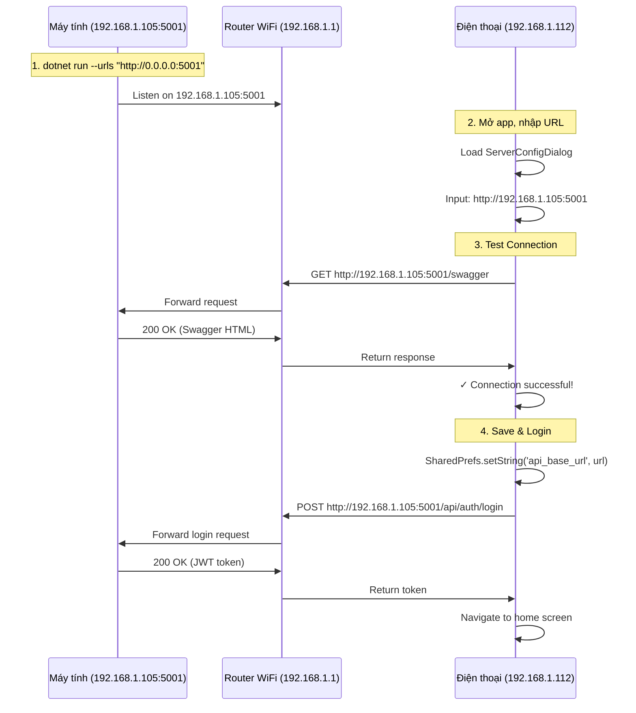

# 📱 Hướng dẫn kết nối LAN - Mobile App Testing

## 🎯 Tổng quan cơ chế

Khi test APK thực tế trên điện thoại Android qua mạng LAN:

```
┌─────────────────┐         LAN WiFi         ┌──────────────────┐
│   Máy tính      │◄─────────────────────────►│  Điện thoại      │
│  (Host Server)  │    192.168.1.x:5001      │   (APK Client)   │
└─────────────────┘                          └──────────────────┘
```

---

## 🖥️ **BƯỚC 1: Chuẩn bị trên Máy Tính**

### 1.1. Khởi động Edge Server
```powershell
cd edge-services
docker compose up -d edge-postgres edge-pgadmin
dotnet run --urls "http://0.0.0.0:5001"
```

**⚠️ Quan trọng:** 
- `0.0.0.0:5001` = Server lắng nghe trên **TẤT CẢ** network interfaces
- Nếu dùng `localhost:5001` = Chỉ máy local truy cập được!

### 1.2. Lấy địa chỉ IP máy tính

#### Windows:
```powershell
ipconfig
```

Tìm dòng **IPv4 Address** trong phần WiFi adapter:
```
Wireless LAN adapter Wi-Fi:
   IPv4 Address. . . . . . . . . . . : 192.168.1.105  ← ĐÂY
```

#### Các dải IP phổ biến:
- **Router TP-Link/D-Link:** `192.168.1.x`
- **Router Tenda/Xiaomi:** `192.168.0.x`
- **Router VNPT/FPT:** `10.0.0.x`

### 1.3. Mở Firewall (nếu bị chặn)

```powershell
# Thêm rule cho port 5001
New-NetFirewallRule -DisplayName "Maritime Edge Server" `
  -Direction Inbound -Protocol TCP -LocalPort 5001 -Action Allow
```

Hoặc tắt firewall tạm thời (testing only):
- Settings → Windows Security → Firewall & Network Protection → Private Network → **OFF**

### 1.4. Kiểm tra server đang chạy

Mở trình duyệt trên máy tính:
```
http://192.168.1.105:5001/swagger
```

Nếu thấy Swagger UI = Server OK! ✅

---

## 📱 **BƯỚC 2: Build APK và cài lên điện thoại**

### 2.1. Build APK (Debug hoặc Release)

#### Debug APK (có logs, dễ debug):
```powershell
cd frontend-mobile
flutter build apk --debug
```

#### Release APK (tối ưu, không logs):
```powershell
flutter build apk --release
```

**File APK sẽ ở:**
```
frontend-mobile/build/app/outputs/flutter-apk/app-debug.apk
```
hoặc
```
frontend-mobile/build/app/outputs/flutter-apk/app-release.apk
```

### 2.2. Cài APK lên điện thoại

**Cách 1: USB Cable**
```powershell
# Bật USB debugging trên điện thoại trước
flutter install
```

**Cách 2: Copy file qua WiFi/Bluetooth**
- Copy file `app-debug.apk` vào điện thoại
- Mở File Manager → Tìm file → Install

**Cách 3: Google Drive/Telegram**
- Upload APK lên Drive
- Tải về điện thoại và cài

---

## 📲 **BƯỚC 3: Cấu hình kết nối trong App**

### 3.1. Kết nối cùng WiFi

**⚠️ CỰC KỲ QUAN TRỌNG:**
- Máy tính và điện thoại phải cùng mạng WiFi (cùng router)
- Ví dụ:
  - Máy tính: `192.168.1.105` (WiFi: "HOME_WIFI")
  - Điện thoại: `192.168.1.112` (WiFi: "HOME_WIFI")

### 3.2. Nhập Server URL trong App

Khi mở app lần đầu, sẽ có **Server Config Dialog**:

```
┌─────────────────────────────────────┐
│   🌐 Server Configuration           │
├─────────────────────────────────────┤
│                                     │
│  Server URL:                        │
│  ┌───────────────────────────────┐  │
│  │ http://192.168.1.105:5001     │  │ ← Nhập IP máy tính
│  └───────────────────────────────┘  │
│                                     │
│  [Test Connection] [Save & Apply]   │
│                                     │
│  ✓ Connection successful!           │
└─────────────────────────────────────┘
```

**Các URL mẫu có sẵn:**
- `http://192.168.1.100:5001`
- `http://192.168.0.50:5001`
- `http://10.0.0.100:5001`

### 3.3. Test Connection

1. Nhập URL: `http://<IP_MÁY_TÍNH>:5001`
2. Bấm **"Test Connection"**
3. Nếu thấy "✓ Connection successful!" = OK!
4. Bấm **"Save & Apply"**

### 3.4. Code xử lý (đã có sẵn trong app)

File: `lib/presentation/widgets/server_config_dialog.dart`

```dart
Future<void> _testConnection() async {
  final dio = ApiClient().dio;
  dio.options.baseUrl = url; // VD: http://192.168.1.105:5001
  
  final response = await dio.get('/swagger/index.html')
    .timeout(const Duration(seconds: 5));
  
  if (response.statusCode == 200) {
    // ✅ Kết nối thành công!
  }
}
```

URL được lưu vào **SharedPreferences** (`api_base_url`):
```dart
// File: lib/core/storage/server_config_storage.dart
static Future<void> saveServerUrl(String url) async {
  final prefs = await SharedPreferences.getInstance();
  await prefs.setString(_keyServerUrl, url);
}
```

---

## 🔧 **Xử lý sự cố thường gặp**

### ❌ Lỗi: "Connection timeout"

**Nguyên nhân:**
- Firewall chặn port 5001
- Server chưa chạy
- Sai IP address

**Giải pháp:**
```powershell
# 1. Kiểm tra server đang chạy
netstat -an | findstr 5001

# 2. Ping từ điện thoại đến máy tính
# Mở Terminal app trên Android:
ping 192.168.1.105

# 3. Tắt firewall tạm thời
```

### ❌ Lỗi: "Connection refused"

**Nguyên nhân:**
- Server chạy `localhost:5001` thay vì `0.0.0.0:5001`

**Giải pháp:**
```powershell
# Dừng server cũ (Ctrl+C)
# Chạy lại với 0.0.0.0
dotnet run --urls "http://0.0.0.0:5001"
```

### ❌ Lỗi: "Invalid URL format"

**Nguyên nhân:**
- Thiếu `http://` hoặc `https://`
- Sai format port

**URL đúng:**
```
✅ http://192.168.1.105:5001
✅ http://10.0.0.50:5001
❌ 192.168.1.105:5001         (thiếu http://)
❌ http://192.168.1.105       (thiếu port)
❌ https://192.168.1.105:5001 (HTTPS cần cert)
```

### ❌ Không kết nối được dù đã đúng IP

**Kiểm tra:**

1. **Cùng mạng WiFi?**
   ```
   Máy tính:    ipconfig → 192.168.1.105
   Điện thoại:  Settings → WiFi → IP: 192.168.1.x
   ```

2. **Router có cách ly AP?**
   - Một số router có "AP Isolation" ngăn thiết bị kết nối nhau
   - Tắt trong cài đặt router (Advanced → AP Isolation → OFF)

3. **VPN đang bật?**
   - Tắt VPN trên cả máy tính và điện thoại

---

## 📊 **Luồng hoạt động hoàn chỉnh**



---

## 🎯 **Checklist testing**

Trước khi test APK:

### Máy tính:
- [ ] Edge Server đang chạy (`dotnet run --urls "http://0.0.0.0:5001"`)
- [ ] Lấy được IP: `ipconfig` → `192.168.1.x`
- [ ] Mở được Swagger: `http://192.168.1.x:5001/swagger`
- [ ] Firewall cho phép port 5001

### Điện thoại:
- [ ] APK đã cài đặt
- [ ] Kết nối cùng WiFi với máy tính
- [ ] Nhập đúng URL: `http://192.168.1.x:5001`
- [ ] Test Connection thành công
- [ ] Login và sử dụng app bình thường

---

## 💡 **Tips nâng cao**

### 1. Dynamic IP (IP thay đổi)

Nếu IP máy tính thay đổi mỗi lần khởi động:

**Giải pháp 1: Set Static IP trong router**
- Router settings → DHCP → Reserve IP for PC MAC address

**Giải pháp 2: Dùng hostname (Windows 11)**
```
http://YOUR-PC-NAME.local:5001
```

### 2. Remote testing (qua Internet)

Nếu muốn test từ mạng khác (4G/5G):

**Cách 1: Port forwarding trên router**
```
Router settings → Port Forwarding:
External Port: 5001 → Internal IP: 192.168.1.105:5001

URL: http://PUBLIC_IP:5001
```

**Cách 2: Ngrok (đơn giản hơn)**
```powershell
ngrok http 5001
```
→ URL: `https://abc123.ngrok.io`

### 3. HTTPS cho production

Khi deploy thực tế, cần HTTPS:

```csharp
// Program.cs
builder.WebHost.ConfigureKestrel(options =>
{
    options.Listen(IPAddress.Any, 5001); // HTTP
    options.Listen(IPAddress.Any, 5002, listenOptions =>
    {
        listenOptions.UseHttps("certificate.pfx", "password");
    });
});
```

---

## 📝 **Tóm tắt**

| Bước | Máy tính | Điện thoại |
|------|----------|------------|
| 1 | Chạy server: `dotnet run --urls "http://0.0.0.0:5001"` | - |
| 2 | Lấy IP: `ipconfig` → `192.168.1.105` | Cài APK |
| 3 | Mở firewall port 5001 | Kết nối WiFi (cùng mạng) |
| 4 | - | Mở app → Server Config |
| 5 | - | Nhập URL: `http://192.168.1.105:5001` |
| 6 | - | Test Connection → Save |
| 7 | - | Login và sử dụng! |

**Server URL format:**
```
http://<IP_MÁY_TÍNH>:<PORT>
       ↑                ↑
   192.168.1.105      5001
```

App sẽ tự động lưu URL này vào SharedPreferences, lần sau mở app không cần nhập lại! 🎉
