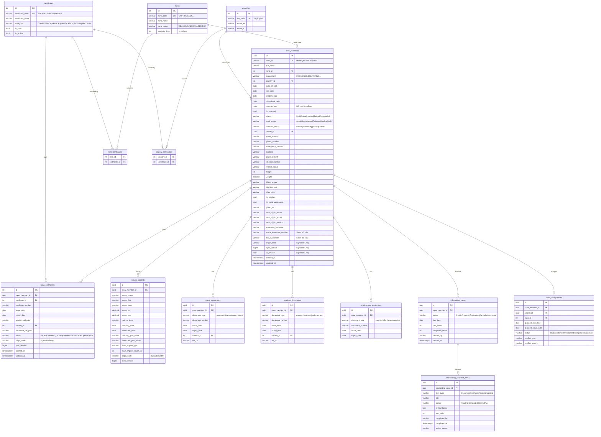

# MODULE 1: QUẢN LÝ THÔNG TIN THUYỀN VIÊN
## (Crew Information Management)

> **Thuộc hệ thống:** Maritime Management System v1.1  
> **Phạm vi:** Shore Backend + Edge Backend + Shore Frontend + Edge Frontend  
> **Tiêu chuẩn áp dụng:** STCW 2010, MLC 2006, SOLAS Chapter V  
> **Phiên bản tài liệu:** 1.0 — 27/04/2026

---

## MỤC LỤC

1. [Phân tích nghiệp vụ](#1-phân-tích-nghiệp-vụ)
2. [Thiết kế dữ liệu](#2-thiết-kế-dữ-liệu)
3. [Thiết kế hệ thống (API + Services)](#3-thiết-kế-hệ-thống)
4. [Cài đặt — Quản lý hồ sơ nhân sự](#4-cài-đặt--quản-lý-hồ-sơ-nhân-sự)
5. [Cài đặt — Hợp đồng & Phân công](#5-cài-đặt--hợp-đồng--phân-công)
6. [Cài đặt — Chứng chỉ](#6-cài-đặt--chứng-chỉ)
7. [Cài đặt — Cảnh báo & Nhắc nhở](#7-cài-đặt--cảnh-báo--nhắc-nhở)
8. [Thử nghiệm & Kịch bản Demo](#8-thử-nghiệm--kịch-bản-demo)
9. [Câu hỏi vấn đáp chuyên sâu](#9-câu-hỏi-vấn-đáp-chuyên-sâu)

---

# 1. PHÂN TÍCH NGHIỆP VỤ

## 1.1 Bối Cảnh Nghiệp Vụ

Một công ty vận tải biển quản lý hàng chục tàu, mỗi tàu có 20–30 thuyền viên. Thuyền viên có thể đang:
- **Onboard** (trên tàu): phục vụ trong chuyến đi
- **Pool** (chờ phân công): đang nghỉ phép hoặc chờ tàu tiếp theo
- **PendingReview** (chờ duyệt): vừa được thêm từ Shore, thuyền trưởng chưa xác nhận

Toàn bộ thông tin thuyền viên phải tuân thủ:
- **STCW 2010**: Mỗi chức danh (Rank) phải có đủ chứng chỉ STCW tương ứng
- **MLC 2006**: Hợp đồng lao động phải rõ ràng, có ngày bắt đầu/kết thúc
- **SOLAS**: Nhật ký trực ca (Watchkeeping), diễn tập khẩn cấp phải có đủ nhân sự

## 1.2 Danh Sách Nghiệp Vụ (Use Cases)

| Mã | Tên nghiệp vụ | Actor | Ưu tiên |
|----|--------------|-------|---------|
| UC-01 | Thêm mới hồ sơ thuyền viên | HR Admin (Shore) | Cao |
| UC-02 | Xem và cập nhật hồ sơ thuyền viên | HR Admin, Crew Coordinator | Cao |
| UC-03 | Phân công thuyền viên lên tàu | Crew Coordinator | Cao |
| UC-04 | Thêm/cập nhật chứng chỉ STCW | HR Admin | Cao |
| UC-05 | Hệ thống cảnh báo chứng chỉ sắp hết hạn | System (tự động) | Cao |
| UC-06 | Tạo hồ sơ onboarding checklist | System (tự động) | Trung bình |
| UC-07 | Thuyền trưởng duyệt thuyền viên lên tàu | Master (Edge) | Trung bình |
| UC-08 | Ghi nhận sự kiện Sign-On / Sign-Off | Edge (Master) | Cao |
| UC-09 | Xem lịch sử công tác (Service Records) | HR Admin, Crew | Trung bình |
| UC-10 | Quản lý giấy tờ tùy thân (Passport, Visa) | HR Admin | Trung bình |
| UC-11 | Kiểm tra tuân thủ khi phân công | ComplianceOfficer | Cao |
| UC-12 | Nhắc nhở hết hạn hợp đồng | System (tự động) | Trung bình |

## 1.3 Phân Tích Ca Sử Dụng Chính

### UC-01: Thêm Mới Hồ Sơ Thuyền Viên

```
Actor: HR Admin
Tiền điều kiện: HR Admin đã đăng nhập, có quyền "CanManageCrew"

Luồng chính:
1. HR Admin vào trang Crew Management → nhấn "Thêm thuyền viên"
2. Hệ thống hiển thị form với các tab:
   - Thông tin cơ bản (họ tên, ngày sinh, quốc tịch, chức danh)
   - Thông tin sinh trắc học (chiều cao, cân nặng, nhóm máu...)
   - Thông tin liên hệ & người thân
   - Thông tin học vấn
3. HR Admin điền form, nhấn "Lưu"
4. Hệ thống validate:
   - CrewId không trùng lặp
   - FullName bắt buộc không rỗng
5. Hệ thống tạo hồ sơ, tự động:
   - Tạo OnboardingCase với checklist chuẩn
   - Broadcast xuống SyncOutbox để Edge pull về
6. Hiển thị thông báo thành công, chuyển sang trang chi tiết

Luồng ngoại lệ:
- CrewId trùng → trả về 409 Conflict, hiển thị thông báo
- Mất kết nối DB → 500, hiển thị thông báo lỗi chung
```

### UC-04: Thêm Chứng Chỉ STCW

```
Actor: HR Admin
Tiền điều kiện: Hồ sơ thuyền viên đã tồn tại

Luồng chính:
1. HR Admin vào trang chi tiết thuyền viên → tab "Chứng chỉ"
2. Nhấn "Thêm chứng chỉ", chọn loại chứng chỉ từ danh mục
3. Điền số chứng chỉ, ngày cấp, ngày hết hạn, cơ quan cấp
4. Upload file scan (PDF/JPG)
5. Hệ thống lưu, tính status tự động:
   - Nếu ExpiryDate < Today → EXPIRED
   - Nếu ExpiryDate < Today + 90 ngày → EXPIRING_SOON
   - Còn lại → VALID
6. Broadcast chứng chỉ mới xuống Edge (ShoreAutoSyncInterceptor)

Luồng ngoại lệ:
- File upload > giới hạn → 413 Request Too Large
- Ngày hết hạn < ngày cấp → validation error
```

### UC-05: Cảnh Báo Chứng Chỉ Sắp Hết Hạn (Tự Động)

```
Actor: System (CertificateExpiryMonitorService)
Kích hoạt: Mỗi 6 giờ (configurable)

Luồng:
1. Query tất cả crew_certificates WHERE expiry_date <= NOW() + 90 ngày
2. Với mỗi chứng chỉ:
   - Nếu expiry_date < NOW() → cập nhật Status = "EXPIRED"
   - Nếu expiry_date < NOW()+90d → cập nhật Status = "EXPIRING_SOON"
3. SaveChanges → ShoreAutoSyncInterceptor tự động queue vào SyncOutbox
4. Edge pull về → thuyền trưởng thấy cảnh báo trên dashboard
```

---

# 2. THIẾT KẾ DỮ LIỆU

## 2.1 Entity Relationship Diagram



## 2.2 Mô Tả Các Bảng Quan Trọng

### Bảng `crew_members` — Trung Tâm Module

```sql
CREATE TABLE crew_members (
    id                  UUID PRIMARY KEY DEFAULT gen_random_uuid(),
    crew_id             VARCHAR(50) UNIQUE NOT NULL,     -- "VN-2024-0001"
    full_name           VARCHAR(200) NOT NULL,

    -- Phân loại
    rank_id             INT REFERENCES ranks(id),
    department          VARCHAR(100),                    -- "DECK" | "ENGINE" | "CATERING"
    country_id          INT REFERENCES countries(id),

    -- Thời gian
    date_of_birth       DATE,
    join_date           DATE,                            -- Ngày vào công ty
    embark_date         DATE,                            -- Ngày lên tàu lần này
    disembark_date      DATE,                            -- Ngày xuống tàu
    contract_end        DATE,                            -- Hết hạn hợp đồng lao động

    -- Trạng thái (Edge sở hữu)
    is_onboard          BOOLEAN DEFAULT false,
    vessel_id           UUID REFERENCES vessels(id),

    -- Vòng đời profile
    status              VARCHAR(20) DEFAULT 'Draft',     -- Draft|Active|Inactive|Retired
    pool_status         VARCHAR(20) DEFAULT 'Available', -- Available|Assigned|OnLeave|Medical|Hold
    onboard_status      VARCHAR(30),                     -- PendingReview|Approved|OnHold (cho Edge review)
    onboard_status_changed_at   TIMESTAMPTZ,
    onboard_status_changed_by   VARCHAR(100),

    -- Sinh trắc học (STCW BIO-DATA form)
    place_of_birth      VARCHAR(200),
    id_card_number      VARCHAR(50),
    marital_status      VARCHAR(20),
    height              INT,                             -- cm
    weight              DECIMAL(5,2),                    -- kg
    blood_group         VARCHAR(5),                      -- "A+", "O-"...
    clothing_size       VARCHAR(10),
    shoe_size           VARCHAR(10),
    catering_size       VARCHAR(10),
    is_smoker           BOOLEAN,
    is_covid_vaccinated BOOLEAN,
    photo_url           VARCHAR(500),

    -- Liên hệ
    email_address       VARCHAR(200),
    phone_number        VARCHAR(50),
    address             VARCHAR(500),
    emergency_contact   VARCHAR(500),

    -- Người thân (MLC 2006 requirement)
    next_of_kin_name    VARCHAR(200),
    next_of_kin_relation VARCHAR(50),
    next_of_kin_phone   VARCHAR(50),
    next_of_kin_address VARCHAR(500),

    -- Học vấn
    education_institution   VARCHAR(300),
    education_course        VARCHAR(200),
    education_period_years  INT,
    education_graduation_year INT,

    -- Shore sở hữu (không được Edge ghi đè)
    social_insurance_number VARCHAR(20),
    tax_id_number           VARCHAR(20),

    notes               TEXT,

    -- ISyncableEntity fields
    is_synced           BOOLEAN DEFAULT false,
    origin_node         VARCHAR(50) NOT NULL DEFAULT 'SHORE',
    sync_version        BIGINT DEFAULT 0,
    created_at          TIMESTAMPTZ NOT NULL DEFAULT NOW(),
    updated_at          TIMESTAMPTZ NOT NULL DEFAULT NOW()
);

-- Indexes
CREATE INDEX idx_crew_is_onboard    ON crew_members(is_onboard);
CREATE INDEX idx_crew_vessel_id     ON crew_members(vessel_id);
CREATE INDEX idx_crew_status        ON crew_members(status);
CREATE INDEX idx_crew_contract_end  ON crew_members(contract_end)
    WHERE contract_end IS NOT NULL;   -- Tối ưu query cảnh báo hết hạn HĐ
```

**Lý do thiết kế:**
- `crew_id` là mã do HR tự đặt (ví dụ: `VN-2024-0001`) — KHÔNG dùng UUID vì cần dễ đọc trong giấy tờ
- `is_onboard` do Edge sở hữu → không được Shore set trực tiếp trong conflict resolution
- `status` (profile lifecycle) tách biệt `is_onboard` (trạng thái vật lý) → Shore có thể deactivate profile mà không ảnh hưởng trạng thái tàu
- `contract_end` có partial index riêng → query cảnh báo sắp hết hạn HĐ chạy nhanh

### Bảng `crew_certificates` — Chứng Chỉ STCW

```sql
CREATE TABLE crew_certificates (
    id                  SERIAL PRIMARY KEY,
    crew_member_id      UUID NOT NULL REFERENCES crew_members(id) ON DELETE CASCADE,
    certificate_id      INT NOT NULL REFERENCES certificates(id),
    certificate_number  VARCHAR(100) NOT NULL,
    issue_date          DATE NOT NULL,
    expiry_date         DATE NOT NULL,
    issuing_authority   VARCHAR(200),
    certificate_of_competency VARCHAR(200),
    country_id          INT REFERENCES countries(id),    -- Quốc gia cấp
    document_file_path  VARCHAR(500),                    -- Path file scan

    -- Trạng thái tự động tính
    status              VARCHAR(20) NOT NULL DEFAULT 'VALID',
                        -- VALID | EXPIRING_SOON | EXPIRED | SUSPENDED | REVOKED

    notes               TEXT,

    -- ISyncableEntity
    is_synced           BOOLEAN DEFAULT false,
    origin_node         VARCHAR(50) NOT NULL DEFAULT 'SHORE',
    sync_version        BIGINT DEFAULT 0,
    created_at          TIMESTAMPTZ NOT NULL DEFAULT NOW(),
    updated_at          TIMESTAMPTZ NOT NULL DEFAULT NOW(),

    CONSTRAINT uq_crew_cert_number UNIQUE (crew_member_id, certificate_id, certificate_number)
);

CREATE INDEX idx_crew_certs_expiry ON crew_certificates(expiry_date, status);
CREATE INDEX idx_crew_certs_crew   ON crew_certificates(crew_member_id);
```

### Bảng `service_records` — Lịch Sử Công Tác

```sql
CREATE TABLE service_records (
    id                  UUID PRIMARY KEY DEFAULT gen_random_uuid(),
    crew_member_id      UUID NOT NULL REFERENCES crew_members(id),

    -- Thông tin tàu
    vessel_name         VARCHAR(200) NOT NULL,
    vessel_flag         VARCHAR(50),
    vessel_type         VARCHAR(50),      -- "Bulk Carrier", "Tanker", "Container"
    vessel_grt          DECIMAL(12,2),
    vessel_dwt          DECIMAL(12,2),
    vessel_year_built   INT,
    trade_area          VARCHAR(100),

    -- Thông tin máy
    main_engine_type    VARCHAR(100),
    main_engine_power_kw INT,
    main_engine_maker   VARCHAR(100),
    boiler_type         VARCHAR(100),
    has_exhaust_gas_scrubber BOOLEAN,
    ecdis               VARCHAR(100),

    -- Thông tin phục vụ
    rank_at_time        VARCHAR(100),     -- Chức danh lúc phục vụ
    boarding_date       DATE NOT NULL,
    disembark_date      DATE,
    boarding_port_code  VARCHAR(5),
    boarding_port_name  VARCHAR(150),
    disembark_port_code VARCHAR(5),
    disembark_port_name VARCHAR(150),
    boarding_records    TEXT,

    -- ISyncableEntity (Edge sở hữu)
    is_synced           BOOLEAN DEFAULT false,
    origin_node         VARCHAR(50) NOT NULL,
    sync_version        BIGINT DEFAULT 0,
    created_at          TIMESTAMPTZ NOT NULL DEFAULT NOW(),
    updated_at          TIMESTAMPTZ NOT NULL DEFAULT NOW()
);
```

**Lý do thiết kế:**
- `ServiceRecord` thuộc sở hữu Edge — chỉ tàu mới biết thực tế thuyền viên phục vụ khi nào, ở đâu
- Lưu đầy đủ thông tin tàu (GRT, DWT, engine type) theo chuẩn STCW BIO-DATA Section 7
- Không có FK đến bảng `vessels` → Service record có thể thuộc về tàu cũ không còn trong hệ thống

---

# 3. THIẾT KẾ HỆ THỐNG

## 3.1 Kiến Trúc Tổng Quan Module

```
┌─────────────────────────────────────────────────────────────────────┐
│                    SHORE SYSTEM                                     │
│                                                                     │
│  Shore Frontend (React 19)         Shore Backend (.NET 8)           │
│  ┌──────────────────────────┐     ┌─────────────────────────────┐  │
│  │ /crew                    │     │ CrewController              │  │
│  │   CrewList.tsx           │────►│   GET  /api/crew            │  │
│  │   CrewDetail.tsx         │     │   POST /api/crew            │  │
│  │   CrewForm.tsx           │     │   PUT  /api/crew/{id}       │  │
│  │ /crew/certificates       │     │   DELETE /api/crew/{id}     │  │
│  │   CertificateList.tsx    │────►│                             │  │
│  │   CertificateForm.tsx    │     │ CertificatesController      │  │
│  │ /crew/assignments        │     │   GET  /api/certificates    │  │
│  │   AssignmentBoard.tsx    │────►│   POST /api/certificates/   │  │
│  │ /compliance              │     │       crew-certificates     │  │
│  │   CompliancePage.tsx     │     │                             │  │
│  └──────────────────────────┘     │ OnboardingController        │  │
│                                   │ AssignmentController        │  │
│                                   │ ComplianceController        │  │
│                                   └─────────────┬───────────────┘  │
│                                                 │                   │
│                                   ┌─────────────▼───────────────┐  │
│                                   │   Services Layer            │  │
│                                   │                             │  │
│                                   │ CrewService                 │  │
│                                   │ CertificateService          │  │
│                                   │ OnboardingService           │  │
│                                   │ AssignmentService           │  │
│                                   │ ComplianceService           │  │
│                                   │                             │  │
│                                   │ Background Services:        │  │
│                                   │ CertificateExpiryMonitor    │  │
│                                   │   (mỗi 6 giờ)              │  │
│                                   └─────────────┬───────────────┘  │
│                                                 │                   │
│                                   ┌─────────────▼───────────────┐  │
│                                   │   PostgreSQL (Port 5434)    │  │
│                                   │   crew_members              │  │
│                                   │   crew_certificates         │  │
│                                   │   service_records           │  │
│                                   │   ...20+ bảng crew          │  │
│                                   └─────────────────────────────┘  │
└─────────────────────────────────────────────────────────────────────┘
                              │ SyncOutbox → Edge pull
                              ▼
┌─────────────────────────────────────────────────────────────────────┐
│                    EDGE SYSTEM (Trên Tàu)                           │
│  Edge Frontend (React 19)          Edge Backend (.NET 8)            │
│  ┌──────────────────────────┐     ┌─────────────────────────────┐  │
│  │ /crew                    │────►│ CrewController (Edge)       │  │
│  │ /crew/certificates       │────►│ CertificatesController      │  │
│  │ /crew/pending-review     │     │ (51 controllers total)      │  │
│  └──────────────────────────┘     └─────────────────────────────┘  │
└─────────────────────────────────────────────────────────────────────┘
```

## 3.2 Danh Sách API Endpoints

### Shore — Crew Management

| Method | Endpoint | Quyền | Mô tả |
|--------|----------|-------|-------|
| `GET` | `/api/crew` | InternalAccess | Danh sách thuyền viên (phân trang, filter) |
| `GET` | `/api/crew/stats` | InternalAccess | Thống kê: total, onboard, pool, pending |
| `GET` | `/api/crew/hold-notifications` | InternalAccess | Thuyền viên vừa bị hold (30 ngày) |
| `GET` | `/api/crew/{id}` | InternalAccess | Chi tiết thuyền viên |
| `GET` | `/api/crew/{id}/detail` | InternalAccess | Chi tiết + tài liệu |
| `POST` | `/api/crew` | InternalAccess | Tạo mới thuyền viên |
| `PUT` | `/api/crew/{id}` | InternalAccess | Cập nhật thuyền viên |
| `DELETE` | `/api/crew/{id}` | InternalAccess | Xóa thuyền viên |
| `POST` | `/api/crew/{id}/assign` | InternalAccess | Gán thuyền viên vào tàu |

### Shore — Certificates

| Method | Endpoint | Mô tả |
|--------|----------|-------|
| `GET` | `/api/certificates` | Danh mục loại chứng chỉ (filter: category, rankId) |
| `POST` | `/api/certificates` | Tạo loại chứng chỉ mới |
| `PUT` | `/api/certificates/{id}` | Cập nhật loại chứng chỉ |
| `DELETE` | `/api/certificates/{id}` | Vô hiệu hóa loại chứng chỉ |
| `GET` | `/api/certificates/{id}/countries` | Quốc gia áp dụng chứng chỉ |
| `GET` | `/api/certificates/{id}/ranks` | Chức danh yêu cầu chứng chỉ |
| `GET` | `/api/certificates/crew/{crewId}` | Chứng chỉ của một thuyền viên |
| `POST` | `/api/certificates/crew-certificates` | Thêm chứng chỉ cho thuyền viên |
| `PUT` | `/api/certificates/crew-certificates/{id}` | Cập nhật chứng chỉ |
| `DELETE` | `/api/certificates/crew-certificates/{id}` | Xóa chứng chỉ |

### Shore — Onboarding & Assignment

| Method | Endpoint | Mô tả |
|--------|----------|-------|
| `POST` | `/api/onboarding-cases` | Tạo hồ sơ onboarding |
| `GET` | `/api/onboarding-cases` | Danh sách hồ sơ active |
| `GET` | `/api/onboarding-cases/{id}` | Chi tiết checklist |
| `PUT` | `/api/onboarding-cases/{id}/status` | Cập nhật trạng thái |
| `PUT` | `/api/onboarding-cases/checklist-items/{id}` | Tick checklist item |
| `POST` | `/api/onboarding-cases/checklist-items/{id}/waive` | Miễn trừ checklist item |
| `GET` | `/api/compliance/rule-sets` | Bộ quy tắc tuân thủ |
| `POST` | `/api/compliance/rule-sets` | Tạo rule set |
| `POST` | `/api/compliance/rules` | Thêm rule vào rule set |

---

# 4. CÀI ĐẶT — QUẢN LÝ HỒ SƠ NHÂN SỰ

## 4.1 Tạo Mới Thuyền Viên (`CrewService.CreateCrewAsync`)

```csharp
// shore_product/backend/Services/Crew/CrewService.cs
public async Task<CrewMemberDto> CreateCrewAsync(CreateCrewRequest request)
{
    // --- Bước 1: Validate đầu vào ---
    if (string.IsNullOrWhiteSpace(request.FullName))
        throw new ArgumentException("FullName is required");
    if (string.IsNullOrWhiteSpace(request.CrewId))
        throw new ArgumentException("CrewId is required");

    // --- Bước 2: Kiểm tra CrewId không trùng ---
    var exists = await _context.CrewMembers
        .AnyAsync(c => c.CrewId == request.CrewId);
    if (exists)
        throw new InvalidOperationException(
            $"Crew member with ID '{request.CrewId}' already exists");

    // --- Bước 3: Tạo entity ---
    var crew = new CrewMember {
        Id         = Guid.NewGuid(),
        CrewId     = request.CrewId,
        FullName   = request.FullName,
        RankId     = request.RankId,
        Department = request.Department,
        // ... các trường khác
        ContractEnd = ToUtc(request.ContractEnd),  // Chuẩn hóa về UTC
        OriginNode  = "SHORE",                      // Shore tạo ra
        IsSynced    = false,
        CreatedAt   = DateTime.UtcNow,
        UpdatedAt   = DateTime.UtcNow
    };

    _context.CrewMembers.Add(crew);
    await _context.SaveChangesAsync();
    // ↑ EF Core SaveChanges kích hoạt ShoreAutoSyncInterceptor
    //   → tự động enqueue vào SyncOutbox để Edge pull về

    // --- Bước 4: Tự động tạo Onboarding Case ---
    if (_onboardingService != null)
    {
        await _onboardingService.CreateCaseAsync(new CreateOnboardingCaseRequest {
            CrewMemberId = crew.Id
        }, "System (Auto-Onboarding)");
    }

    return MapToDto(crew);
}
```

**Điểm chú ý kỹ thuật:**
- `ToUtc()`: DateTime từ client có thể là `DateTimeKind.Unspecified` → Npgsql sẽ lỗi nếu không ép UTC
- `OriginNode = "SHORE"`: Khi sync về Edge → ConflictResolverService biết đây là bản ghi Shore tạo
- `IsSynced = false`: Flag để biết dữ liệu chưa được Edge pull về

## 4.2 Tìm Kiếm & Lọc (`CrewService.GetAllCrewAsync`)

```csharp
public async Task<(List<CrewMemberDto>, int, int)> GetAllCrewAsync(
    int page, int pageSize,
    string? search, bool? isOnboard, Guid? shipId, bool? poolOnly,
    string? rankName, string? department, string? vesselName)
{
    var query = _context.CrewMembers
        .AsNoTracking()           // Không cần track cho read-only
        .Include(c => c.Rank)
        .Include(c => c.Country)
        .AsQueryable();

    // --- Tìm kiếm full-text trên FullName, CrewId, Rank ---
    if (!string.IsNullOrWhiteSpace(search))
    {
        var s = search.ToLower();
        query = query.Where(c =>
            c.FullName.ToLower().Contains(s) ||
            c.CrewId.ToLower().Contains(s) ||
            (c.Rank != null && c.Rank.RankName.ToLower().Contains(s)));
    }

    // --- Filters ---
    if (isOnboard.HasValue)
        query = query.Where(c => c.IsOnboard == isOnboard.Value);

    if (shipId.HasValue)
        query = query.Where(c => c.VesselId == shipId.Value);

    // Pool = chưa phân công tàu VÀ không đang onboard
    if (poolOnly == true)
        query = query.Where(c => c.VesselId == null && !c.IsOnboard);

    // --- Phân trang ---
    var totalCount = await query.CountAsync();
    var totalPages = (int)Math.Ceiling(totalCount / (double)pageSize);

    var crew = await query
        .OrderBy(c => c.FullName)
        .Skip((page - 1) * pageSize)  // Offset pagination cho list
        .Take(pageSize)
        .ToListAsync();

    // --- Resolve tên tàu (batch query tránh N+1) ---
    var vesselIds = crew
        .Where(c => c.VesselId.HasValue)
        .Select(c => c.VesselId!.Value)
        .Distinct()
        .ToList();
    var vesselNames = vesselIds.Count > 0
        ? await _context.Vessels.AsNoTracking()
            .Where(v => vesselIds.Contains(v.Id))
            .ToDictionaryAsync(v => v.Id, v => v.Name)
        : new Dictionary<Guid, string>();

    return (crew.Select(c => MapToDto(c, vesselNames.GetValueOrDefault(...))).ToList(),
            totalCount, totalPages);
}
```

**Điểm chú ý:**
- `AsNoTracking()`: Chỉ đọc → tắt change tracking để tăng performance
- Tránh N+1 problem: Không gọi `_context.Vessels.Find(c.VesselId)` trong loop mà batch query một lần
- Giới hạn `pageSize <= 200`: Ngăn client request toàn bộ dataset

## 4.3 Chi Tiết Thuyền Viên (`GetCrewDetailAsync`)

```csharp
public async Task<CrewDetailDto?> GetCrewDetailAsync(Guid id)
{
    // Load crew + certificates (eager loading)
    var crew = await _context.CrewMembers
        .AsNoTracking()
        .Include(c => c.Rank)
        .Include(c => c.Country)
        .Include(c => c.Certificates)
            .ThenInclude(cc => cc.Certificate)   // Tên loại chứng chỉ
        .FirstOrDefaultAsync(c => c.Id == id);

    if (crew == null) return null;

    var dto = MapToDetailDto(crew, vesselName);

    // Load passport (chọn cái mới nhất)
    var passport = await _context.TravelDocuments
        .AsNoTracking()
        .Where(d => d.CrewMemberId == id && d.DocumentType == "passport")
        .OrderByDescending(d => d.ExpiryDate)
        .FirstOrDefaultAsync();

    if (passport != null) {
        dto.PassportNumber = passport.DocumentNumber;
        dto.PassportExpiry = passport.ExpiryDate;
    }

    // Load seaman book
    var seamanBook = await _context.SeafarerDocuments
        .AsNoTracking()
        .Where(d => d.CrewMemberId == id && d.DocumentType == "seaman_book")
        .OrderByDescending(d => d.ExpiryDate)
        .FirstOrDefaultAsync();

    if (seamanBook != null)
        dto.SeamanBookNumber = seamanBook.DocumentNumber;

    return dto;
}
```

---

# 5. CÀI ĐẶT — HỢP ĐỒNG & PHÂN CÔNG

## 5.1 Vòng Đời Phân Công Thuyền Viên

```
   Shore HR tạo Draft        Shore Coordinator          Crew xác nhận
   Assignment                 đề xuất                   
        │                          │                         │
        ▼                          ▼                         ▼
  ┌──────────┐             ┌──────────────┐         ┌──────────────────┐
  │  Draft   │ ──Propose──►│  Proposed    │──Send──►│PendingCrewConfirm│
  └──────────┘             └──────────────┘         └────────┬─────────┘
                                                             │
                                              ┌──────────────┴───────────┐
                                              │ Confirm                  │ Decline
                                              ▼                          ▼
                                       ┌──────────┐              ┌──────────┐
                                       │Confirmed │              │ Declined │
                                       └────┬─────┘              └──────────┘
                                            │
                                     TravelInProgress
                                            │
                                       ┌────▼─────┐
                                       │ReadyToJoin│
                                       └────┬─────┘
                                            │ Edge: Sign-On
                                       ┌────▼──────┐
                                       │ OnBoarded │ (Edge sở hữu is_onboard=true)
                                       └────┬──────┘
                                            │ Edge: Sign-Off
                                       ┌────▼──────┐
                                       │ Completed │
                                       └───────────┘
```

**Trạng thái theo `AssignmentStatus` enum:**
```csharp
// shared/Models/CrewManagement/Enums.cs
public static class AssignmentStatus
{
    public const string Draft                   = "Draft";
    public const string Proposed                = "Proposed";
    public const string PendingCrewConfirmation = "PendingCrewConfirmation";
    public const string Confirmed               = "Confirmed";
    public const string TravelInProgress        = "TravelInProgress";
    public const string ReadyToJoin             = "ReadyToJoin";
    public const string OnBoarded               = "OnBoarded";
    public const string Completed               = "Completed";
    public const string Cancelled               = "Cancelled";
    public const string Declined                = "Declined";
}
```

## 5.2 Kiểm Tra Xung Đột Khi Phân Công

Khi tạo assignment, `AssignmentService` kiểm tra các loại conflict:

| Loại xung đột | Mô tả | Severity |
|---|---|---|
| `DateOverlap` | Thuyền viên đã có assignment khác trong khoảng thời gian này | **Blocker** |
| `GapTooShort` | Thời gian nghỉ giữa 2 chuyến < tối thiểu (theo MLC) | Warning |
| `CrewUnavailable` | Pool status không phải "Available" | Blocker |
| `RankMismatch` | Rank thuyền viên không khớp vị trí cần trên tàu | Blocker |
| `ComplianceBlocker` | Thiếu chứng chỉ bắt buộc | Blocker |
| `TravelInfeasible` | Không thể đặt vé kịp ngày join | Warning |

```csharp
// AssignmentService — kiểm tra overlap
public async Task<List<AssignmentConflict>> CheckConflictsAsync(
    Guid crewMemberId, DateTime plannedJoin, DateTime plannedLeave)
{
    var conflicts = new List<AssignmentConflict>();

    // Kiểm tra overlap với assignment hiện có
    var overlapping = await _db.CrewAssignments
        .Where(a => a.CrewMemberId == crewMemberId
                 && a.Status != AssignmentStatus.Cancelled
                 && a.Status != AssignmentStatus.Declined
                 && a.PlannedJoinDate < plannedLeave
                 && a.PlannedLeaveDate > plannedJoin)
        .ToListAsync();

    if (overlapping.Any())
        conflicts.Add(new AssignmentConflict {
            Type     = ConflictType.DateOverlap,
            Severity = ConflictSeverity.Blocker,
            Message  = $"Crew already assigned from {overlapping[0].PlannedJoinDate:d}"
        });

    // Kiểm tra compliance (chứng chỉ bắt buộc)
    var complianceResult = await _complianceService.EvaluateAsync(crewMemberId, vesselId);
    if (complianceResult.Result == EligibilityResult.NotEligible)
        conflicts.Add(new AssignmentConflict {
            Type     = ConflictType.ComplianceBlocker,
            Severity = ConflictSeverity.Blocker,
            Message  = "Missing required STCW certificates"
        });

    return conflicts;
}
```

## 5.3 Onboarding Checklist Tự Động

Khi `OnboardingService.CreateCaseAsync()` được gọi, hệ thống tự sinh checklist:

```csharp
private List<OnboardingChecklistItem> GenerateStandardChecklist(Guid caseId)
{
    return new List<OnboardingChecklistItem> {
        new() {
            OnboardingCaseId      = caseId,
            ItemType              = "Document",
            Title                 = "Valid Passport",
            RequiredDocumentType  = "passport",
            IsMandatory           = true,
            SortOrder             = 1,
            Status                = ChecklistItemStatus.Pending
        },
        new() {
            ItemType = "Document",
            Title    = "Seaman Book",
            RequiredDocumentType = "seaman_book",
            IsMandatory = true,
            SortOrder = 2
        },
        new() {
            ItemType = "Medical",
            Title    = "Medical Certificate (ENG1/ML5)",
            IsMandatory = true,
            SortOrder = 3
        },
        new() {
            ItemType    = "Certificate",
            Title       = "STCW Basic Safety Training",
            IsMandatory = true,
            SortOrder   = 4
        },
        // ... 10+ item chuẩn
    };
}
```

Ngoài ra còn **Compliance-based checklist** — tự sinh từ `ComplianceRuleSet` của tàu:

```csharp
private async Task<List<OnboardingChecklistItem>> GenerateComplianceChecklistAsync(
    Guid caseId, Guid crewMemberId, Guid? vesselId)
{
    // Tìm rule set áp dụng cho tàu này
    var rules = await _complianceService.GetRulesForVesselAsync(vesselId);

    return rules
        .Where(r => r.EvaluationStage == EvaluationStage.Onboarding)
        .Select(r => new OnboardingChecklistItem {
            OnboardingCaseId       = caseId,
            ItemType               = "Certificate",
            Title                  = r.Description,
            RequiredCertificateId  = r.RequiredCertificateId,
            SourceRuleId           = r.Id.ToString(),
            IsMandatory            = r.Severity == RuleSeverity.Blocker,
            SortOrder              = 100 + r.SortOrder,
            Status                 = ChecklistItemStatus.Pending
        })
        .ToList();
}
```

---

# 6. CÀI ĐẶT — CHỨNG CHỈ

## 6.1 Danh Mục Loại Chứng Chỉ (Master Data)

Hệ thống có bảng `certificates` là **master data** — chỉ Shore mới được thêm/sửa:

| Danh mục | Ví dụ |
|---|---|
| **COMPETENCY** | STCW II/1 (Officer in Charge of Navigational Watch), STCW III/1 (Engineer Officer) |
| **MEDICAL** | ENG1 Medical Certificate, ML5, Yellow Fever Vaccination |
| **PROFICIENCY** | STCW VI/1 (Basic Safety Training), STCW VI/2 (Survival Craft) |
| **SAFETY** | STCW VI/3 (Advanced Fire Fighting), STCW VI/4 (Medical First Aid) |
| **SECURITY** | STCW VI/6 (Security Awareness), ISPS Ship Security Officer |

```csharp
// CertificateService.cs
public async Task<CertificateTypeDto> CreateCertificateTypeAsync(CreateCertificateRequest request)
{
    var cert = new Certificate {
        CertificateCode = request.CertificateCode,
        CertificateName = request.CertificateName,
        Category        = request.Category,   // COMPETENCY|MEDICAL|...
        IsSTCW          = request.IsSTCW,
        IsActive        = true,
        CreatedAt       = DateTime.UtcNow
    };
    _context.Certificates.Add(cert);
    await _context.SaveChangesAsync();
    // ShoreAutoSyncInterceptor: Tự động broadcast xuống Edge
    return MapToDto(cert);
}
```

## 6.2 Gán Chứng Chỉ Cho Thuyền Viên

```csharp
// CertificateService.cs
public async Task<CrewCertificateDto> AddCrewCertificateAsync(CrewCertificateRequest request)
{
    // Tính status tự động
    var status = CertificateStatus.VALID;
    var now = DateTime.UtcNow;
    if (request.ExpiryDate <= now)
        status = CertificateStatus.EXPIRED;
    else if (request.ExpiryDate <= now.AddDays(90))
        status = CertificateStatus.EXPIRING_SOON;

    var cert = new CrewCertificate {
        CrewMemberId        = request.CrewMemberId,
        CertificateId       = request.CertificateId,
        CertificateNumber   = request.CertificateNumber,
        IssueDate           = request.IssueDate,
        ExpiryDate          = request.ExpiryDate,
        IssuingAuthority    = request.IssuingAuthority,
        CountryId           = request.CountryId,
        DocumentFilePath    = request.DocumentFilePath,
        Status              = status,
        OriginNode          = "SHORE",
        SyncVersion         = 0,
        CreatedAt           = DateTime.UtcNow,
        UpdatedAt           = DateTime.UtcNow
    };

    _context.CrewCertificates.Add(cert);
    await _context.SaveChangesAsync();
    // ShoreAutoSyncInterceptor → SyncOutbox → Edge pull về
    return MapToDto(cert);
}
```

## 6.3 Ma Trận Chứng Chỉ Theo Chức Danh (Rank-Certificate Matrix)

Bảng `rank_certificates` định nghĩa chứng chỉ **bắt buộc** theo từng chức danh:

```
Ví dụ: Rank = "Master" (Thuyền trưởng)
  Yêu cầu:
  ✅ STCW II/2 — Master on vessels of 3000 GT
  ✅ STCW VI/1 — Basic Safety Training
  ✅ STCW VI/2 — Survival Craft & Rescue Boats
  ✅ ENG1 Medical Certificate
  ✅ GMDSS — Global Maritime Distress and Safety System
  ✅ ECDIS Certificate

Ví dụ: Rank = "2nd Officer" (Sĩ quan boong II)
  Yêu cầu:
  ✅ STCW II/1 — Officer in Charge of a Navigational Watch
  ✅ STCW VI/1 — Basic Safety Training
  ✅ ENG1 Medical
```

Khi `ComplianceService.EvaluateAsync(crewId, vesselId)` chạy:
1. Lấy Rank hiện tại của thuyền viên
2. Query `rank_certificates` để biết cần chứng chỉ gì
3. Query `crew_certificates` để biết thuyền viên có gì
4. So sánh → trả về `EligibilityResult` (Eligible / NotEligible / EligibleWithWarnings)

---

# 7. CÀI ĐẶT — CẢNH BÁO & NHẮC NHỞ

## 7.1 Background Service: Giám Sát Chứng Chỉ Hết Hạn

```csharp
// shore_product/backend/Services/Sync/CertificateExpiryMonitorService.cs
public class CertificateExpiryMonitorService : BackgroundService
{
    protected override async Task ExecuteAsync(CancellationToken stoppingToken)
    {
        // Chờ 30 giây sau khi ứng dụng khởi động
        await Task.Delay(TimeSpan.FromSeconds(30), stoppingToken);

        while (!stoppingToken.IsCancellationRequested)
        {
            try {
                await CheckAndBroadcastExpiryStatusAsync(stoppingToken);
            }
            catch (Exception ex) {
                _logger.LogError(ex, "Certificate expiry check failed");
                // Không crash service → tiếp tục ở chu kỳ sau
            }

            // Chạy mỗi 6 giờ (có thể cấu hình qua appsettings)
            var interval = _configuration.GetValue("Sync:CertExpiryCheckIntervalHours", 6);
            await Task.Delay(TimeSpan.FromHours(interval), stoppingToken);
        }
    }

    private async Task CheckAndBroadcastExpiryStatusAsync(CancellationToken token)
    {
        using var scope = _serviceProvider.CreateScope();
        var context = scope.ServiceProvider.GetRequiredService<AppDbContext>();

        var warningDays = _configuration.GetValue("Sync:CertExpiryWarningDays", 90);
        var now         = DateTime.UtcNow;
        var warningDate = now.AddDays(warningDays);

        // Tìm chứng chỉ cần cập nhật status
        var certsToUpdate = await context.CrewCertificates
            .AsTracking()
            .Include(cc => cc.Certificate)
            .Include(cc => cc.CrewMember)
            .Where(cc => cc.ExpiryDate <= warningDate)   // Trong vòng 90 ngày
            .Where(cc => cc.Status != CertificateStatus.EXPIRED
                      && cc.Status != CertificateStatus.EXPIRING_SOON)
            .ToListAsync(token);

        int updated = 0;
        foreach (var cert in certsToUpdate)
        {
            var newStatus = cert.ExpiryDate <= now
                ? CertificateStatus.EXPIRED
                : CertificateStatus.EXPIRING_SOON;

            if (cert.Status == newStatus) continue;

            cert.Status    = newStatus;
            cert.UpdatedAt = DateTime.UtcNow;
            updated++;

            _logger.LogInformation(
                "Cert {Num} for {Crew}: {Old} → {New} (expires {Date:d})",
                cert.CertificateNumber,
                cert.CrewMember?.FullName,
                cert.Status, newStatus, cert.ExpiryDate);
        }

        if (updated > 0)
        {
            await context.SaveChangesAsync(token);
            // ShoreAutoSyncInterceptor sẽ tự enqueue vào SyncOutbox
            // → Edge pull về → thuyền trưởng thấy trạng thái chứng chỉ mới
        }
    }
}
```

**Cấu hình trong `appsettings.json`:**
```json
{
  "Sync": {
    "CertExpiryCheckIntervalHours": 6,
    "CertExpiryWarningDays": 90
  }
}
```

## 7.2 Cảnh Báo Hold Status (Thuyền Viên Bị Tạm Đình)

Khi thuyền viên bị đặt `OnboardStatus = "OnHold"` trên Edge (ví dụ: vi phạm kỷ luật), Shore nhận sync về và hiển thị chuông thông báo:

```csharp
// CrewController.cs
[HttpGet("hold-notifications")]
public async Task<IActionResult> GetHoldNotifications()
{
    var cutoff = DateTime.UtcNow.AddDays(-30);
    var results = await _context.CrewMembers
        .AsNoTracking()
        .Where(c => c.OnboardStatus == "OnHold"
                 && c.OnboardStatusChangedAt >= cutoff)  // Trong 30 ngày qua
        .Join(_context.Vessels,
            c => c.VesselId,
            v => v.Id,
            (c, v) => new {
                c.Id, c.CrewId, c.FullName,
                VesselId = v.Id, VesselName = v.Name,
                c.OnboardStatusChangedAt,
                c.OnboardStatusChangedBy
            })
        .OrderByDescending(x => x.OnboardStatusChangedAt)
        .Take(50)
        .ToListAsync();

    return Ok(results);
}
```

## 7.3 Các Loại Cảnh Báo Trong Hệ Thống

| Cảnh báo | Nguồn | Cơ chế | Hiển thị |
|---|---|---|---|
| Chứng chỉ hết hạn (≤ 0 ngày) | `CertificateExpiryMonitorService` | Background mỗi 6h | Màu đỏ trong Crew Detail |
| Chứng chỉ sắp hết hạn (≤ 90 ngày) | `CertificateExpiryMonitorService` | Background mỗi 6h | Màu vàng, badge đếm |
| Hợp đồng sắp hết hạn | Frontend query `ContractEnd` | Client-side tính | Badge trong crew list |
| Thuyền viên bị Hold | Edge → Sync → Shore | Real-time khi sync | Notification bell |
| Thiếu chứng chỉ khi phân công | `ComplianceService.EvaluateAsync` | On-demand khi assign | Modal cảnh báo |
| Passport/Visa hết hạn | `TravelDocuments` query | Client-side | Icon cảnh báo |

## 7.4 Cảnh Báo Hết Hạn Hợp Đồng (Frontend)

Trên Shore Frontend, component `CrewList.tsx` tính toán client-side:

```typescript
// Tính ngày còn lại của hợp đồng
const getContractStatus = (contractEnd: Date | null) => {
  if (!contractEnd) return null;
  const today = new Date();
  const daysLeft = Math.floor(
    (contractEnd.getTime() - today.getTime()) / (1000 * 60 * 60 * 24)
  );

  if (daysLeft < 0)    return { label: 'Expired',       color: 'red'    };
  if (daysLeft <= 30)  return { label: `${daysLeft}d`,  color: 'red'    };
  if (daysLeft <= 90)  return { label: `${daysLeft}d`,  color: 'yellow' };
  return               { label: `${daysLeft}d`,         color: 'green'  };
};
```

---

# 8. THỬ NGHIỆM & KỊCH BẢN DEMO

## 8.1 Kịch Bản 1: Thêm Thuyền Viên Mới Và Phân Công Tàu

**Điều kiện ban đầu:** Tàu "MV Pacific Star" cần bổ sung 1 sĩ quan boong (2nd Officer).

**Bước thực hiện:**

```
1. Đăng nhập Shore với tài khoản HR Admin
   URL: http://localhost:3000
   
2. Vào menu Crew → Thêm thuyền viên
   CrewId: VN-2026-0101
   FullName: Nguyễn Văn Minh
   Rank: 2nd Officer
   Department: DECK
   Nationality: Vietnam
   DateOfBirth: 1990-05-15
   ContractEnd: 2027-01-31
   
3. Hệ thống:
   ✅ Tạo bản ghi crew_members
   ✅ Tự tạo onboarding case với 10 checklist items
   ✅ Queue vào SyncOutbox (broadcast toàn bộ tàu)
   
4. Vào tab "Chứng chỉ" → Thêm chứng chỉ
   Loại: STCW II/1 (Officer in Charge of Navigational Watch)
   Số: VN-STCW-2022-5678
   Ngày cấp: 01/06/2022
   Ngày hết hạn: 01/06/2027
   Cơ quan cấp: Vietnam Maritime Administration
   
5. Kiểm tra status: ExpiryDate (2027-06-01) > Now+90d → Status = "VALID" ✅
   
6. Vào Assignments → Phân công tàu
   Tàu: MV Pacific Star
   Join date: 15/05/2026
   Leave date: 15/11/2026
   
7. System kiểm tra compliance:
   ✅ STCW II/1: VALID
   ✅ Không overlap với assignment khác
   → EligibilityResult = "Eligible"
   
8. Xác nhận phân công → Status = Confirmed
   → Broadcast assignment xuống SyncOutbox

9. Edge (tàu) pull về sau ≤30 giây:
   - Thuyền viên mới xuất hiện trong danh sách với OnboardStatus = "PendingReview"
   - Thuyền trưởng vào Crew → Pending Review → Duyệt
   - is_onboard = true, SyncQueue entry tạo → push về Shore
   
10. Shore nhận sync từ Edge:
    - Crew record: is_onboard = true (Edge sở hữu trường này → apply)
    - Crew stats: onboard count +1
```

**Kết quả mong đợi:**
- Shore: Thuyền viên trong danh sách, is_onboard = true, vessel = MV Pacific Star
- Edge: Thuyền viên có thể login, thấy lịch trực, thao tác trên tàu

## 8.2 Kịch Bản 2: Chứng Chỉ Sắp Hết Hạn — Cảnh Báo & Xử Lý

**Điều kiện:** Thuyền viên Nguyễn Văn A có chứng chỉ GMDSS hết hạn ngày 15/07/2026 (còn 79 ngày tính từ 27/04/2026).

```
1. CertificateExpiryMonitorService chạy lúc 06:00 UTC
   
2. Query: crew_certificates WHERE expiry_date <= NOW()+90d
   Kết quả: CrewCert ID=157, ExpDate=2026-07-15, Status='VALID'

3. Cập nhật: Status = 'EXPIRING_SOON', UpdatedAt = NOW()
   SaveChangesAsync() → ShoreAutoSyncInterceptor kích hoạt
   → SyncOutbox: { tableName: "crew_certificates", action: "UPDATE",
                   payload: {..., status: "EXPIRING_SOON"} }

4. Edge pull về lúc 06:00:30 (30s sau)
   SyncConflictHandler:
   - crew_certificates owned by SHORE → Accept
   - Update local DB: cert status = "EXPIRING_SOON"

5. Edge Dashboard:
   - Crew Detail: Chứng chỉ GMDSS hiển thị màu vàng + "79 days left"
   - Thuyền trưởng thấy badge "1 cert expiring soon"

6. Shore Dashboard:
   - Compliance Officer thấy cảnh báo trong Fleet Compliance view
   - Gửi email nhắc nhở (AlertBackgroundService, nếu cấu hình)

7. HR Admin đặt lịch gia hạn:
   - Liên hệ VMA (Vietnam Maritime Administration)
   - Khi có chứng chỉ mới: PUT /api/certificates/crew-certificates/157
     { expiryDate: "2031-07-15", certificateNumber: "VN-GMDSS-2026-NEW" }
   - Status tự tính lại: VALID
   - Broadcast xuống Edge
```

## 8.3 Kịch Bản 3: Sign-Off — Thuyền Viên Xuống Tàu

```
1. Edge (Master/Captain): Vào Crew → chọn thuyền viên → "Sign Off"
   EventType: "SignedOff"
   Port: VNCLT (Cát Lái Terminal)
   Reason: ContractEnd

2. Edge Backend:
   - Tạo OnboardEvent: { type: "SignedOff", timestamp: NOW() }
   - Cập nhật crew_member: is_onboard=false, disembark_date=NOW()
   - Tạo ServiceRecord mới (lịch sử công tác chuyến này)
   - SyncQueue: 3 entries (crew, event, service_record) với priority Operational

3. SyncBackgroundWorker push về Shore (≤30s nếu có mạng)

4. Shore ConflictResolverService:
   - crew_member.is_onboard → Edge owns → apply (is_onboard = false)
   - crew_member.disembark_date → Edge owns → apply
   - service_record → Edge owns → INSERT (không conflict)
   - OnboardEvent → INSERT

5. Shore hiển thị:
   - Thuyền viên chuyển sang Pool (is_onboard=false, vessel=null)
   - ServiceRecord mới trong lịch sử công tác
   - Slot trên tàu: rỗng → Crew Coordinator cần tìm người thay thế
```

## 8.4 Dữ Liệu Kiểm Tra (Test Data)

File `seed-crew-data.sql` trong `shore_product/` chứa:
- 20+ thuyền viên mẫu với đầy đủ trường
- Chứng chỉ ở các trạng thái: VALID, EXPIRING_SOON (<=90d), EXPIRED
- Assignments hoàn chỉnh với nhiều trạng thái

```sql
-- Ví dụ từ seed-crew-data.sql
INSERT INTO crew_members (crew_id, full_name, rank_id, department, ...)
VALUES ('VN-2024-0001', 'Nguyen Van Anh', 1, 'DECK', ...);

-- Chứng chỉ sắp hết hạn (để test cảnh báo)
INSERT INTO crew_certificates (crew_member_id, certificate_id, expiry_date, status)
VALUES (..., ..., NOW() + INTERVAL '45 days', 'EXPIRING_SOON');
```

---

# 9. CÂU HỎI VẤN ĐÁP CHUYÊN SÂU

### Q1: Tại sao `is_onboard` thuộc sở hữu Edge mà không phải Shore?

**Trả lời:**
Chỉ có tàu (Edge) biết chính xác thuyền viên có **thực sự** đang ở trên tàu không. Ví dụ:
- Shore có thể set assignment status = "OnBoarded" theo kế hoạch
- Nhưng thuyền viên có thể bị delay, chưa lên tàu
- **Sự thật vật lý** chỉ người trên tàu (Master) biết được qua Sign-On ceremony

Nếu Shore ghi đè `is_onboard` → dữ liệu sai → ảnh hưởng manning calculation, watchkeeping schedule, ISO ISM audit.

Trong `ConflictResolverService`:
```csharp
// Crew merge rule
merged.IsOnboard       = incoming.IsOnboard;     // Edge owns
merged.EmbarkDate      = incoming.EmbarkDate;    // Edge owns
merged.DisembarkDate   = incoming.DisembarkDate; // Edge owns
// Shore fields KHÔNG bị ghi đè bởi Edge
// merged.SocialInsuranceNumber → giữ nguyên từ Shore
```

### Q2: Làm thế nào `CertificateExpiryMonitorService` không conflict với normal save?

**Trả lời:**
Service này dùng `DI Scope mới` mỗi lần chạy để tránh DbContext conflict với các request đang chạy:

```csharp
using var scope = _serviceProvider.CreateScope();
var context = scope.ServiceProvider.GetRequiredService<AppDbContext>();
```

Nếu dùng shared `AppDbContext`, các request HTTP đang chạy đồng thời có thể modify cùng entity → `DbUpdateConcurrencyException`. Tạo scope mới → context riêng → thread-safe.

### Q3: Khi tạo chứng chỉ, tại sao status không query lại từ DB mà tính ngay trong code?

**Trả lời:**
Vì đây là **derived value** — có thể tính từ `ExpiryDate` mà không cần query thêm:

```csharp
var status = cert.ExpiryDate <= now           ? CertificateStatus.EXPIRED
           : cert.ExpiryDate <= now.AddDays(90) ? CertificateStatus.EXPIRING_SOON
           :                                      CertificateStatus.VALID;
```

Lưu `status` vào DB để:
1. Frontend không phải tính lại client-side
2. Index `idx_crew_certs_expiry(expiry_date, status)` → query cảnh báo nhanh hơn
3. Edge nhận sync về → thấy ngay status mà không cần tính lại

### Q4: `rank_certificates` và `country_certificates` dùng để làm gì?

**Trả lời:**
Đây là **requirement matrix** cho compliance engine:
- `rank_certificates`: Chức danh X phải có chứng chỉ Y → dùng khi check trước khi assign
- `country_certificates`: Quốc gia Z (Flag State) yêu cầu thêm chứng chỉ W → dùng khi tàu treo cờ quốc gia đó

Ví dụ:
```
Tàu treo cờ Liberia (LBR):
  → Yêu cầu thêm: Liberian Drug and Alcohol Policy Certificate
  → country_certificates: (LBR, LDAP-CERT-ID)

Khi phân công thuyền viên lên tàu cờ Liberia:
  ComplianceService kiểm tra:
  ✅ rank_certificates (theo chức danh)
  ✅ country_certificates (theo flag state)
  → Nếu thiếu → EligibilityResult = NotEligible
```

### Q5: `OnboardingCase` và `CrewAssignment` khác nhau như thế nào?

**Trả lời:**
Đây là 2 khái niệm khác nhau:

| | OnboardingCase | CrewAssignment |
|---|---|---|
| **Mục đích** | Quản lý hành trình hồ sơ ban đầu của thuyền viên mới vào công ty | Quản lý phân công thuyền viên lên tàu cụ thể |
| **Tạo khi** | Tạo thuyền viên mới → auto-create | HR chủ động tạo khi cần người cho tàu |
| **Nội dung** | Checklist giấy tờ, chứng chỉ cần nộp | Tàu cụ thể, chức danh, ngày join/leave |
| **Lifecycle** | Draft → InProgress → Completed (1 lần) | Nhiều lần trong career của thuyền viên |
| **Quan hệ** | 1 thuyền viên ↔ 1 onboarding case (mỗi lần vào công ty) | 1 thuyền viên ↔ nhiều assignments (mỗi chuyến) |

### Q6: `SeafarerDocument` và `TravelDocument` khác nhau thế nào?

**Trả lời:**
Cả hai đều kế thừa `BaseCountryDocument` nhưng dùng cho loại giấy tờ khác:

| `TravelDocument` | `SeafarerDocument` |
|---|---|
| Passport | Seaman Book (Sổ thuyền viên) |
| Visa | Certificate of Competency |
| Residence Permit | Endorsement |
| *Giấy tờ công dân bình thường* | *Giấy tờ chuyên ngành hàng hải* |

Lý do tách: Giấy tờ hàng hải có thêm quốc gia cấp (Flag State), số chứng chỉ theo chuẩn IMO — khác với passport/visa.

### Q7: Service Records được tạo như thế nào? Tự động hay thủ công?

**Trả lời:**
Có **2 nguồn tạo**:

1. **Thủ công từ Shore** (khi nhập lịch sử cũ):
   - HR Admin vào trang Service History, nhập từng chuyến tàu đã phục vụ trước khi vào công ty

2. **Tự động từ Edge** (chuyến hiện tại):
   - Khi Master thực hiện Sign-Off trên Edge
   - `OnboardEventService.cs` tự tạo `ServiceRecord` với thông tin chuyến vừa kết thúc
   - Record có `OriginNode = "SHIP_IMO_..."` → Shore không ghi đè

Đây là lý do ServiceRecord thuộc sở hữu Edge — dữ liệu phục vụ thực tế chỉ tàu biết.

---

## Tóm Tắt Module 1

| Khía cạnh | Nội dung |
|---|---|
| **Bảng chính** | `crew_members`, `crew_certificates`, `service_records`, `rank_certificates`, `country_certificates`, `travel_documents`, `seafarer_documents`, `employment_documents`, `onboarding_cases` |
| **API endpoints** | 25+ endpoints (Crew CRUD, Certificates, Onboarding, Compliance, Assignments) |
| **Services** | `CrewService`, `CertificateService`, `OnboardingService`, `AssignmentService`, `ComplianceService`, `CertificateExpiryMonitorService` |
| **Tiêu chuẩn** | STCW 2010, MLC 2006, SOLAS Chapter V |
| **Cảnh báo tự động** | Chứng chỉ hết hạn (mỗi 6h), Hold notifications, Hợp đồng hết hạn |
| **Sync behavior** | Crew metadata → Shore owns; `is_onboard`, `embark_date` → Edge owns; `service_records` → Edge owns |
| **Điểm đặc biệt** | Conflict resolution theo trường (field-level), không phải theo bản ghi (record-level) |
