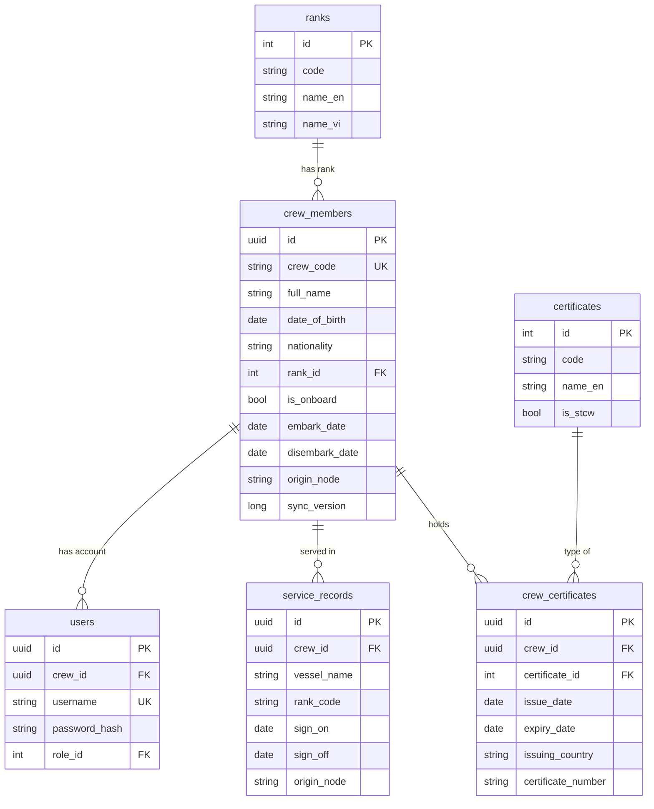
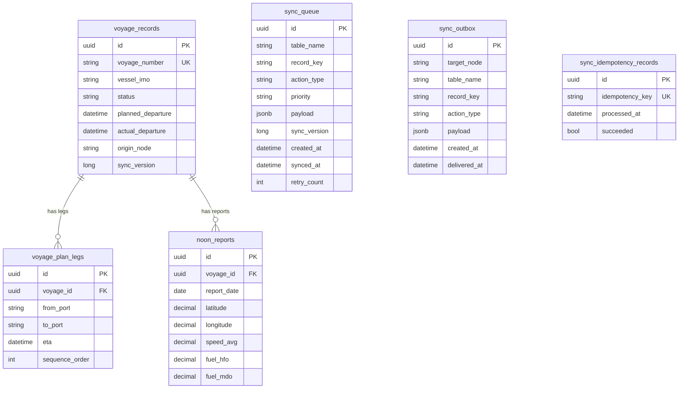

# TÀI LIỆU BẢO VỆ BÁO CÁO THỰC TẬP
## Đề tài: Hệ thống Quản lý Hạm Đội Tàu Biển theo Mô hình Edge-Shore Computing

> **Phiên bản:** 1.0 | **Ngày:** 27/04/2026  
> **Dự án:** Maritime Management System v1.1  
> **Repository:** `Martime_product_v1.1`

---

## 2. Sản phẩm công nghệ

Hệ thống: **Phần mềm quản lý hạm đội tàu biển theo mô hình Edge-Shore Computing** phục vụ công tác vận hành và giám sát đội tàu cho doanh nghiệp hàng hải. Bao gồm một ứng dụng di động dành cho thuyền viên trên tàu và một ứng dụng web vận hành trên tàu và một ứng dụng web quản lý tập trung trên bờ.

Sản phẩm đã được triển khai thử nghiệm trên môi trường Docker, mô phỏng điều kiện hoạt động thực tế với hai hệ thống Edge – Shore đồng bộ dữ liệu hai chiều qua vệ tinh VSAT/4G/Iridium.

**Chức năng:**

Ứng dụng di động: Dành cho thuyền viên, xem hồ sơ cá nhân, chứng chỉ nghề nghiệp (STCW) và nhận thông báo từ hệ thống tàu.

Ứng dụng web trên tàu (Edge): Vận hành tàu offline, quản lý báo cáo hàng hải, bảo trì thiết bị (PMS), kho vật tư và nhật ký hành trình. Tự động đồng bộ dữ liệu với Shore khi có kết nối.

Ứng dụng web trên bờ (Shore): Quản lý đội tàu, hồ sơ và phân công thuyền viên, lập kế hoạch chuyến đi, giám sát tuân thủ tiêu chuẩn MLC 2006 và theo dõi trạng thái đồng bộ toàn đội tàu.

---

# B1. QUY TRÌNH VÀ HỆ THỐNG CHUNG

## 1.1 Git Log & Lịch Sử Phát Triển

Dự án được phát triển theo mô hình **feature branching** trên GitHub với các nhánh:
- `feature/viethoang` — nhánh chính (HEAD)
- `feature/hieu5` — nhánh tính năng thành viên
- `feature/tinhai`, `feature/tinht` — nhánh tính năng tổng hợp

**Các commit tiêu biểu:**

| Commit | Nội dung |
|--------|----------|
| `2ac7c5cb` | Nhánh hiện tại `feature/viethoang` |
| `031fd097` | feat: redesign dashboard UI, dịch tiếng Việt toàn bộ shore frontend |
| `8d7d9d4b` | feat: crew cert rank filter, edge_changes clear on mark viewed |
| `30d4c7c8` | fix: crew sync - VesselId FK remapping, per-item error messages |
| `a8dd8842` | fix: sync auth middleware + conflict resolver duplicate + local config |
| `95a671bf` | fix: nginx client_max_body_size, edge upload cooldown |
| `c49297c5` | fix: restore production ShoreAPI URL and QuestPDF |
| `fc3c8ff6` | Merge feature/viethoang into feature/hieu5: cert rank filter |

> **Quy trình làm việc:** Mỗi tính năng lớn được tạo branch riêng → phát triển → merge qua Pull Request → tích hợp lên nhánh chính.

---

## 1.2 Phân Công Công Việc

| Thành viên | Phạm vi trách nhiệm |
|------------|---------------------|
| **Viet Hoang** | Shore Frontend (React), Crew Management UI, Sync Dashboard |
| **Hieu** | Edge Backend (.NET), Sync Protocol, Conflict Resolver |
| **Tinhai / Tinht** | Voyage Sync, Phase 2.2 Bidirectional Sync, ERD Documentation |
| **Chung** | Edge Frontend (React), Mobile App (Flutter), PMS Module |

---

## 1.3 Tổng Quan Kiến Trúc Hệ Thống

### Bài Toán Thực Tế

Trong ngành hàng hải, tàu hoạt động giữa đại dương nơi kết nối Internet rất hạn chế và đắt tiền:

| Loại kết nối | Băng thông | Chi phí |
|---|---|---|
| **Iridium** (vệ tinh) | 0.12 – 1 kbps | Rất cao |
| **VSAT** (vệ tinh) | 64 kbps – 2 Mbps | Cao |
| **4G/LTE** (cellular) | 1 – 100 Mbps | Trung bình |
| **Shore WiFi** | 10+ Mbps | Thấp |

**Vấn đề cốt lõi:** Cần một hệ thống hoạt động được khi tàu ở giữa đại dương (offline hoàn toàn), nhưng vẫn đồng bộ dữ liệu với trung tâm khi có kết nối — mà không mất dữ liệu, không trùng lặp, không xung đột.

### Giải Pháp: Edge-Shore Computing

```
┌─────────────────────────────┐     ┌─────────────────────────────┐
│       SHORE (Trên Bờ)       │     │       EDGE (Trên Tàu)       │
│   Trung tâm điều hành       │     │   Server đặt trên tàu       │
│                             │     │                             │
│  ✦ Quản lý đội tàu tổng thể │     │  ✦ Thu thập dữ liệu cảm biến│
│  ✦ HR & quản lý thuyền viên │     │  ✦ Giám sát máy móc real-time│
│  ✦ Dữ liệu master tập trung │     │  ✦ Ghi nhật ký hành trình   │
│  ✦ Compliance & audit       │     │  ✦ Báo cáo Noon/Arrival/... │
│  ✦ 29 Controllers           │     │  ✦ 51 Controllers           │
│  ✦ 110+ bảng database       │     │  ✦ 60+ bảng database        │
└─────────────────────────────┘     └─────────────────────────────┘
              │                                    │
              └──────────┐      ┌──────────────────┘
                         ▼      ▼
              ┌──────────────────────┐
              │  VSAT / 4G / Iridium │
              │  Kết nối không liên tục│
              │  Store-and-Forward   │
              └──────────────────────┘
```

### Nguyên Tắc Thiết Kế Cốt Lõi

| Nguyên tắc | Mô tả | Lý do |
|---|---|---|
| **Offline-First** | Edge hoạt động 100% khi mất kết nối | Tàu có thể mất kết nối hàng tuần |
| **Store-and-Forward** | Dữ liệu xếp hàng đợi, gửi khi có mạng | Không mất dữ liệu dù mạng chập chờn |
| **Network-Aware** | Ưu tiên sync theo loại kết nối | Iridium rất đắt → chỉ gửi Critical |
| **Domain-Based Conflict** | Mỗi bảng/trường có quy tắc riêng | Last-Write-Wins không phù hợp hàng hải |
| **Bidirectional Sync** | Dữ liệu chảy hai chiều Shore ↔ Edge | Shore plan → Edge thực thi → Shore nhận kết quả |
| **Idempotent Processing** | Xử lý nhiều lần không gây trùng lặp | Mạng không ổn định → retry là bình thường |

---

## 1.4 Tiến Độ Phát Triển

| Phase | Nội dung | Trạng thái |
|---|---|---|
| **Phase 1** | Kiến trúc cơ bản: Shore + Edge API, Database schema | ✅ Hoàn thành |
| **Phase 2.1** | Sync một chiều Edge → Shore (Crew, Telemetry) | ✅ Hoàn thành |
| **Phase 2.2** | Bidirectional Sync (Voyage Planning, Crew HR) | ✅ Hoàn thành (05/04/2026) |
| **Phase 3** | AI Module, Advanced Analytics | 🔄 Đang lên kế hoạch |

---

# B2.1. KHẢO SÁT, PHÂN TÍCH VÀ THIẾT KẾ CHI TIẾT

## 2.1.1 Mô Tả Nghiệp Vụ Hệ Thống

### Module 1: Quản Lý Thuyền Viên (Crew Management)

**Đầu vào:**
- Hồ sơ thuyền viên: họ tên, ngày sinh, quốc tịch, chức danh (Rank)
- Chứng chỉ STCW (Standards of Training, Certification and Watchkeeping)
- Giấy tờ tùy thân, hộ chiếu, sách thuyền viên (Seafarer's Book)
- Hồ sơ sức khỏe, bảo hiểm xã hội, mã số thuế

**Đầu ra:**
- Danh sách thuyền viên đang phục vụ trên tàu (IsOnboard = true)
- Lịch sử công tác (ServiceRecord) theo từng chuyến đi
- Cảnh báo chứng chỉ sắp hết hạn
- Báo cáo tuân thủ MLC 2006 (Maritime Labour Convention)

**Quy tắc xử lý nghiệp vụ:**
1. Mỗi thuyền viên có một `CrewCode` duy nhất trong hệ thống
2. Không thể xóa thuyền viên nếu còn bản ghi phục vụ — chỉ được soft-delete
3. Chứng chỉ STCW bắt buộc phải có trước khi phân công lên tàu (kiểm tra `ComplianceService`)
4. `IsOnboard` chỉ được Edge (tàu) thay đổi — Shore không được ghi đè trường này
5. Khi thuyền viên mới được Shore tạo và sync xuống Edge → trạng thái `PendingReview`, thuyền trưởng phải duyệt trước khi chính thức onboard

### Module 2: Đồng Bộ Dữ Liệu (Sync Protocol)

**Đầu vào:**
- Thay đổi từ ứng dụng Edge: crew update, noon report, position, safety alarm...
- Thay đổi từ Shore: voyage plan, crew assignment, master data update...
- Loại kết nối mạng hiện tại: `None / Iridium / VSAT / 4G / WiFi`

**Đầu ra:**
- `SyncQueue` (Edge): hàng đợi outgoing với trạng thái `Pending / Synced / Failed`
- `SyncOutbox` (Shore): hàng đợi gửi cho Edge với trạng thái `Pending / Delivered`
- `SyncLog`: audit trail đầy đủ mọi thao tác sync
- Kết quả `SyncBatchProcessResult`: số item thành công / thất bại, chi tiết lỗi

**Quy tắc xử lý nghiệp vụ:**
1. **Priority filtering theo network type:**
   - Iridium → chỉ gửi `Critical` (safety alarms, distress)
   - VSAT → `Critical + Operational`
   - 4G/WiFi → tất cả priorities
2. **Idempotency:** Key = `{TableName}:{RecordKey}:{SyncVersion}` — xử lý nhiều lần không gây duplicate
3. **Exponential backoff:** Retry tối đa 5 lần, delay tăng theo lũy thừa
4. **Batch size:** Tối đa 100 items/request, cursor-based pagination cho pull
5. **Conflict resolution:** Domain-based (không phải Last-Write-Wins)

### Module 3: Báo Cáo Hàng Hải (Maritime Reports)

**Đầu vào:**
- Dữ liệu từ buồng lái: vị trí GPS, tốc độ, hướng đi
- Tiêu thụ nhiên liệu (bunker): HFO, MDO, LFO theo từng máy
- Thông tin hàng hóa: trọng lượng, loại, tình trạng
- Thời tiết: sóng, gió, áp suất khí quyển

**Đầu ra:**
- **Noon Report:** báo cáo 12:00 UTC hằng ngày (IMO standard)
- **Departure Report:** báo cáo khi tàu rời cảng
- **Arrival Report:** báo cáo khi tàu vào cảng
- **Bunker Report:** báo cáo tiêu thụ nhiên liệu
- **Position Report:** vị trí tàu định kỳ

**Quy tắc xử lý:**
1. Noon Report phải có đủ: position, speed, fuel consumption, weather conditions
2. Không thể nộp báo cáo trùng ngày/loại (unique constraint `VoyageId + ReportDate + Type`)
3. Sau khi nộp, báo cáo được queue vào SyncQueue với priority `Operational`

### Module 4: Bảo Trì Phòng Ngừa — PMS (Planned Maintenance System)

**Đầu vào:**
- Danh mục thiết bị tàu: máy chính, máy phụ, bơm, van, thiết bị cứu sinh
- Lịch bảo trì theo nhà sản xuất (running hours / calendar)
- Kết quả công việc bảo trì: trạng thái, vật tư tiêu hao, ghi chú

**Đầu ra:**
- `MaintenanceSchedule`: lịch bảo trì tự động theo chu kỳ
- `MaintenanceTask` với trạng thái: `Pending / InProgress / Done / Overdue / Deferred`
- Yêu cầu hoãn (`DeferralRequest`) cần duyệt của Chief Engineer
- Dashboard PMS tổng hợp: overdue count, upcoming, completion rate

**Quy tắc:**
1. Công việc overdue không thể tự đóng — phải có duyệt của Captain hoặc ChiefEngineer
2. `DeferralRequest` vượt quá 30 ngày cần phê duyệt từ Shore (ClassSurveyor)
3. Tuân thủ ISM Code: mọi thao tác bảo trì phải có AuditLog

---

## 2.1.2 Sơ Đồ Phân Tích và Thiết Kế

### Sơ Đồ Luồng Đồng Bộ Dữ Liệu (Sync Flow)

```
EDGE (Tàu)                                    SHORE (Bờ)
══════════                                    ══════════
  App.SaveChanges()
       │
       ▼
  ISyncableEntity? ──NO──► Bỏ qua
       │ YES
       ▼
  SyncQueue.Add(                              POST /api/sync
    tableName,                ────────►       SyncController
    recordKey,                PUSH            SyncInboxService
    payload (JSON),           (batch 100)         │
    priority,                                     ├─► IsAlreadyProcessed?
    syncVersion,                                  │       │ YES → skip
    actionType,                                   │       │ NO  ↓
    originNode                                    ├─► ConflictResolverService
  )                                               │       │
       │                                          │       ├─► Master Data?  → Shore wins
  SyncBackgroundWorker                            │       ├─► Operational?  → Edge wins
  (mỗi 30 giây)                                  │       ├─► Crew member?  → Merge fields
       │                                          │       └─► Fallback?     → Last-Write-Wins
       ├─► Check NetworkType                      │
       ├─► Filter by Priority                     ├─► Apply to DB
       ├─► Send batch                             ├─► SyncIdempotencyRecord.Add()
       └─► Mark SyncedAt                          └─► SyncLog.Add()


SHORE (Bờ)                                    EDGE (Tàu)
══════════                                    ══════════
  Business Logic                              GET /api/sync/pull
  SaveChanges()                   ◄────────   SyncBackgroundWorker
       │                          PULL         (mỗi 30 giây)
       ▼                          (cursor-         │
  ShoreAutoSyncInterceptor        based)           ├─► Nhận SyncOutbox items
       │                                          │
  SyncOutboxService.EnqueueAsync()               ├─► SyncConflictHandler
       │                                          │       │
       ├─► TargetNode = ShipIMO                   │       ├─► Master Data? → Accept
       ├─► Deduplication check                    │       ├─► ServiceRecord? → Reject
       └─► Upsert SyncOutbox                      │       ├─► Crew from Shore? → PendingReview
                                                   │       └─► Crew update? → Merge HR fields
                                                   │
                                              POST /api/sync/acknowledge
                                              ────────────────────────►
                                              Shore marks DeliveredAt
```

### Sơ Đồ ERD — Module Crew, Chứng Chỉ, Users



### Sơ Đồ ERD — Module Voyage & Sync Infrastructure



---

## 2.1.3 Thiết Kế Bảng Dữ Liệu Chính

### Bảng `crew_members` — Bảng trung tâm thuyền viên

```sql
CREATE TABLE crew_members (
    id              UUID PRIMARY KEY DEFAULT gen_random_uuid(),
    crew_code       VARCHAR(20) UNIQUE NOT NULL,     -- Mã thuyền viên duy nhất
    full_name       VARCHAR(200) NOT NULL,
    date_of_birth   DATE,
    nationality     VARCHAR(50),
    rank_id         INT REFERENCES ranks(id),
    -- Trường Edge sở hữu (chỉ tàu được cập nhật)
    is_onboard      BOOLEAN DEFAULT false,
    embark_date     DATE,
    disembark_date  DATE,
    embark_port     VARCHAR(10),
    disembark_port  VARCHAR(10),
    ship_id         UUID,
    -- Trường Shore sở hữu (chỉ HR được cập nhật)
    social_insurance_number VARCHAR(20),
    tax_id_number           VARCHAR(20),
    -- Sync infrastructure fields (implement ISyncableEntity)
    is_synced       BOOLEAN DEFAULT false,
    origin_node     VARCHAR(50) NOT NULL,    -- "SHORE" hoặc "SHIP_001"
    sync_version    BIGINT DEFAULT 0,        -- Optimistic concurrency
    created_at      TIMESTAMPTZ NOT NULL DEFAULT NOW(),
    updated_at      TIMESTAMPTZ NOT NULL DEFAULT NOW()
);
```

**Lý do thiết kế:**
- `origin_node`: Xác định ai tạo ra bản ghi, dùng trong conflict resolution
- `sync_version`: Tăng mỗi lần update, dùng cho idempotency key
- Tách trường Shore/Edge sở hữu: phản ánh đúng ownership model

### Bảng `sync_queue` — Hàng đợi outgoing tại Edge

```sql
CREATE TABLE sync_queue (
    id           UUID PRIMARY KEY DEFAULT gen_random_uuid(),
    table_name   VARCHAR(100) NOT NULL,
    record_key   VARCHAR(200) NOT NULL,    -- Primary key của bản ghi
    action_type  VARCHAR(20) NOT NULL,     -- CREATE | UPDATE | DELETE | SNAPSHOT
    priority     VARCHAR(20) NOT NULL,     -- Critical | Operational | Low
    payload      JSONB NOT NULL,           -- Serialized entity data
    sync_version BIGINT NOT NULL,
    origin_node  VARCHAR(50) NOT NULL,
    created_at   TIMESTAMPTZ NOT NULL DEFAULT NOW(),
    synced_at    TIMESTAMPTZ,             -- NULL = chưa đồng bộ
    retry_count  INT DEFAULT 0,
    last_error   TEXT
);
CREATE INDEX idx_sync_queue_unsynced ON sync_queue(priority, created_at) 
    WHERE synced_at IS NULL;             -- Index cho background worker
```

**Lý do thiết kế:**
- `priority` + partial index: Background worker chỉ scan hàng chờ, nhanh
- `payload JSONB`: Linh hoạt, không cần schema migration khi thêm trường
- `retry_count` + `last_error`: Exponential backoff và diagnostics

---

# B2.2. TÌM HIỂU CÔNG CỤ, CÔNG NGHỆ

## 2.2.1 Stack Công Nghệ

### Backend — ASP.NET Core 8.0

**Lý do chọn .NET 8:**
- Performance cao nhất trong lịch sử .NET (Benchmark TechEmpower vượt Go)
- Native AOT compilation → khởi động nhanh trên server tàu resource hạn chế
- Entity Framework Core 8 với interceptor pattern → tự động hóa sync queue
- IHostedService cho background worker mà không cần thư viện ngoài

**Các pattern được áp dụng:**
- **Repository Pattern**: Tách DB access khỏi business logic
- **Service Layer**: Controller → Service → Repository → DB
- **Interceptor Pattern** (`SaveChangesInterceptor`): Tự động phát hiện thay đổi ISyncableEntity
- **Background Service** (`IHostedService`): Sync worker chạy độc lập
- **JWT + Role-based Authorization**: 9 roles khác nhau (Admin, Master, ChiefOfficer...)

### Frontend — React 19 + TypeScript

**Shore Frontend** (Port 3000): React Context API cho state management
**Edge Frontend** (Port 3002): Zustand 5.0 với persistent state (offline-aware)

**Lý do chọn Zustand cho Edge:**
- Redux quá nặng cho thiết bị trên tàu
- Zustand hỗ trợ persist middleware → lưu state vào localStorage
- Offline-first: UI không bị reset khi reload

**Tính năng đặc biệt:**
- Export Excel: `ExcelJS` (PMS schedule, crew list)
- Export PDF: `jsPDF` (noon reports)
- Drag & Drop: `@dnd-kit` (PMS task board)
- Real-time charts: `Recharts` (telemetry dashboard)

### Mobile — Flutter 3.x

**Lý do chọn Flutter:**
- Single codebase cho Android + iOS
- Dart AOT compilation → hiệu suất gần native
- Hive local database → offline cache thuyền viên
- Provider state management → đủ đơn giản cho app thao tác trên tàu

### Database — PostgreSQL 15

**Lý do chọn PostgreSQL:**
- JSONB native: payload đồng bộ lưu không cần schema cứng
- `gen_random_uuid()` built-in: UUID primary keys cho distributed system
- Partial indexes: `sync_queue` chỉ index hàng chờ (`WHERE synced_at IS NULL`)
- `TIMESTAMPTZ`: Tránh timezone bug khi tàu đổi múi giờ

---

## 2.2.2 Tổ Chức Mã Nguồn

### Cấu Trúc Shore Backend

```
shore_product/backend/
├── Controllers/             → API endpoints (thin layer, chỉ nhận request)
│   ├── SyncController.cs    → POST /api/sync, GET /api/sync/pull
│   ├── Crew/                → CrewController, CertificatesController
│   └── ...
├── Services/
│   ├── Sync/
│   │   ├── SyncInboxService.cs         → Xử lý push từ Edge
│   │   ├── SyncOutboxService.cs        → Enqueue dữ liệu cho Edge
│   │   ├── ConflictResolverService.cs  → Domain-based conflict resolution
│   │   ├── ShoreAutoSyncInterceptor.cs → Tự động phát hiện thay đổi
│   │   └── SyncHealthMonitorService.cs → Giám sát sức khỏe
│   ├── Crew/                → CrewService, CertificateService
│   └── Background/          → AlertBackgroundService
├── Models/                  → Domain entities (110+ classes)
├── Data/AppDbContext.cs      → EF Core DbContext
├── DTOs/                    → Request/Response models
└── Security/                → JWT, Authorization policies
```

### Cấu Trúc Edge Backend

```
edge_product/edge-services/
├── Controllers/ (51)        → API endpoints theo domain
│   ├── Reporting/           → Noon, Departure, Arrival, Position reports
│   ├── Logbooks/            → DeckLogbook, EngineLogbook, OilRecordBook
│   ├── Maintenance/         → PMS, EquipmentAsset, TaskChecklist
│   └── ...
├── Services/
│   ├── Core/
│   │   ├── SyncBackgroundWorker.cs   → Push + Pull mỗi 30 giây
│   │   └── SyncConflictHandler.cs   → Xử lý conflict khi nhận từ Shore
│   ├── Voyage/, Reporting/, Maintenance/
│   └── AI/                          → AI Assistant module
├── Models/ (97+)
└── BackgroundServices/
    ├── TelemetrySimulatorService.cs  → Dev mode: giả lập GPS/engine
    └── SignalKDataCollectorService.cs → Production: real sensor data
```

### ISyncableEntity Interface

```csharp
// Maritime.Shared/Interfaces/ISyncableEntity.cs
public interface ISyncableEntity
{
    bool IsSynced { get; set; }
    string OriginNode { get; set; }      // "SHORE" | "SHIP_IMO_NUMBER"
    long SyncVersion { get; set; }       // Tăng mỗi lần update
    DateTime CreatedAt { get; set; }
    DateTime UpdatedAt { get; set; }
}
```

Tất cả entity cần đồng bộ đều implement interface này:
`CrewMember`, `CrewCertificate`, `ServiceRecord`, `VoyageRecord`, `NoonReport`, `MaintenanceTask`...

### Kiểm Tra Dữ Liệu & Bắt Lỗi

**Validation tầng Controller:**
```csharp
[HttpPost]
public async Task<IActionResult> CreateCrewMember([FromBody] CreateCrewMemberDto dto)
{
    if (!ModelState.IsValid)          // DataAnnotations validation
        return BadRequest(ModelState);

    if (await _crewService.CodeExistsAsync(dto.CrewCode))
        return Conflict("Crew code already exists");
    // ...
}
```

**Global Exception Middleware:**
```csharp
// Middleware/ExceptionMiddleware.cs
app.UseExceptionHandler(err => err.Run(async ctx => {
    var ex = ctx.Features.Get<IExceptionHandlerFeature>()?.Error;
    ctx.Response.StatusCode = ex switch {
        NotFoundException => 404,
        ValidationException => 400,
        ConflictException => 409,
        _ => 500
    };
    await ctx.Response.WriteAsJsonAsync(new { error = ex?.Message });
}));
```

**Sync Batch Error Handling:**
```csharp
// SyncInboxService.cs
public async Task<SyncBatchProcessResult> ProcessBatchAsync(List<SyncQueueItemDto> items)
{
    var result = new SyncBatchProcessResult();
    foreach (var item in items)
    {
        try {
            if (await IsAlreadyProcessedAsync(item.TableName, item.RecordKey, item.SyncVersion))
                continue;  // Idempotency check

            await ProcessIncomingAsync(item);
            result.Succeeded++;
        }
        catch (Exception ex) {
            result.Failed++;
            result.FailedItems.Add(new SyncBatchItemFailure {
                TableName = item.TableName,
                RecordKey = item.RecordKey,
                Error = ex.Message
            });
            _logger.LogError(ex, "Failed to process sync item {Table}/{Key}", 
                item.TableName, item.RecordKey);
            // Không throw → tiếp tục xử lý items còn lại
        }
    }
    return result;
}
```

---

## 2.2.3 Sản Phẩm & Kịch Bản Demo

### Kịch Bản Demo 1: Thuyền Viên Lên Tàu

1. **Shore** (HRAdmin): Tạo hồ sơ thuyền viên mới trên shore dashboard
2. **Shore AutoSync Interceptor** tự động queue vào `SyncOutbox` (target = Ship IMO)
3. **Edge** SyncBackgroundWorker pull về → `SyncConflictHandler` xử lý → tạo crew với `IsOnboard=false, PendingReview=true`
4. **Edge** (Captain/Master): Duyệt thuyền viên trong danh sách chờ → set `IsOnboard=true`
5. **Edge→Shore sync**: Trạng thái mới được push về Shore

### Kịch Bản Demo 2: Báo Cáo Noon (Giữa Đại Dương)

1. Tàu mất kết nối mạng (`NetworkType = None`)
2. Chief Officer nhập Noon Report trên Edge Dashboard
3. Hệ thống lưu vào DB + tạo `SyncQueue` entry (`Priority=Operational`)
4. Sau 3 ngày, tàu vào vùng 4G coverage
5. SyncBackgroundWorker phát hiện `NetworkType = Cellular_4G`
6. Push tất cả Operational + Critical items → Shore nhận, cập nhật fleet dashboard
7. Shore tự động tính CII (Carbon Intensity Indicator) từ fuel data

### Kịch Bản Demo 3: Conflict Resolution

1. **Shore HR** cập nhật `FullName` thuyền viên: "Nguyen Van A" → "Nguyen Van An"
2. Trong lúc mất mạng, **Edge** cũng cập nhật `IsOnboard=true` cho thuyền viên đó
3. Khi có kết nối, cả 2 thay đổi được gửi lên Shore
4. `ConflictResolverService` xử lý:
   - `FullName` → Shore owns → giữ "Nguyen Van An"
   - `IsOnboard` → Edge owns → giữ `true`
5. Kết quả merge được push lại Edge
6. Log xung đột được ghi vào `SyncLog` để audit

---

# B2.3. TRÌNH BÀY GIẢI PHÁP

## 2.3.1 Tư Duy Thiết Kế

### Tại Sao Không Dùng Giải Pháp Đơn Giản Hơn?

**Phương án A — Chỉ dùng Cloud:**
- ❌ Khi tàu mất kết nối, toàn bộ hệ thống không hoạt động
- ❌ Chi phí băng thông VSAT cực kỳ đắt nếu mọi thao tác đều cần real-time

**Phương án B — Chỉ dùng Edge, không sync:**
- ❌ Shore không biết trạng thái tàu
- ❌ Không thể quản lý đội tàu tập trung, không compliance

**Phương án C (Đã chọn) — Edge-Shore với Store-and-Forward:**
- ✅ Edge hoạt động hoàn toàn offline
- ✅ Shore có đầy đủ dữ liệu khi tàu có mạng
- ✅ Tốn bandwidth tối thiểu (chỉ sync data cần thiết theo priority)

### Tại Sao Không Dùng Last-Write-Wins?

Trong hàng hải, dữ liệu có **ý nghĩa chuyên môn sâu**:
- Shore có thể cập nhật `FullName` theo hộ chiếu mới → phải thắng
- Edge biết thuyền viên thực sự đang trên tàu (`IsOnboard`) → phải thắng  
- Nếu dùng LWW: Shore cập nhật `IsOnboard=false` cho thuyền viên đang làm việc → sự cố nghiêm trọng

**Giải pháp:** Domain-Based Conflict Resolution — mỗi trường có chủ sở hữu (`OriginNode`) được định nghĩa trước trong `SYNC_OWNERSHIP_MATRIX.md`.

### Tại Sao Dùng Interceptor Thay Vì Manual Enqueue?

**Trước Phase 2.2:** Mỗi service phải tự gọi `_syncOutbox.EnqueueAsync()` → dễ quên, code trùng lặp.

**Phase 2.2:** `ShoreAutoSyncInterceptor` kế thừa `SaveChangesInterceptor` của EF Core → tự động phát hiện 23+ entity types thay đổi → không thể bỏ sót.

```csharp
// ShoreAutoSyncInterceptor.cs
public override async ValueTask<InterceptionResult<int>> SavingChangesAsync(...)
{
    var changes = context.ChangeTracker.Entries<ISyncableEntity>()
        .Where(e => e.State is Added or Modified or Deleted)
        .ToList();
    
    foreach (var entry in changes)
        await _syncOutbox.EnqueueAsync(entry.Entity, entry.State, ...);
    
    return await base.SavingChangesAsync(...);
}
```

---

## 2.3.2 Điểm Nổi Bật Để Trình Bày

1. **Offline-First là bài toán thực tế** — không phải lý thuyết: tàu thực sự mất mạng hàng tuần
2. **9 tiêu chuẩn quốc tế** được tích hợp: SOLAS, MARPOL, STCW, MLC, ISM Code, IMO DCS/MRV/CII, ISPS
3. **Conflict Resolution thông minh**: Không phải "ai update sau thì thắng" mà là "ai có thẩm quyền thì thắng"
4. **Kiến trúc 2 hệ thống độc lập**: Shore và Edge có thể deploy riêng biệt, không phụ thuộc nhau khi mất mạng
5. **Mobile App Flutter** cho thuyền viên: Có thể hoạt động offline với Hive local cache

---

## 2.3.3 Gợi Ý Slide Trình Chiếu

| Slide | Nội dung |
|-------|----------|
| 1 | Tiêu đề + tên thành viên |
| 2 | Bài toán: Tàu biển và kết nối mạng (bảng bandwidth) |
| 3 | Giải pháp tổng quan: Kiến trúc Edge-Shore (diagram ASCII) |
| 4 | Nguyên tắc thiết kế 6 điểm |
| 5 | Shore System: chức năng + stack |
| 6 | Edge System: chức năng + stack |
| 7 | Sync Protocol: Store-and-Forward flow diagram |
| 8 | Conflict Resolution: Domain-Based (ví dụ crew member) |
| 9 | Database: ERD tóm tắt 2 hệ thống |
| 10 | Demo: Kịch bản noon report offline 3 ngày |
| 11 | Tiêu chuẩn hàng hải: 9 tiêu chuẩn IMO |
| 12 | Thống kê: 80+ controllers, 170+ bảng, 6 apps |
| 13 | Kết luận + Q&A |

---

# B2.4. VẤN ĐÁP — CÂU HỎI & TRẢ LỜI

## Nhóm 1: Công Nghệ Tổng Quan

### Câu hỏi 1: Tại sao chọn .NET 8 thay vì Node.js hoặc Python?

**Trả lời:**
- **.NET 8** có hiệu suất rất cao (benchmark TechEmpower Top 10), phù hợp cho server chạy trên tàu với RAM/CPU hạn chế
- **Strongly-typed** với C#: Catch lỗi lúc compile thay vì runtime — quan trọng với hệ thống hàng hải cần độ tin cậy cao
- **Entity Framework Core** có tính năng `SaveChangesInterceptor` giúp tự động hóa sync queue — khó làm với ORM của Python/Node
- **IHostedService**: Background service tích hợp sẵn, không cần Celery/Bull như Python/Node

### Câu hỏi 2: Tại sao dùng PostgreSQL thay vì MySQL hoặc SQL Server?

**Trả lời:**
- **JSONB** của PostgreSQL: Payload đồng bộ lưu dạng JSON có thể query, index — MySQL JSON kém hơn
- **`gen_random_uuid()`** built-in: UUID primary keys cần thiết cho distributed system
- **Partial index**: `WHERE synced_at IS NULL` — MySQL không hỗ trợ
- **`TIMESTAMPTZ`**: Timezone-aware — tàu di chuyển qua nhiều múi giờ
- SQL Server: License fee đắt, không phù hợp triển khai trên tàu với chi phí thấp
- Docker image `postgres:15-alpine` rất nhỏ gọn, phù hợp thiết bị tàu

### Câu hỏi 3: Tại sao dùng React 19 thay vì Vue hoặc Angular?

**Trả lời:**
- **React 19** có Concurrent Features: `useTransition`, `useDeferredValue` — giúp UI mượt khi load nhiều data telemetry
- **Zustand** (Edge) hỗ trợ persist middleware → offline-aware state management
- **Ecosystem**: `Recharts` cho telemetry charts, `dnd-kit` cho PMS drag-drop, `ExcelJS` cho export
- Angular: quá nặng cho Edge device
- Vue: ecosystem nhỏ hơn với các thư viện maritime cần dùng

### Câu hỏi 4: Store-and-Forward pattern là gì?

**Trả lời:**
Store-and-Forward là pattern trong đó:
1. Dữ liệu được **lưu cục bộ** (Store) vào `SyncQueue` ngay khi tạo ra — dù chưa có mạng
2. Khi có kết nối, Worker đọc queue và **chuyển tiếp** (Forward) lên Shore
3. Nếu gửi thất bại → giữ trong queue, retry sau

**Ưu điểm:** Không bao giờ mất dữ liệu, không cần mạng real-time.
**Ví dụ thực tế:** Email SMTP server cũng dùng pattern này.

---

## Nhóm 2: Luồng Dữ Liệu & Mã Nguồn

### Câu hỏi 5: Khi thuyền viên bấm "Lưu" trên Edge, dữ liệu đi đâu?

**Trả lời — Luồng đầy đủ:**

```
1. CrewController.UpdateCrew(dto)
   └─► CrewService.UpdateAsync(crew)
        └─► _context.SaveChangesAsync()
             └─► EF Core change tracker:
                  ├─► Ghi vào table crew_members (transaction)
                  └─► [HOOK] ProcessSyncQueue():
                       └─► Tạo SyncQueue entry:
                            {
                              TableName: "crew_members",
                              RecordKey: crew.Id.ToString(),
                              ActionType: "UPDATE",
                              Priority: "Operational",
                              Payload: JsonSerialize(crew),
                              SyncVersion: crew.SyncVersion + 1,
                              OriginNode: "SHIP_IMO_9123456"
                            }

2. [30 giây sau] SyncBackgroundWorker.ExecuteAsync()
   └─► Check NetworkType (từ appsettings / network probe)
   └─► Query: SELECT * FROM sync_queue 
              WHERE synced_at IS NULL 
              AND priority IN ('Critical','Operational')  -- nếu VSAT
              ORDER BY created_at LIMIT 100
   └─► POST http://shore:5000/api/sync
        Body: { items: [{ tableName, recordKey, payload, ... }] }
   └─► Response: { succeeded: 1, failed: 0 }
   └─► UPDATE sync_queue SET synced_at = NOW() WHERE id = ...
```

### Câu hỏi 6: ConflictResolverService hoạt động như thế nào?

**Trả lời:**

```csharp
// Khi Shore nhận push từ Edge chứa crew_member update:
public async Task<ConflictResolution> ResolveAsync(string tableName, 
    object existingEntity, object incomingEntity, string originNode)
{
    return tableName switch {
        // Master data: Shore luôn thắng, từ chối ghi đè
        "certificates" or "countries" or "ranks" => 
            ConflictResolution.RejectIncoming("Master data owned by Shore"),
        
        // Operational data: Edge thắng, luôn áp dụng
        "service_records" or "position_data" or "noon_reports" =>
            ConflictResolution.AcceptIncoming(),
        
        // Crew member: Merge theo từng trường
        "crew_members" => 
            MergeCrewMember(existingEntity as CrewMember, 
                           incomingEntity as CrewMember, 
                           originNode),
        
        // Fallback: Last-Write-Wins dựa trên UpdatedAt
        _ => ResolveByTimestamp(existingEntity, incomingEntity)
    };
}

private ConflictResolution MergeCrewMember(CrewMember existing, 
    CrewMember incoming, string originNode)
{
    var merged = existing.Clone();
    
    // Edge sở hữu các trường operational
    if (originNode != "SHORE") {
        merged.IsOnboard = incoming.IsOnboard;
        merged.EmbarkDate = incoming.EmbarkDate;
        merged.DisembarkDate = incoming.DisembarkDate;
        merged.AvatarUrl = incoming.AvatarUrl;
    }
    
    // Shore sở hữu các trường HR — không áp dụng từ Edge
    // merged.SocialInsuranceNumber → giữ nguyên
    // merged.TaxIdNumber → giữ nguyên
    
    // Các trường thông thường: dùng timestamp
    if (incoming.UpdatedAt > existing.UpdatedAt && originNode != "SHORE") {
        merged.FullName = incoming.FullName;
        // ... các trường khác
    }
    
    return ConflictResolution.Merged(merged);
}
```

### Câu hỏi 7: Idempotency được xử lý như thế nào?

**Trả lời:**

Idempotency đảm bảo: xử lý cùng một sync item nhiều lần không tạo ra kết quả khác nhau.

```csharp
// SyncInboxService.cs
public async Task<bool> IsAlreadyProcessedAsync(
    string tableName, string recordKey, long syncVersion)
{
    var key = $"{tableName}:{recordKey}:{syncVersion}";
    return await _context.SyncIdempotencyRecords
        .AnyAsync(r => r.IdempotencyKey == key);
}

// Trong ProcessBatchAsync:
if (await IsAlreadyProcessedAsync(item.TableName, item.RecordKey, item.SyncVersion))
{
    _logger.LogInformation("Skipping already-processed: {Key}", idempotencyKey);
    result.Succeeded++; // Coi như thành công
    continue;
}

// Sau khi xử lý thành công:
_context.SyncIdempotencyRecords.Add(new SyncIdempotencyRecord {
    IdempotencyKey = $"{tableName}:{recordKey}:{syncVersion}",
    ProcessedAt = DateTime.UtcNow,
    Succeeded = true
});
```

**Tại sao cần idempotency?**
- Mạng tàu không ổn định → cùng batch có thể được gửi lại nhiều lần
- Nếu không có idempotency → một crew member có thể bị tạo duplicate nhiều lần

### Câu hỏi 8: SyncBackgroundWorker chạy như thế nào?

**Trả lời:**

```csharp
// SyncBackgroundWorker.cs (kế thừa BackgroundService)
protected override async Task ExecuteAsync(CancellationToken stoppingToken)
{
    while (!stoppingToken.IsCancellationRequested)
    {
        try 
        {
            var networkType = await _networkService.GetCurrentNetworkTypeAsync();
            
            if (networkType != NetworkType.None)
            {
                // PUSH: Edge → Shore
                await PushPendingItemsAsync(networkType);
                
                // PULL: Shore → Edge
                await PullFromShoreAsync();
            }
        }
        catch (Exception ex) 
        {
            _logger.LogError(ex, "Sync worker error");
            // Không crash worker, tiếp tục ở lần sau
        }
        
        await Task.Delay(TimeSpan.FromSeconds(30), stoppingToken);
    }
}

private async Task PushPendingItemsAsync(NetworkType networkType)
{
    var allowedPriorities = networkType switch {
        NetworkType.Satellite_Iridium => new[] { "Critical" },
        NetworkType.Satellite_VSAT    => new[] { "Critical", "Operational" },
        _                             => new[] { "Critical", "Operational", "Low" }
    };
    
    var batch = await _context.SyncQueue
        .Where(q => q.SyncedAt == null 
                 && allowedPriorities.Contains(q.Priority)
                 && q.RetryCount < 5)
        .OrderBy(q => q.CreatedAt)
        .Take(100)
        .ToListAsync();
    
    if (!batch.Any()) return;
    
    var result = await _shoreApiClient.PushBatchAsync(batch);
    // Cập nhật SyncedAt / RetryCount
}
```

### Câu hỏi 9: JWT Authorization hoạt động như thế nào? Phân quyền thế nào?

**Trả lời:**

Hệ thống dùng **JWT Bearer Token** với **Role-based + Policy-based Authorization**.

**Các Role:**
- Shore: `Admin`, `HRAdmin`, `CrewCoordinator`, `ComplianceOfficer`, `FleetManager`, `PortCaptain`, `SystemAdmin`
- Edge: `Master` (Captain), `ChiefOfficer`, `ChiefEngineer`, `Officer`, `Crew`

**Ví dụ Authorization Policy:**
```csharp
// Program.cs
builder.Services.AddAuthorization(options => {
    options.AddPolicy("CanManageCrew", policy =>
        policy.RequireRole("HRAdmin", "CrewCoordinator", "Admin"));
    
    options.AddPolicy("CanApproveMaintenance", policy =>
        policy.RequireRole("Master", "ChiefOfficer", "ChiefEngineer"));
    
    options.AddPolicy("SyncAccess", policy =>
        policy.RequireClaim("node_type", "edge", "shore"));
});

// Controller
[Authorize(Policy = "CanManageCrew")]
[HttpPost("crew")]
public async Task<IActionResult> CreateCrew([FromBody] CreateCrewDto dto) { ... }
```

**Flow xác thực:**
1. Edge/Shore gửi `POST /api/auth/login` với username + password
2. Server tạo JWT với claims: `userId`, `role`, `nodeId`, `exp`
3. Client gửi `Authorization: Bearer {token}` trong mọi request
4. Middleware validate token, populate `HttpContext.User`

---

## Nhóm 3: Câu Hỏi Sâu Về Thiết Kế

### Câu hỏi 10: Làm sao đảm bảo không mất dữ liệu khi gửi sync bị lỗi giữa chừng?

**Trả lời:**

Hệ thống dùng **Outbox Pattern** kết hợp với transaction:

```
Bước 1: ATOMIC TRANSACTION
  BEGIN TRANSACTION
    INSERT INTO crew_members (...) VALUES (...)   ← Ghi dữ liệu chính
    INSERT INTO sync_queue (...) VALUES (...)     ← Ghi vào queue
  COMMIT
  
  → Nếu bất kỳ bước nào fail → rollback cả hai → Không có trạng thái trung gian
  → Nếu thành công → cả data và queue entry đều tồn tại
```

```
Bước 2: ASYNCHRONOUS SEND (SyncBackgroundWorker)
  Đọc từ sync_queue WHERE synced_at IS NULL
  Gửi lên Shore
  
  → Nếu gửi thành công: UPDATE sync_queue SET synced_at = NOW()
  → Nếu gửi thất bại:   UPDATE sync_queue SET retry_count = retry_count + 1
                         (thử lại ở chu kỳ sau, tối đa 5 lần)
```

Kể cả server Edge bị tắt đột ngột, khi khởi động lại: Worker đọc lại hàng chờ và gửi tiếp.

### Câu hỏi 11: Tại sao dùng cursor-based pagination cho pull thay vì offset?

**Trả lời:**

**Offset pagination (`OFFSET 100 LIMIT 50`):**
- Vấn đề: Nếu có insert mới trong khi đang phân trang → dữ liệu bị shift → bỏ sót hoặc trùng lặp

**Cursor pagination (`WHERE id > {lastId} LIMIT 50`):**
- Ổn định: Cursor là ID cụ thể → không bị ảnh hưởng bởi insert mới
- Hiệu suất: Index scan trực tiếp thay vì scan + skip

Trong ngữ cảnh sync hàng hải, tàu có thể pull dở giữa chừng rồi mất mạng → cursor pagination đảm bảo tiếp tục đúng chỗ đã dừng.

### Câu hỏi 12: ISyncableEntity.SyncVersion dùng để làm gì?

**Trả lời:**

`SyncVersion` là **optimistic concurrency control field**:

1. **Idempotency Key**: `{TableName}:{RecordKey}:{SyncVersion}` — đảm bảo xử lý chính xác một lần
2. **Conflict Detection**: Nếu Shore nhận `SyncVersion=5` nhưng DB đang có `SyncVersion=7` → biết là có conflict
3. **Version Ordering**: Khi nhận nhiều updates của cùng một record → áp dụng theo thứ tự version

```csharp
// Mỗi lần update, version tăng 1:
entity.SyncVersion += 1;
entity.UpdatedAt = DateTime.UtcNow;
```

### Câu hỏi 13: Dead Letter Queue (DLQ) trong sync là gì?

**Trả lời:**

DLQ là nơi lưu các sync item **không thể xử lý được** sau nhiều lần retry:

```
SyncQueue item: retry_count >= 5
    └─► SyncDlqService.MoveToDeadLetterAsync()
         └─► INSERT INTO sync_dlq (item, failure_reason, moved_at)
         └─► DELETE FROM sync_queue

Monitoring: SyncHealthMonitorService kiểm tra DLQ
    └─► Nếu DLQ có items → Alert cho SysAdmin
    └─► SysAdmin có thể: Retry thủ công / Xóa / Điều tra nguyên nhân
```

File: `dlq.sql` trong repository chứa query để kiểm tra Dead Letter Queue.

---

## Nhóm 4: Câu Hỏi Về Tiêu Chuẩn Hàng Hải

### Câu hỏi 14: Hệ thống tuân thủ những tiêu chuẩn nào?

**Trả lời:**

| Tiêu chuẩn | Áp dụng trong module |
|---|---|
| **SOLAS** (Safety of Life at Sea) | Logbooks (DeckLogbook, Watchkeeping), SafetyAlarm, Drills |
| **MARPOL** (Marine Pollution) | OilRecordBook, GarbageRecord, BallastWaterRecord |
| **STCW** | Crew Certificates, Rank-Certificate matrix |
| **MLC 2006** | Crew service records, working hours, rest period |
| **ISM Code** | PMS maintenance audit trail, non-conformance reports |
| **IMO DCS** | Fuel consumption data collection (NoonReport) |
| **IMO MRV** | Monitoring, Reporting, Verification — emission tracking |
| **IMO CII** | Carbon Intensity Indicator — tính từ FuelAnalytics |
| **ISPS** | Ship security compliance tracking |

### Câu hỏi 15: Noon Report là gì và tại sao quan trọng?

**Trả lời:**

Noon Report là báo cáo bắt buộc theo **IMO** (International Maritime Organization), được nộp mỗi ngày lúc 12:00 UTC. Nó chứa:
- Vị trí tàu (lat/lon), tốc độ trung bình, hướng đi
- Tiêu thụ nhiên liệu: HFO (Heavy Fuel Oil), MDO (Marine Diesel Oil)
- Điều kiện thời tiết: sóng (Beaufort scale), gió, áp suất
- Khoảng cách đã đi, khoảng cách còn lại

**Dùng để:**
- Tính **CII** (Carbon Intensity Indicator) — Chỉ số phát thải carbon theo IMO 2023
- Tính **ETA** (Estimated Time of Arrival) chính xác
- Thanh toán charter party (hợp đồng thuê tàu theo ngày)
- Kiểm tra của Port State Control khi tàu vào cảng

---

## Nhóm 5: Câu Hỏi Về Bảo Mật & Độ Tin Cậy

### Câu hỏi 16: Làm sao ngăn Edge giả mạo gửi dữ liệu lên Shore?

**Trả lời:**

1. **JWT Authentication**: Mỗi Edge node có credentials riêng, JWT chứa `nodeId` (Ship IMO)
2. **Node Verification**: Shore kiểm tra `SyncQueueItemDto.OriginNode` khớp với `nodeId` trong JWT
3. **Payload Hashing**: Shore tính hash của payload nhận được, so sánh với hash Edge gửi kèm
4. **SyncNonceRegistryService**: Mỗi request có nonce duy nhất → chống replay attack

```csharp
// SyncController.cs
[Authorize(Policy = "SyncAccess")]
[HttpPost]
public async Task<IActionResult> Push([FromBody] SyncBatchDto dto)
{
    var claimedNodeId = User.FindFirst("nodeId")?.Value;
    
    // Kiểm tra tất cả items phải có origin khớp với JWT
    if (dto.Items.Any(i => i.OriginNode != claimedNodeId))
        return Forbid("Origin node mismatch");
    
    // ... xử lý
}
```

### Câu hỏi 17: Hệ thống xử lý khi Shore API bị down thế nào?

**Trả lời:**

Đây là ưu điểm cốt lõi của Offline-First:
1. Edge **không phụ thuộc Shore** để hoạt động — mọi thao tác vẫn chạy bình thường
2. `SyncQueue` tiếp tục tích lũy items
3. `SyncBackgroundWorker` retry với **Exponential Backoff**:
   - Lần 1: Retry sau 60s
   - Lần 2: Retry sau 120s
   - Lần 3: Retry sau 240s
   - Lần 4: Retry sau 480s
   - Lần 5: Retry sau 960s → sau đó chuyển sang DLQ
4. Khi Shore phục hồi → Worker tiếp tục gửi hàng đợi đã tích lũy
5. `SyncHealthMonitorService` trên Shore theo dõi `last_heartbeat` của mỗi tàu → alert khi tàu mất liên lạc > threshold

---

## Tóm Tắt Nhanh Để Nhớ

| Điểm mấu chốt | Trả lời 1 câu |
|---|---|
| Hệ thống làm gì? | Quản lý hạm đội tàu biển theo mô hình Edge-Shore, offline-first |
| Bài toán chính? | Tàu mất kết nối hàng tuần nhưng vẫn cần hoạt động và đồng bộ |
| Giải pháp kỹ thuật? | Store-and-Forward + Priority-based Sync + Domain Conflict Resolution |
| Tech stack? | .NET 8 + React 19 + Flutter + PostgreSQL + Docker |
| Điểm khó nhất? | Conflict Resolution — ai thắng khi cả Shore lẫn Edge cùng sửa một bản ghi |
| Quy mô? | 80 controllers, 170+ bảng, 6 ứng dụng, 9 tiêu chuẩn IMO |
| Pattern nổi bật? | Outbox Pattern, Idempotency, Cursor Pagination, Interceptor Pattern |
